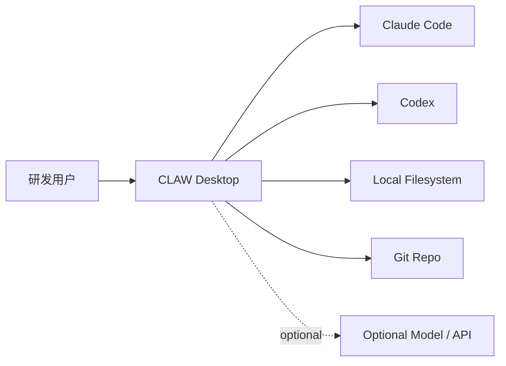

# 10-系统上下文图

## Purpose
定义 CLAW 与用户、AgentOS、本地存储和外部依赖之间的系统边界。

## Scope
本文件只描述系统上下文，不展开内部组件实现。

## Actors / Owners
- Owner: Architecture
- Readers: 新成员、产品、架构评审

## Inputs / Outputs
- Inputs: 产品定义、设计原则
- Outputs: Context 级图、系统边界和外部依赖说明

## Core Concepts
- CLAW 是用户面对的主产品。
- Claude Code 和 Codex 是被接入的 AgentOS。
- 本地文件系统承载 SpecAsset 与 RuntimeAsset。
- Git Repo 负责同步配置类资产，不承载 v1 全量运行时真相。

## Behavior / Flow

## Interfaces / Types
- User 与 CLAW 之间:
  - Chat
  - Task Graph
  - Replay / Analysis
- CLAW 与 AgentOS 之间:
  - Session control
  - Message transport
  - Event normalization
- CLAW 与存储之间:
  - SpecAsset read/write
  - RuntimeAsset append/snapshot

## Failure Modes
- 若 Git 被当作主运行时存储，会造成回放与状态一致性问题。
- 若 AgentOS 被视为 CLAW 内部模块，会混淆产品边界。

## Observability
- 需要能追踪每个用户动作最终落到哪个 AgentOS 和哪些本地资产。

## Open Questions / ADR Links
- 未来引入云端协作时，仅扩展 Context 图，不修改 v1 边界定义。
