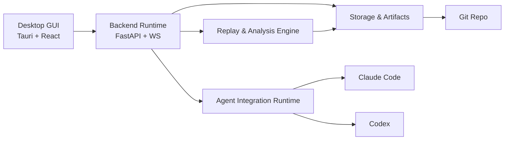

# 11-系统容器图

## Purpose
定义 CLAW 的一级容器及其职责划分。

## Scope
本文件只描述容器，不描述容器内的细粒度组件。

## Actors / Owners
- Owner: Architecture
- Readers: 技术负责人、实现者

## Inputs / Outputs
- Inputs: 系统上下文图
- Outputs: Container 级图与职责边界

## Core Concepts
- `Desktop GUI`: 用户交互入口。
- `Backend Runtime`: 控制平面和实时接口。
- `Agent Integration Runtime`: 对外接 Claude Code / Codex。
- `Storage & Artifacts`: 本地文件系统上的状态和文档产物。
- `Replay & Analysis Engine`: 从事件生成回放和报告。

## Behavior / Flow

## Interfaces / Types
- GUI 消费:
  - Session APIs
  - Workflow APIs
  - Realtime event stream
- Backend Runtime 生产:
  - Session state
  - Task graph state
  - Replay and analysis jobs
- Storage 持久化:
  - `SpecAsset`
  - `RuntimeAsset`

## Failure Modes
- 若把分析引擎与执行 runtime 强耦合，回放生成会阻塞主流程。
- 若 GUI 直接操作 AgentOS，会绕过统一观测和状态管理。

## Observability
- 至少记录容器级流量:
  - GUI command
  - Agent event ingress
  - state snapshot
  - replay/report generation

## Open Questions / ADR Links
- `27-API与实时通道规范.md` 将细化 GUI 与 Runtime 契约。
