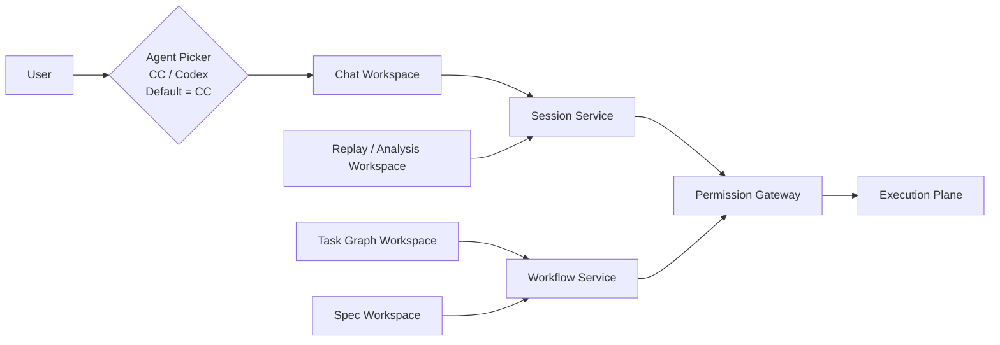
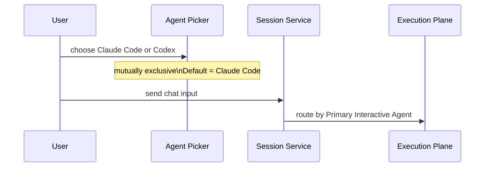

# 12-控制平面组件图

## Purpose
拆解 CLAW 控制平面，定义用户如何发起、查看和干预任务。

## Scope
本文件覆盖 GUI 与控制平面服务，不进入 AgentOS 适配和底层执行细节。

## Actors / Owners
- Owner: Frontend + Core Runtime
- Readers: 前端、API 层实现者

## Inputs / Outputs
- Inputs: Session、TaskGraph、Replay、SpecAsset
- Outputs: 用户命令、调度请求、人工干预决策

## Core Concepts
- `Chat Workspace`
- `Agent Picker`
- `Task Graph Workspace`
- `Spec Workspace`
- `Replay / Analysis Workspace`
- `Session Service`
- `Workflow Service`
- `Permission Gateway`
- `Primary Interactive Agent`

## Behavior / Flow

聊天控制流：

## Interfaces / Types
- 控制平面产出:
  - user message
  - task graph mutation
  - spec asset version
  - approval / rejection
- 控制平面消费:
  - session state
  - task state
  - live events
  - replay / report links

聊天界面代理选择规则：
- 聊天输入区同一时刻只允许一个活跃 AgentOS
- 可选项仅为 `Claude Code` 或 `Codex`
- 默认选中 `Claude Code`
- 多 Agent 协作不通过聊天栏并列激活，而通过 `Task Graph + Hub` 实现

## Failure Modes
- 若聊天和任务图不能共享同一 `Session`，会出现双轨状态漂移。
- 若权限决策散落在多个模块，无法回放人工干预链路。
- 若聊天界面同时允许多个 Agent 激活，会破坏会话归属和消息路由确定性。

## Observability
- 记录所有用户触发的控制命令及其目标 Session / Task / Worker。

## Open Questions / ADR Links
- 详见 [30-前端信息架构.md](../30-operations/30-%E5%89%8D%E7%AB%AF%E4%BF%A1%E6%81%AF%E6%9E%B6%E6%9E%84.md)
