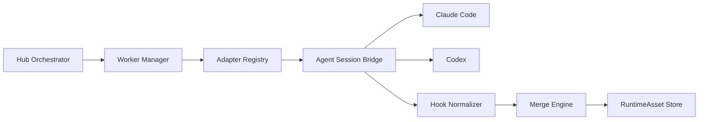

# 13-执行平面组件图

## Purpose
定义 CLAW 执行平面的关键组件，以及它们如何半托管底层 AgentOS。

## Scope
覆盖 Hub、Worker 管理、适配器、事件归一和合并引擎。

## Actors / Owners
- Owner: Core Runtime
- Readers: 后端、调度、Agent 集成实现者

## Inputs / Outputs
- Inputs: task graph、session command、spec assets
- Outputs: worker runs、normalized events、merged results

## Core Concepts
- `Hub Orchestrator`
- `Worker Manager`
- `Adapter Registry`
- `Agent Session Bridge`
- `Hook Normalizer`
- `Merge Engine`

## Behavior / Flow

## Interfaces / Types
- Hub 负责:
  - 任务分解
  - 调度策略
  - 上下文分发
- Worker Manager 负责:
  - `WorkerRun` 生命周期
  - 并发、重试、终止
- Merge Engine 负责:
  - 结果摘要
  - 冲突检测
  - 回写决策

## Failure Modes
- 若 Hook Normalizer 缺失，Claude/Codex 差异会直接污染上层。
- 若 Merge Engine 只合并文件，不合并状态和摘要，回放会缺关键上下文。

## Observability
- 执行平面必须对每个 `WorkerRun` 输出状态流和结果流。

## Open Questions / ADR Links
- 详见 [20-AgentOS集成规范.md](../20-specs/20-AgentOS%E9%9B%86%E6%88%90%E8%A7%84%E8%8C%83.md)
