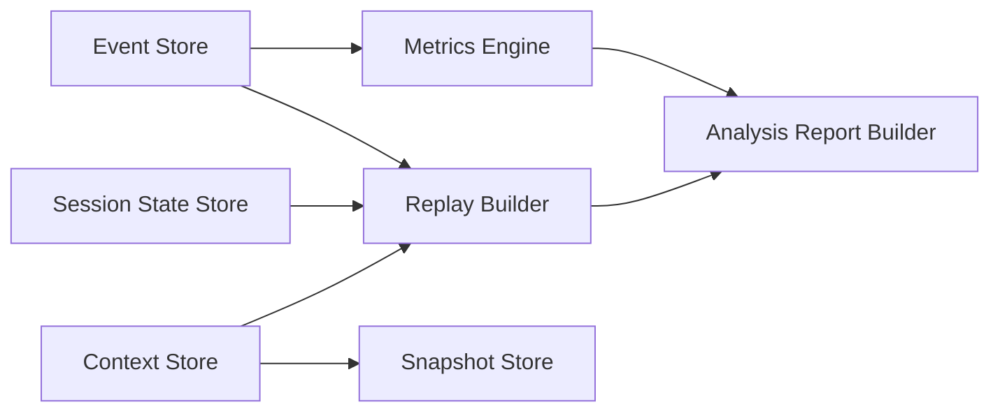

# 14-数据与智能平面组件图

## Purpose
定义 CLAW 如何持久化运行资产，并从事件流生成回放和分析。

## Scope
覆盖状态、事件、快照、回放和分析组件，不定义具体字段 schema。

## Actors / Owners
- Owner: Storage + Analyzer
- Readers: 后端、数据、分析实现者

## Inputs / Outputs
- Inputs: normalized events、session state、context snapshots
- Outputs: replay documents、analysis reports、metrics views

## Core Concepts
- `Event Store`
- `Session State Store`
- `Context Store`
- `Snapshot Store`
- `Replay Builder`
- `Metrics Engine`
- `Recommendation Engine`

## Behavior / Flow

## Interfaces / Types
- 输入对象:
  - `EventEnvelope`
  - `Session`
  - `ContextSnapshot`
- 输出对象:
  - `ReplayDocument`
  - `AnalysisReport`
  - trend metrics

## Failure Modes
- 若只保留聚合状态不保留事件，则无法生成可信回放。
- 若只保留事件不保留状态快照，长周期会话恢复成本会过高。

## Observability
- 分析与回放引擎自身也要输出作业事件，以便诊断产物生成失败。

## Open Questions / ADR Links
- 详见 [24-事件模型与可观测规范.md](../20-specs/24-%E4%BA%8B%E4%BB%B6%E6%A8%A1%E5%9E%8B%E4%B8%8E%E5%8F%AF%E8%A7%82%E6%B5%8B%E8%A7%84%E8%8C%83.md)
