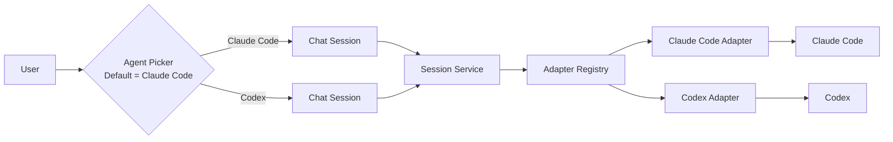
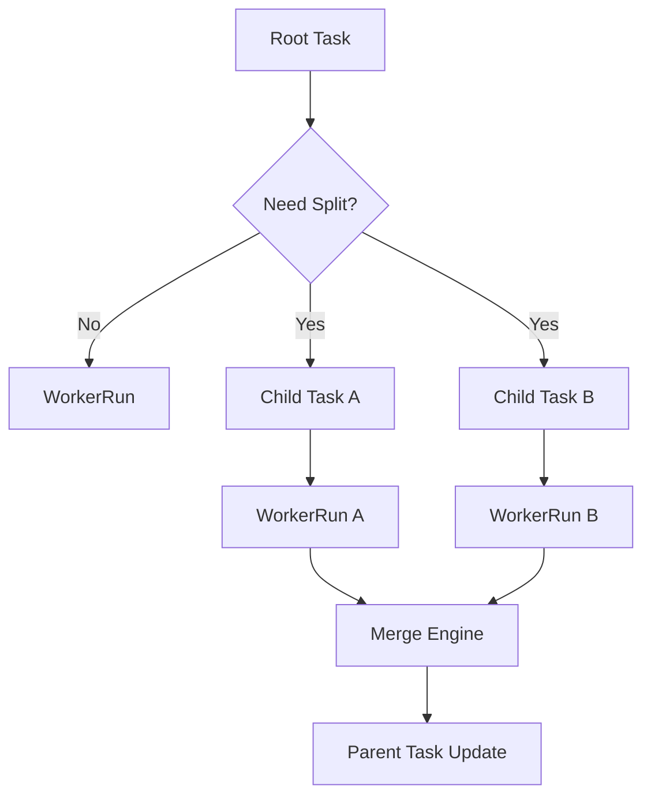
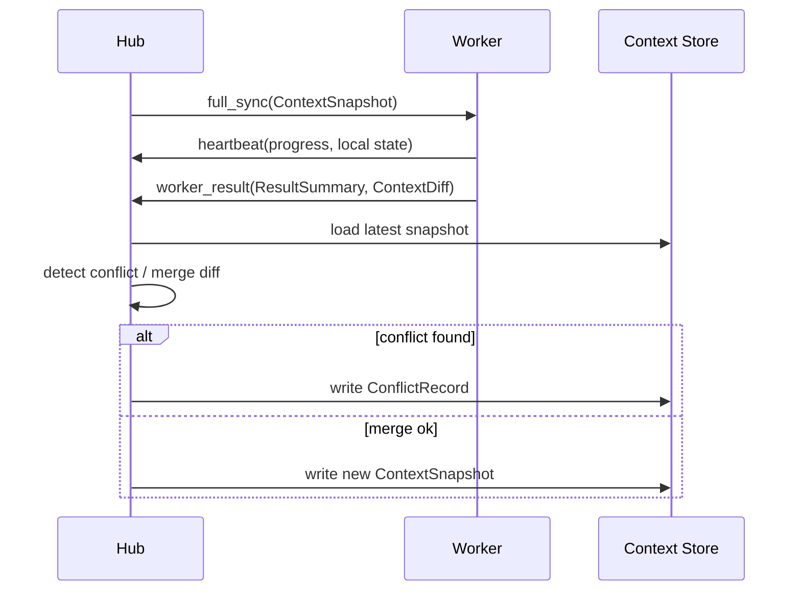
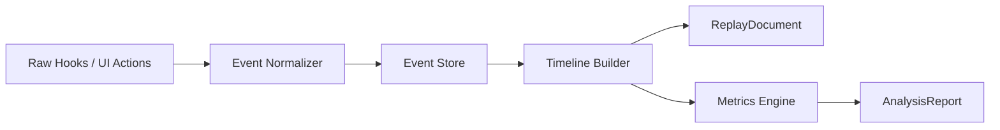

# 15-核心流程图

## Purpose
用跨模块流程图补足 CLAW 的关键运行链路，让读者不只看到静态容器图，还能快速理解系统如何实际流动。

## Scope
本文件聚焦 4 条主流程：
- 聊天界面代理选择与消息路由
- 任务图拆分与 Worker 合并
- 上下文同步与冲突回写
- 事件到回放与分析生成

## Actors / Owners
- Owner: Architecture + Core Runtime
- Readers: 前端、后端、调度、分析实现者

## Inputs / Outputs
- Inputs: Session、TaskNode、ContextSnapshot、EventEnvelope
- Outputs: 跨模块流程图、实现参考链路

## Core Concepts
- `Chat Agent Picker`: 聊天界面里 Claude Code / Codex 的互斥选择器，默认 `Claude Code`
- `Primary Interactive Agent`: 当前聊天会话的主要交互 Agent
- `Execution Plane`: 负责 Worker 调度、AgentAdapter 和结果回写
- `Evidence Plane`: 负责事件、回放和分析

## Behavior / Flow
### 1. 聊天界面代理选择与消息路由

### 2. 任务图拆分与 Worker 合并

### 3. 上下文同步与冲突回写

### 4. 事件到回放与分析生成

## Interfaces / Types
- 聊天模式只绑定一个 `Primary Interactive Agent`
- 任务图模式允许不同 `TaskNode` 绑定不同 AgentOS
- 所有跨模块链路都必须可回溯到 `EventEnvelope`

## Failure Modes
- 若只有静态架构图没有流程图，实现者会难以理解“消息怎么流、状态怎么变、证据怎么落”
- 若聊天界面支持多 Agent 同时激活，会模糊会话归属和回放边界

## Observability
- 以上 4 条流程都必须有对应事件族支撑回放和诊断

## Open Questions / ADR Links
- 相关文档:
  - [20-AgentOS集成规范.md](../20-specs/20-AgentOS%E9%9B%86%E6%88%90%E8%A7%84%E8%8C%83.md)
  - [22-任务图与递归拆分规范.md](../20-specs/22-%E4%BB%BB%E5%8A%A1%E5%9B%BE%E4%B8%8E%E9%80%92%E5%BD%92%E6%8B%86%E5%88%86%E8%A7%84%E8%8C%83.md)
  - [23-上下文同步与合并规范.md](../20-specs/23-%E4%B8%8A%E4%B8%8B%E6%96%87%E5%90%8C%E6%AD%A5%E4%B8%8E%E5%90%88%E5%B9%B6%E8%A7%84%E8%8C%83.md)
  - [24-事件模型与可观测规范.md](../20-specs/24-%E4%BA%8B%E4%BB%B6%E6%A8%A1%E5%9E%8B%E4%B8%8E%E5%8F%AF%E8%A7%82%E6%B5%8B%E8%A7%84%E8%8C%83.md)
