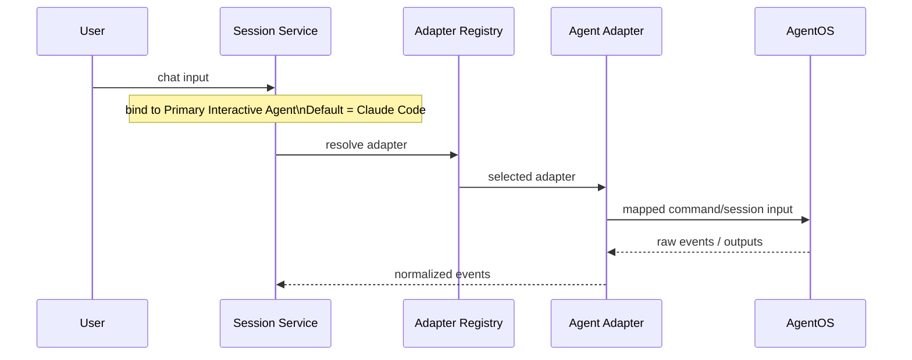

# 20-AgentOS集成规范

## Purpose
定义 CLAW 如何深适配 Claude Code、Codex 等 AgentOS，同时不越界重做它们的底层执行内核。

## Scope
本文件覆盖 AgentOS 接入边界、统一适配接口、能力发现、事件归一和差异处理。
本文件不规定具体的底层 CLI 参数、私有 SDK 实现或供应商专属部署方式。

## Actors / Owners
- Owner: Core Runtime
- Readers: Agent 集成实现者、调度实现者、架构评审

## Inputs / Outputs
- Inputs: 用户命令、TaskNode、SpecAsset、Session 上下文
- Outputs: `Session`、`WorkerRun`、`EventEnvelope`、标准化能力声明

## Core Concepts
- `AgentOS`: 底层执行系统，负责会话执行、工具调用、基础权限与上下文处理。
- `AgentAdapter`: CLAW 对外统一的深适配接口。
- `AgentCapability`: 由适配器声明的标准能力集合。
- `Agent Extension`: 无法被通用模型完全抽平时保留的 agent-specific 扩展位。
- `Primary Interactive Agent`: 聊天界面当前主交互 Agent，取值仅为 `Claude Code` 或 `Codex`

AgentOS 与 CLAW 的职责边界：

| Responsibility | Owned By |
|---|---|
| 推理、工具调用、底层运行时 | AgentOS |
| Session 编排与产品化视图 | CLAW |
| Task Graph、SpecAsset、Replay、Analysis | CLAW |
| 底层 Hook/事件原始格式 | AgentOS |
| 标准化事件信封与回放闭环 | CLAW |

## Behavior / Flow
1. CLAW 通过 `Adapter Registry` 选择目标 AgentAdapter。
2. Adapter 声明能力矩阵，告知上层是否支持中断、事件流、子代理、权限请求等能力。
3. Hub 将 `TaskNode + ContextSnapshot + SpecAsset` 交给适配器。
4. 适配器负责将 CLAW 的统一控制命令映射到 AgentOS 的实际调用方式。
5. AgentOS 返回原始状态、事件和产物后，适配器将其转成 `EventEnvelope`。
6. 若某项能力无法抽平，适配器通过 extension 字段暴露差异，而不是污染通用模型。

交互模式分层：

| Mode | Agent Rule |
|---|---|
| `chat_mode` | 聊天界面在 `Claude Code / Codex` 之间二选一，默认 `Claude Code` |
| `task_graph_mode` | 不同 `TaskNode` 可由不同 AgentOS 执行 |

聊天消息路由流程：



## Interfaces / Types
标准适配器接口：

```python
class AgentAdapter(Protocol):
    async def start_session(self, session: "Session", worker_run: "WorkerRun") -> None: ...
    async def send_input(self, session_id: str, input_text: str) -> None: ...
    async def interrupt(self, session_id: str, reason: str | None = None) -> None: ...
    async def stop_session(self, session_id: str) -> None: ...
    async def get_status(self, session_id: str) -> "AgentStatus": ...
    async def stream_events(self, session_id: str) -> AsyncIterator["EventEnvelope"]: ...
    async def list_capabilities(self) -> list["AgentCapability"]: ...
```

标准能力分组：

| Capability | Description |
|---|---|
| `interactive_input` | 支持持续接收用户/Hub 输入 |
| `event_stream` | 支持持续产生结构化事件 |
| `interrupt` | 支持中断当前执行 |
| `subagent` | 支持底层子代理或并发工作流 |
| `permission_signal` | 支持显式权限请求事件 |
| `file_change_signal` | 支持输出文件变更信息 |
| `structured_result` | 支持返回结构化结果或总结 |

差异处理原则：
- 通用能力进入 `AgentCapability`
- 非通用行为进入 `extension`
- 上层 UI 默认展示统一能力；高级视图可按 agent-specific 展开

聊天界面的适配规则：
- `Primary Interactive Agent` 必须始终可解析到唯一 `AgentAdapter`
- 默认聊天代理为 `Claude Code`
- 切换到 `Codex` 后，后续聊天输入路由到 Codex 适配器
- 聊天模式的二选一不限制 Task Graph 中的跨 AgentOS 调度

## Failure Modes
- 如果适配器把底层执行细节直接暴露给上层，CLAU/Codex 差异会泄漏到全部模块。
- 如果 CLAW 试图统一一切底层行为，会变成“重写 AgentOS”。
- 如果能力矩阵缺失，Hub 无法正确做降级调度。

## Observability
- 适配器必须记录:
  - session start/stop
  - capability declaration
  - command mapping
  - raw event received
  - normalization success/failure
- 适配器失败也必须落入 `EventEnvelope`，而不是只写 stderr。

## Open Questions / ADR Links
- 未来是否引入第三种 AgentOS，需要新增能力矩阵 ADR。
- 相关文档:
  - [21-统一能力模型.md](./21-%E7%BB%9F%E4%B8%80%E8%83%BD%E5%8A%9B%E6%A8%A1%E5%9E%8B.md)
  - [29-AgentOS能力映射矩阵.md](./29-AgentOS%E8%83%BD%E5%8A%9B%E6%98%A0%E5%B0%84%E7%9F%A9%E9%98%B5.md)
  - [24-事件模型与可观测规范.md](./24-%E4%BA%8B%E4%BB%B6%E6%A8%A1%E5%9E%8B%E4%B8%8E%E5%8F%AF%E8%A7%82%E6%B5%8B%E8%A7%84%E8%8C%83.md)
