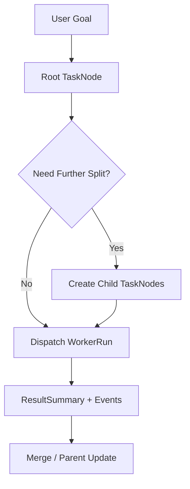
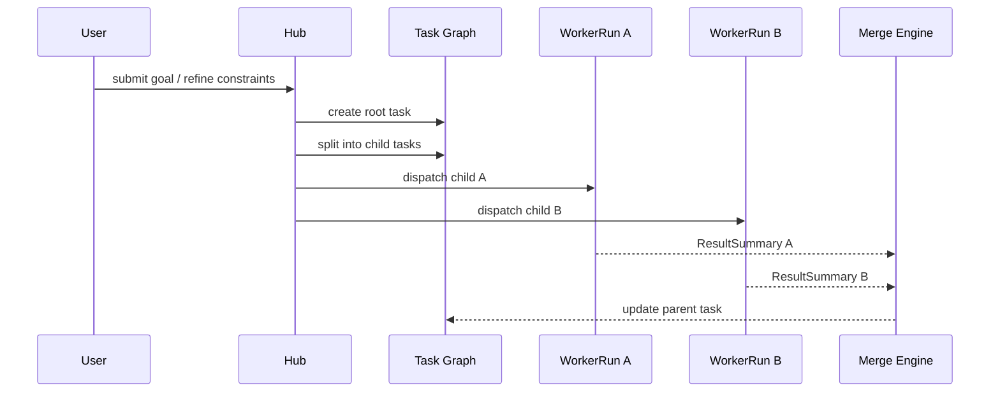

# 22-任务图与递归拆分规范

## Purpose
定义 CLAW 如何把用户目标转成可持续细拆的任务图，并将其调度到不同 AgentOS。

## Scope
本文件覆盖 `TaskNode`、依赖、递归拆分、预算、回写和合并边界。
本文件不规定具体 UI 表现或最终分析评分。

## Actors / Owners
- Owner: Core Runtime
- Readers: 调度、前端、Agent 集成实现者

## Inputs / Outputs
- Inputs: 用户目标、SpecAsset、ContextSnapshot、依赖关系
- Outputs: Task Graph、WorkerRun、Task summaries、merge requests

## Core Concepts
- `TaskNode`: 最小可调度节点。
- `TaskEdge`: 节点依赖关系。
- `DecompositionPolicy`: 任务如何被继续拆分的策略。
- `ExecutionBudget`: token、时间、并发、文件作用域等预算集合。
- `ResultSummary`: 子任务回写给父任务的结构化摘要。

重要原则：
- 架构上允许递归拆分，不规定固定最大深度。
- 运行时策略层可以基于预算、用户策略或 AgentCapability 设置软/硬限制。
- Task Graph 是显式资产，而不是只存在于 prompt 里的隐式结构。

## Behavior / Flow

任务生命周期：
1. 用户目标进入 Hub，形成 root `TaskNode`。
2. Hub 根据 `DecompositionPolicy` 判断是否继续拆分。
3. 子节点继承父节点的 constraints、budget baseline、allowed paths 和相关 SpecAsset 引用。
4. Worker 执行完成后回写 `ResultSummary`，父节点决定是否继续拆分、合并或结束。
5. 整张图在 Session 结束前始终可视、可回放、可人工修订。

任务图调度流程：

## Interfaces / Types
`TaskNode` 最小字段：

| Field | Meaning |
|---|---|
| `id` | 任务唯一标识 |
| `parent_id` | 父任务，可为空 |
| `goal` | 当前任务目标 |
| `constraints` | 技术和行为约束 |
| `dependencies` | 依赖的其他节点 |
| `budget` | 执行预算 |
| `allowed_paths` | 可访问文件范围 |
| `assigned_agent` | 目标 AgentOS 或策略 |
| `status` | 当前状态 |
| `result_summary` | 完成后的回写摘要 |

`ExecutionBudget` 至少包含：
- `time_budget`
- `token_budget`
- `parallelism_budget`
- `tool_budget`
- `path_scope`

`TaskStatus` 建议取值：
- `draft`
- `ready`
- `blocked`
- `running`
- `awaiting_merge`
- `completed`
- `failed`
- `cancelled`

拆分与继承规则：
- constraints 默认向下继承，可被子节点追加但不允许静默放宽
- budget 默认按策略切分，不允许子节点无来源扩容
- allowed paths 默认收窄，不默认放大
- root 级 spec 引用可由子节点显式声明覆盖

## Failure Modes
- 无限拆分但没有 budget，会造成不可控的 Worker 扩散。
- 只在 prompt 中描述子任务、不显式建模节点，会导致无法回放和审计。
- 子节点可以随意放宽父约束，会破坏任务图一致性。

## Observability
- 每个节点必须至少记录:
  - create
  - split
  - assign
  - start
  - complete/fail
  - merge decision
- 每次递归拆分必须输出原因和使用的 `DecompositionPolicy`。

## Open Questions / ADR Links
- 是否需要独立的 `Policy Engine`，建议后续 ADR 决策。
- 相关文档:
  - [23-上下文同步与合并规范.md](./23-%E4%B8%8A%E4%B8%8B%E6%96%87%E5%90%8C%E6%AD%A5%E4%B8%8E%E5%90%88%E5%B9%B6%E8%A7%84%E8%8C%83.md)
  - [25-会话与状态机规范.md](./25-%E4%BC%9A%E8%AF%9D%E4%B8%8E%E7%8A%B6%E6%80%81%E6%9C%BA%E8%A7%84%E8%8C%83.md)
