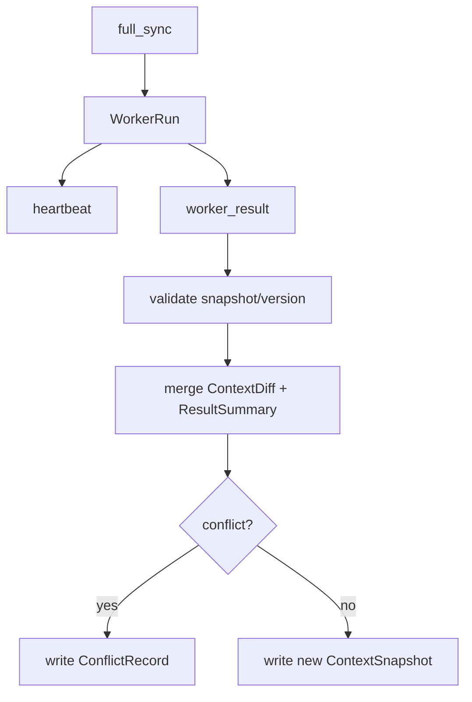

# 23-上下文同步与合并规范

## Purpose
定义 Hub 与 Worker 之间如何交换上下文、结果和冲突信息。

## Scope
本文件覆盖 `ContextSnapshot`、`ContextDiff`、同步类型、回写与合并策略。

## Actors / Owners
- Owner: Core Runtime
- Readers: 调度、存储、回放实现者

## Inputs / Outputs
- Inputs: Global context、TaskNode、WorkerRun state
- Outputs: snapshots、diffs、merge decisions、conflict records

## Core Concepts
- `Global Context`: Session 级共享上下文。
- `SubContext`: WorkerRun 绑定的局部上下文。
- `ContextSnapshot`: 某一时刻完整视图。
- `ContextDiff`: 某次同步的增量变化。
- `ConflictRecord`: 回写时发现的不一致记录。

## Behavior / Flow
同步类型：

| Sync Type | Direction | Use |
|---|---|---|
| `full_sync` | Hub -> Worker | Worker 启动时提供完整上下文 |
| `delta_sync` | Hub -> Worker | 主上下文局部更新 |
| `heartbeat` | Worker -> Hub | 执行中状态回报 |
| `worker_result` | Worker -> Hub | 执行完成后的摘要和产物 |
| `conflict_report` | Worker -> Hub | 冲突或不一致说明 |

合并顺序：
1. 校验 `snapshot_id` 与 `context_version`
2. 应用结构化结果摘要
3. 再处理文件、变量和状态冲突
4. 形成新的 `ContextSnapshot`

同步与回写流程：

## Interfaces / Types
`ContextSnapshot` 最少包含：
- `session_id`
- `context_version`
- `task_graph_digest`
- `active_constraints`
- `shared_state`
- `spec_refs`

`ContextDiff` 最少包含：
- `base_version`
- `changes`
- `produced_by`
- `reason`

## Failure Modes
- 只传自然语言摘要不传版本信息，会破坏可合并性。
- 结果直接覆盖主上下文，会吞掉并行 Worker 的有效信息。

## Observability
- 每次 sync 都要记录版本、方向、大小、原因和结果。
- 冲突处理必须形成独立 `ConflictRecord`，供回放和 UI 消费。

## Open Questions / ADR Links
- 详见 [33-冲突处理与人工介入规范.md](../30-operations/33-%E5%86%B2%E7%AA%81%E5%A4%84%E7%90%86%E4%B8%8E%E4%BA%BA%E5%B7%A5%E4%BB%8B%E5%85%A5%E8%A7%84%E8%8C%83.md)
