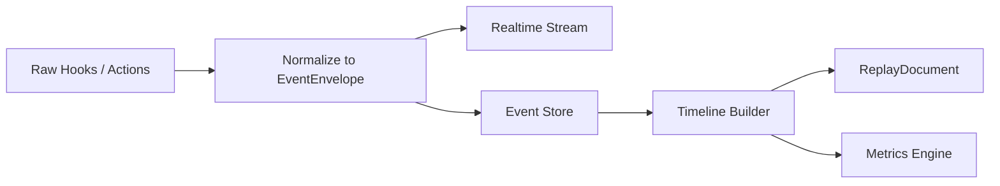
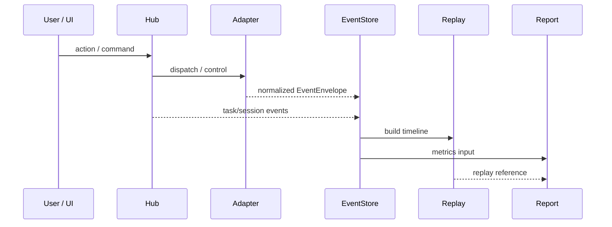

# 24-事件模型与可观测规范

## Purpose
定义 CLAW 的统一事件模型，使所有执行、干预、回放和分析都能建立在同一条证据链上。

## Scope
本文件覆盖事件信封、事件类别、事件来源、实时流和持久化要求。
本文件不定义分析评分公式和最终报告模板。

## Actors / Owners
- Owner: Runtime Observability
- Readers: 适配器、存储、回放、分析、前端实时流实现者

## Inputs / Outputs
- Inputs: AgentOS raw hooks、Hub actions、UI actions、storage jobs
- Outputs: `EventEnvelope`、timeline、replay inputs、metrics inputs

## Core Concepts
- `EventEnvelope`: 全系统统一事件信封。
- `RawEvent`: AgentOS 原始事件。
- `Normalized Event`: 经过 CLAW 归一后的标准事件。
- `Timeline`: 事件按时间和关联实体重建出的执行序列。
- `Replay Boundary`: 回放中必须保留的关键事件点。

事件来源：

| Source | Examples |
|---|---|
| `user` | 发送消息、改任务图、批准权限 |
| `hub` | 拆分任务、分配 Worker、合并结果 |
| `agent_adapter` | session start、command map、normalization error |
| `agent_os` | tool use、permission request、subagent events |
| `storage` | snapshot write、report generation |
| `analysis` | metrics complete、report complete |

## Behavior / Flow

事件原则：
1. 所有关键行为先变成事件，再更新聚合状态。
2. 事件不可原地重写，只允许追加和补充关联。
3. 回放和分析只消费标准化事件，不直接消费原始 AgentOS 日志。
4. 用户动作与系统动作同等重要，必须同链记录。

证据链闭环：

## Interfaces / Types
`EventEnvelope` 建议字段：

| Field | Meaning |
|---|---|
| `event_id` | 事件唯一标识 |
| `ts` | 事件时间 |
| `source` | 来源系统 |
| `event_type` | 统一事件类型 |
| `session_id` | 所属会话 |
| `task_id` | 关联任务 |
| `worker_run_id` | 关联执行实例 |
| `agent_type` | Claude Code / Codex / other |
| `payload` | 标准化内容 |
| `trace` | trace_id、parent_event_id 等链路信息 |
| `extension` | agent-specific 扩展字段 |

核心事件族：

| Event Family | Examples |
|---|---|
| `session.*` | start, pause, resume, stop |
| `task.*` | create, split, assign, block, merge |
| `worker.*` | start, heartbeat, complete, fail, cancel |
| `agent.*` | input, output, tool, permission, subagent |
| `context.*` | snapshot, diff, merge, conflict |
| `artifact.*` | file_change, replay_generated, report_generated |
| `human.*` | intervene, approve, reject, revise |

Replay 必留事件：
- session start/stop
- task split/assign/complete
- permission requests and decisions
- tool failure / retry
- human intervention
- merge decisions

## Failure Modes
- 若只保留聚合日志、不保留标准事件，将无法生成可信时间线。
- 若忽略人工动作事件，回放会丢失真实决策链。
- 若把原始 hook 直接暴露给上层，前端和分析会被不同 AgentOS 耦合。

## Observability
- 事件采集成功率
- normalization failure rate
- end-to-end latency from raw event to persisted event
- replay coverage rate
- events missing required linkage fields

## Open Questions / ADR Links
- 未来是否引入事件版本化，需要 ADR 定义兼容策略。
- 相关文档:
  - [25-会话与状态机规范.md](./25-%E4%BC%9A%E8%AF%9D%E4%B8%8E%E7%8A%B6%E6%80%81%E6%9C%BA%E8%A7%84%E8%8C%83.md)
  - [32-回放与分析报告规范.md](../30-operations/32-%E5%9B%9E%E6%94%BE%E4%B8%8E%E5%88%86%E6%9E%90%E6%8A%A5%E5%91%8A%E8%A7%84%E8%8C%83.md)
