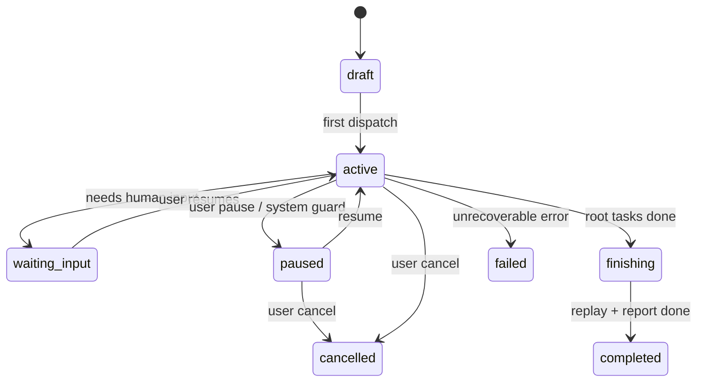
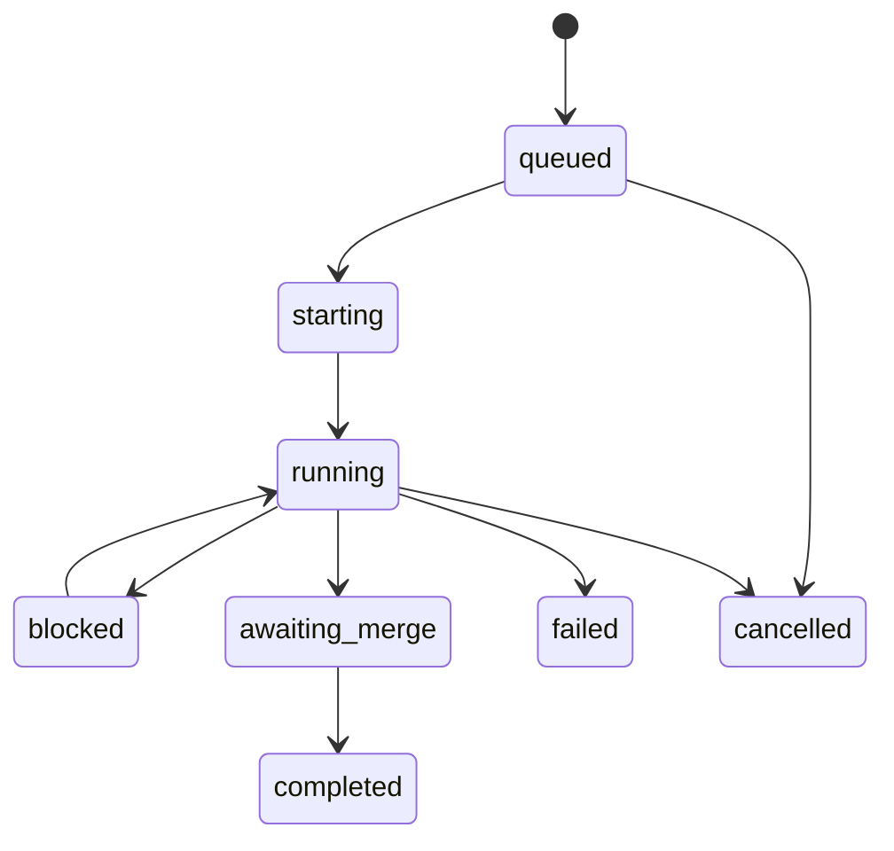

# 25-会话与状态机规范

## Purpose
定义 CLAW 中 `Session` 与 `WorkerRun` 的生命周期状态机，确保 UI、调度、回放和分析消费的是同一套状态语义。

## Scope
本文件覆盖 Session 和 WorkerRun 的状态、触发条件和状态迁移。

## Actors / Owners
- Owner: Core Runtime
- Readers: 前端、调度、分析、回放实现者

## Inputs / Outputs
- Inputs: user commands、task graph changes、normalized events
- Outputs: session state、worker state、state transition events

## Core Concepts
- `Session`: 用户级工作容器，包含 Task Graph、SpecAsset refs 和 RuntimeAsset refs。
- `WorkerRun`: 某个 TaskNode 的一次实际执行尝试。
- `State Transition`: 由事件触发的显式状态变化，不允许隐式跳变。

## Behavior / Flow
Session 状态图：

WorkerRun 状态图：

## Interfaces / Types
`SessionState` 建议取值：
- `draft`
- `active`
- `waiting_input`
- `paused`
- `finishing`
- `completed`
- `failed`
- `cancelled`

`WorkerRunState` 建议取值：
- `queued`
- `starting`
- `running`
- `blocked`
- `awaiting_merge`
- `completed`
- `failed`
- `cancelled`

触发原则：
- 状态迁移必须由标准事件驱动
- 一个 Session 可以包含多个并发 `WorkerRun`
- `waiting_input` 与 `blocked` 不同:
  - `waiting_input` 面向 Session
  - `blocked` 面向某个 WorkerRun 或 TaskNode

## Failure Modes
- 若前端自己“猜测”状态而不是消费状态机，会出现显示与真实执行脱节。
- 若 WorkerRun 状态不显式建模，递归任务图将无法可靠回放。

## Observability
- 每次状态迁移都必须发出事件。
- 需要能查询某个状态是由哪个事件触发的。
- 需支持统计:
  - time in state
  - failed transitions
  - human-induced transitions

## Open Questions / ADR Links
- 后续若引入 `recovering` 或 `replaying` 状态，可通过 ADR 扩展。
