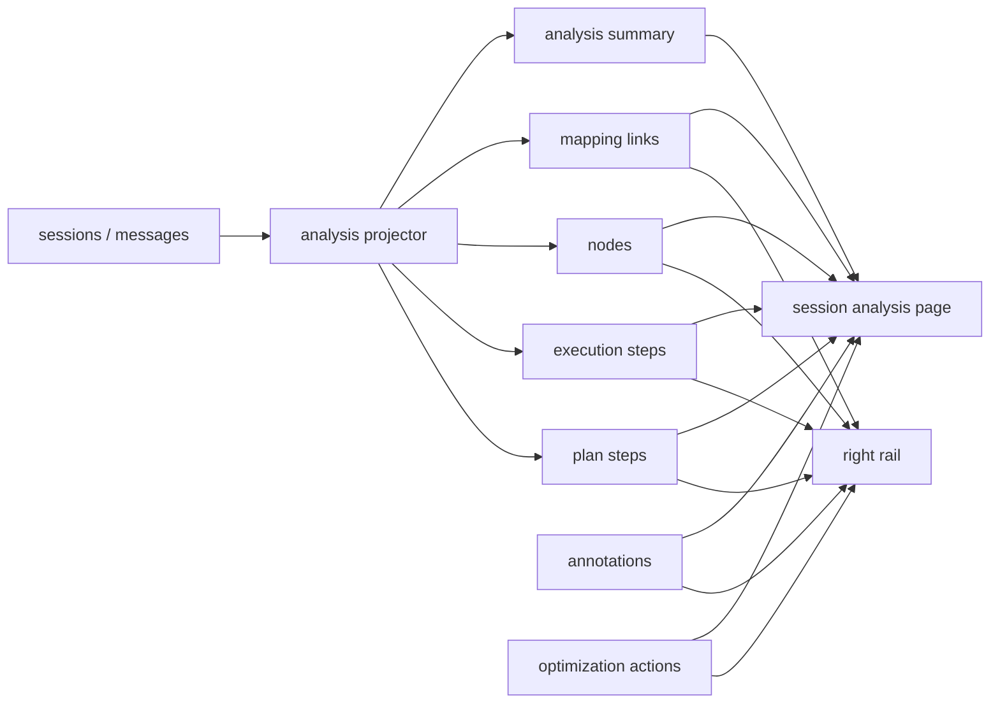

# 30-会话执行分析与标注规范

## Purpose
定义单个会话内的执行分析模型、右侧执行轨迹工作台、会话分析页、人工标注能力与 AI 调优记录能力，确保“实时看懂执行过程”和“事后系统复盘”使用同一套对象与口径。

## Scope
本文覆盖：
- 右侧执行轨迹区的增强信息架构
- 单会话分析页的信息架构
- `AI 计划步骤`、`实际执行步骤`、`节点`、`标注`、`AI 调优动作` 的最小数据模型
- 从原始消息到分析投影的生成与重建规则

本文不覆盖：
- 多会话汇总分析页
- 团队协作权限模型
- 自动采纳 AI 调优建议并直接重跑

## Actors / Owners
- Owner: Product + Core Runtime
- Primary Readers: Electron 前端、会话存储、执行轨迹右栏、会话分析页
- Secondary Readers: 后续跨会话分析、提示词调优、QA 回放

## Inputs / Outputs
- Inputs:
  - `messages` 原始会话消息流
  - `session status`
  - 用户对步骤或节点的人工标记、备注、评论
  - 用户从步骤或节点发起的 AI 调优动作
- Outputs:
  - 右侧执行轨迹工作台投影
  - 单会话分析页投影
  - 可持久化的步骤、节点、标注与调优记录

## Product Goals
- 让用户能明确看到 `Step 1/2/3/4/5` 这类 AI 原始计划，并知道它们是否真正落地。
- 让用户能同时看到系统归纳出的“实际执行步骤”，从而理解真实执行轨迹。
- 让 `Step` 和 `节点` 都能被人工标记、备注和评论。
- 让用户能从 `Step` 或 `节点` 直接发起 AI 调优动作，并保留调优记录。
- 让右侧实时 workbench 和单会话分析页共享一套分析对象，避免两套口径。

## Non-Goals
- 不要求第一期完成跨会话排行榜、趋势分析或模型横向对比。
- 不要求第一期提供复杂评论线程、多人协作审批或权限隔离。
- 不要求第一期自动根据 AI 调优结果修改会话或自动重试执行。

## Core Concepts
- `Plan Step`:
  来自 AI 原始计划文本的编号步骤，例如 `Step 1`、`Step 2`、`Step 3`。该对象代表“模型原本打算怎么做”。
- `Execution Step`:
  系统根据工具调用、结果与阶段语义归纳出的实际执行步骤。该对象代表“系统实际上做了什么”。
- `Analysis Node`:
  时间线中的最小分析单元，通常对应工具调用、中间文本、最终结果、人工确认等证据节点。
- `Plan/Execution Link`:
  用于表达某个原始计划步骤和某个实际执行步骤之间的关系，例如 `matched`、`partial`、`drifted`、`unmapped`。
- `Annotation`:
  用户挂在 `Plan Step`、`Execution Step` 或 `Node` 上的人工反馈对象，统一承载标签、备注、评论与问题状态。
- `Optimization Action`:
  从 `Execution Step` 或 `Node` 发起的一次 AI 调优动作，包含输入快照、动作类型和结果。
- `Projection`:
  基于原始消息重建的分析投影层。投影可重算，人工标注与调优记录不可被重算覆盖。

## Experience Model
产品层分为两个互补视图：

- `右侧执行轨迹工作台`
  - 定位：实时观察与快速复盘入口
  - 目标：快速看懂本次执行如何从计划走向结果
  - 特点：高密度、可折叠、可直接打标和发起 AI 调优

- `单会话分析页`
  - 定位：完整复盘页
  - 目标：系统性回答“原计划是什么、实际怎么跑、哪里偏了、人工怎么判断、后续怎么调”
  - 特点：结构化汇总、适合横向比较步骤与证据

右侧与分析页必须互相可跳转：
- 右侧可进入“查看本会话完整分析”
- 分析页可反跳到某个执行步骤或证据节点

## Right Rail Information Architecture
右侧执行轨迹工作台必须采用“摘要 + 双轨步骤 + 节点 + 详情抽屉”结构：

1. 顶部摘要条
   - 展示：`状态 / 模型 / 耗时 / 输入 / 上下文 / 输出 / 成败 / 告警数`
   - 提供进入单会话分析页的入口

2. `AI 计划步骤` 区
   - 保留原始 `Step 1/2/3/4/5`
   - 展示每个计划步骤的状态：`未落地 / 执行中 / 已完成 / 跑偏 / 无计划`
   - 不得被系统归纳步骤覆盖或改写掉原编号

3. `实际执行步骤` 区
   - 展示系统归纳后的执行步骤，例如 `检查现状`、`修改代码`、`构建验证`
   - 每步显示：`关联节点数 / 耗时 / 输入 / 上下文 / 输出 / 成败`
   - 每步必须标明其映射到哪些 `AI 计划步骤`

4. `节点时间线` 区
   - 作为证据层展示工具调用、中间结果、最终结果和人工确认节点
   - 默认高密度紧凑展示，不承担全部解释责任

5. `详情抽屉`
   - 统一展示 `概览`、`证据`、`原始内容`
   - 原始输入输出区必须可读，不得出现“看似空白”的视觉状态

## Session Analysis Page Information Architecture
单会话分析页必须包含以下模块：

1. `会话总览`
   - `状态 / 模型 / 总耗时 / 输入 / 上下文 / 输出 / 成败 / 告警 / Step 覆盖率 / 标注数`

2. `计划 vs 执行`
   - 左侧为 `AI 计划步骤`
   - 右侧为 `实际执行步骤`
   - 中间展示映射关系：`已落地 / 部分落地 / 未落地 / 跑偏新增`

3. `执行步骤分析表`
   - 每个执行步骤一行
   - 至少包含：`步骤名 / 对应计划步骤 / 耗时 / 节点数 / 输入 / 上下文 / 输出 / 成败 / 标注数 / 调优次数`

4. `关键证据区`
   - 聚焦失败节点、最长耗时节点、上下文热点节点、重复调用节点和人工标记节点

5. `人工反馈区`
   - 汇总 `Step` 级和 `Node` 级的标签、备注、评论与未解决问题

6. `AI 调优记录`
   - 展示基于步骤或节点发起的解释、建议、提示词重写与策略重试建议

7. `完整节点时间线`
   - 允许下钻，但不抢首屏优先级

## Interaction Rules
### Step-Level Actions
`Execution Step` 是第一优先级操作对象，必须支持：
- `标记`
- `备注`
- `评论`
- `AI 调优`

### Node-Level Actions
`Analysis Node` 也必须支持上述动作，但视觉层级低于 `Execution Step`，用于精细补充。

### Annotation Types
第一期统一使用 `Annotation` 承载以下类型：
- `tag`
- `note`
- `comment`
- `issue`
- `good`
- `todo`

第一期推荐标签集合：
- `有问题`
- `做得好`
- `待跟进`
- `关键信息`

### Resolution
问题类标注必须支持 `已解决` 状态，避免问题堆积后无法区分当前遗留项与历史项。

### Optimization Actions
第一期 AI 调优入口固定为以下动作：
- `explain`
- `suggest`
- `rewrite_prompt`
- `retry_strategy`

AI 调优必须基于对象发起，不允许作为脱离上下文的空动作：
- 从 `Execution Step` 发起时，至少携带步骤摘要、对应计划步骤、关联节点摘要与人工反馈
- 从 `Node` 发起时，至少携带节点输入、节点输出、前后文摘要与所属执行步骤

AI 调优结果第一期只记录，不直接自动改写原会话或自动重跑。

## Storage Model
原始消息表继续作为唯一事实源，不在原始消息表中混入人工反馈字段。

建议新增以下投影与反馈对象：

### `session_plan_steps`
- `id`
- `session_id`
- `step_index`
- `title`
- `raw_text`
- `status`
- `source_timeline_id`
- `created_at`
- `updated_at`

### `session_execution_steps`
- `id`
- `session_id`
- `step_index`
- `title`
- `kind`
- `status`
- `started_at`
- `ended_at`
- `duration_ms`
- `input_chars`
- `context_chars`
- `output_chars`
- `success_count`
- `failure_count`
- `created_at`
- `updated_at`

### `session_nodes`
- `id`
- `session_id`
- `timeline_id`
- `node_type`
- `tool_name`
- `title`
- `summary`
- `status`
- `started_at`
- `ended_at`
- `duration_ms`
- `input_chars`
- `context_chars`
- `output_chars`
- `raw_input`
- `raw_output`
- `attention`
- `created_at`
- `updated_at`

### `session_plan_execution_links`
- `id`
- `session_id`
- `plan_step_id`
- `execution_step_id`
- `link_type`
- `confidence`
- `created_at`

`link_type` 第一期开集：
- `matched`
- `partial`
- `drifted`
- `unmapped`

### `session_execution_node_links`
- `id`
- `session_id`
- `execution_step_id`
- `node_id`
- `role`
- `sort_order`
- `created_at`

### `session_annotations`
- `id`
- `session_id`
- `target_type`
- `target_id`
- `annotation_type`
- `content`
- `author_type`
- `status`
- `created_at`
- `updated_at`
- `resolved_at`

`target_type` 第一期开集：
- `plan_step`
- `execution_step`
- `node`

### `session_optimization_actions`
- `id`
- `session_id`
- `target_type`
- `target_id`
- `action_type`
- `input_snapshot`
- `prompt_text`
- `result_text`
- `status`
- `created_at`
- `updated_at`

### `session_analysis_summary`
该表用于加速右侧摘要与会话分析页首屏，可按需引入。

建议字段：
- `session_id`
- `projection_version`
- `status`
- `model`
- `duration_ms`
- `input_tokens`
- `output_tokens`
- `context_chars`
- `success_count`
- `failure_count`
- `alert_count`
- `plan_step_count`
- `execution_step_count`
- `annotation_count`
- `optimization_action_count`
- `updated_at`

## Projection Rules
### Source of Truth
- `sessions` 与 `messages` 是唯一事实源
- 分析投影全部允许通过原始消息重建
- `annotations` 与 `optimization_actions` 绝不能在重建时被覆盖

### Projection Timing
采用“双阶段更新”：
- `实时增量更新`
  - 每次新增消息时，更新当前会话投影
  - 供右侧执行轨迹工作台实时消费
- `收口完整重算`
  - 在 `result`、会话停止、历史加载或投影版本升级时，对单个会话做完整重算
  - 供最终口径收敛与故障修复使用

### Step Projection
- 若 AI 文本中出现显式编号计划，则优先生成 `Plan Step`
- `Execution Step` 始终由系统归纳生成
- UI 必须双轨展示：
  - 上轨：`AI 计划步骤`
  - 下轨：`实际执行步骤`

### Node Projection
- 每个关键工具调用、关键结果文本、最终结果、人工确认请求都可投影为 `Node`
- `Node` 必须可回链到时间线与执行步骤

### Mapping
- `Plan Step` 和 `Execution Step` 的映射关系必须显式持久化
- 映射失败时也要落 `unmapped` 或 `drifted`，不得静默丢失

## Data Flow

## Acceptance
第一期验收至少满足：
- 右侧能清晰展示 `AI 计划步骤` 与 `实际执行步骤`
- 右侧任一执行步骤都能看到关联节点
- 原始输入输出在详情抽屉中可稳定阅读
- `Execution Step` 与 `Node` 都能新增标记和备注
- `Execution Step` 与 `Node` 都能发起并记录 AI 调优动作
- 会话分析页能展示 `计划 vs 执行`、执行步骤分析表、关键证据、人工反馈与 AI 调优记录
- 单会话分析使用的对象与右侧工作台口径一致

## Rollout
### Phase 1
- 完成右侧双轨步骤与节点增强
- 完成 `Step` / `Node` 标记与备注
- 完成 AI 调优动作记录
- 完成单会话分析页首版

### Phase 2
- 增强评论流与问题解决流
- 丰富节点热点、上下文热点和重复调用分析
- 为后续跨会话总分析页输出稳定统计对象

## Failure Modes
- 若右侧继续只依赖前端临时推导，将导致会话分析页、标注与调优记录无法共享稳定口径。
- 若不显式保存 `Plan Step` 与 `Execution Step` 映射，则用户无法判断模型是否按 `Step 1/2/3/4/5` 真正落地。
- 若人工反馈和 AI 调优结果混入投影重建逻辑，则版本升级或重算时会丢失人工判断。

## Observability
建议至少新增以下事件：
- `analysis_projection_updated`
- `analysis_projection_rebuilt`
- `session_annotation_created`
- `session_annotation_resolved`
- `session_optimization_action_requested`
- `session_optimization_action_completed`
- `session_optimization_action_failed`

建议支持以下统计：
- 每会话的计划步骤数、执行步骤数、未映射步骤数
- 每会话的失败节点数、热点节点数、重复节点数
- 每会话的标注数、未解决问题数、调优动作数

## Open Questions / Follow-ups
- 是否需要在第二期将 `plan step` 也作为 AI 调优入口对象开放，目前第一期以 `execution step` 和 `node` 为主。
- 是否需要在第二期引入更细的人工标签体系，例如按“需求理解 / 工具使用 / 验证不足 / 输出质量”分类。
