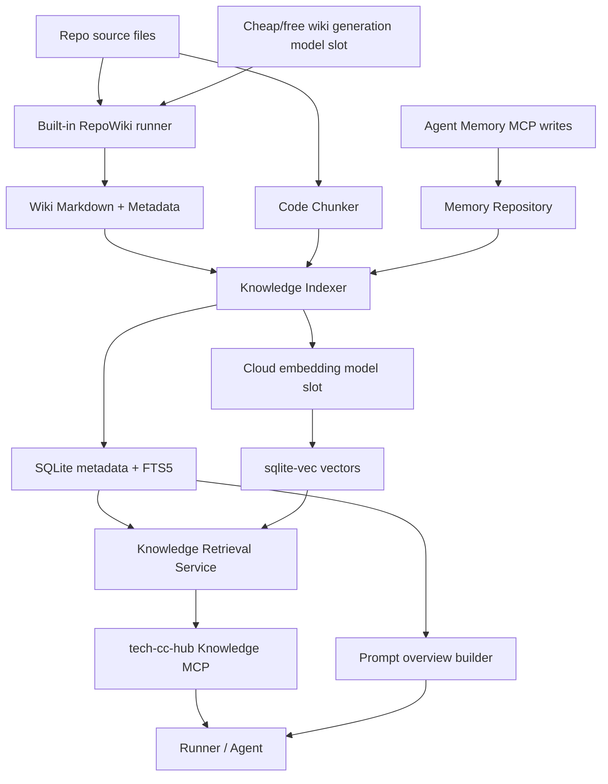

# tech-cc-hub 本地知识引擎开发方案

## 目标

在 tech-cc-hub 中新增一个**内置本地知识引擎版本能力**，让 Agent 能跨会话、跨任务读取仓库知识、历史决策、用户偏好和项目经验。这个能力必须写进 tech-cc-hub 代码、随版本发布、在设置页可见、在 Runner 中默认可用；第三方项目只能作为可替换底座、vendored/forked 子模块、sidecar 或实现参考，不能把产品能力降级成“让用户自己装一个外部插件”。

第一版目标不是做一个新的 DeepWiki 平台，也不是简单把外部 RepoWiki MCP 接进来，而是把现有 Agent 工作台补上三类内置能力：

- **Repo Wiki**：仓库结构化文档、架构说明、源码引用、文件依赖关系。
- **Vector RAG**：对 Wiki、源码 chunk、记忆条目做 embedding，支持语义检索。
- **Agent Memory**：沉淀跨会话经验、项目决策、用户偏好、踩坑记录。

## 产品边界

这次交付必须按“产品模块”定义，而不是按“外部集成”定义。

必须内置：

- `tech-cc-hub-knowledge` 内置 MCP server。
- App data 内部索引库 / 记忆库；项目内 `.tech/` 只放 Markdown/JSON 等可读产物。
- Repo Wiki 生成、刷新、索引状态管理。
- FTS 检索、embedding 生成、向量检索、hybrid rank。
- Knowledge Engine 启用门槛：必须存在可用 embedding provider，并通过维度探测和试算向量；否则设置页不允许开启知识库功能。
- Knowledge 设置页和诊断页。
- Runner system prompt 中的 `<knowledge_overview>` / `<memory_overview>`。
- Prompt Ledger / Activity Rail 中的 knowledge source 记录。
- Win / Mac 默认可用路径：使用模型设置里的云端向量模型 + sqlite-vec；没有配置向量模型或 health check 失败时只能进入“未启用/待配置”状态。

允许依赖第三方：

- 可以 fork / vendor RepoWiki 作为内置生成器底座。
- 可以支持 OpenAI-compatible 云端向量模型；另增一个低成本/免费文本模型槽位，用于批量生成 Repo Wiki。

不允许把核心能力外包：

- 不要求用户先运行 DeepWiki/OpenDeepWiki 才能生成知识库。
- 不把长期 Memory 只交给外部 mcp-memory-service。

## 三方调研结论

本方案的原则是：**产品能力内置，底层能力快速复用三方。**
也就是说，tech-cc-hub 要拥有自己的 Knowledge Engine 模块、MCP、UI、数据库、版本开关和发布说明；但 Wiki 生成、chunk、embedding、vector search 这些底层组件尽量选成熟项目接入或 fork 魔改。

### 可直接作为底座的三方

| 方向 | 推荐三方 | 集成方式 | 结论 |
| --- | --- | --- | --- |
| Repo Wiki 生成 | `he-yufeng/RepoWiki` | fork/vendor 或 Python sidecar CLI | 主底座。它已经有本地仓库扫描、CLI、Markdown/JSON/HTML 导出、SQLite cache、PageRank、bundle 过滤。 |
| Markdown / code chunk | `@langchain/textsplitters` | npm 依赖 | 直接用。避免自己从零写 splitter，第一版再补少量源码结构保护逻辑。 |
| 内置向量存储 | `sqlite-vec` | npm 依赖 + `better-sqlite3` 扩展加载 | 当前版本唯一向量后端。它更符合“内置版本能力”：app data 内部 SQLite 承载 metadata、FTS 和向量，不要求用户额外启动外部服务。 |
| RAG 框架参考 | DeepWiki-Open / LlamaIndex / LangChain | 参考 pipeline，不整体嵌入 | 只取设计，不吃掉 tech-cc-hub 的产品边界。 |
| 长期记忆参考 | `mcp-memory-service` / mem0 类项目 | 后续 optional backend | 只作为 Memory 后端适配，不作为第一版必需。 |

`@langchain/textsplitters` 是第一版的快速路径。如果后续 Electron renderer / preload bundle 体积被它明显拖大，只保留 `RecursiveCharacterTextSplitter` 所需的核心逻辑，内置一个约百行的本地 splitter；这属于打包优化，不改变第一版接口。

### 不采用为主底座的三方

| 项目 | 不作为主底座的原因 |
| --- | --- |
| DeepWiki-Open | Next.js + FastAPI + AdalFlow 是完整应用栈，嵌入 Electron 会变成“套另一个产品”。适合参考 RAG 和 wiki 生成流程。 |
| OpenDeepWiki | .NET 9 + Semantic Kernel + Docker 更像企业知识平台。能力完整但运行时太重，不适合做内置桌面模块第一版。 |
| Chroma | 常见 RAG 库，但 Node/Electron 内置体验不如 SQLite 单文件直接。可作为后续后端适配。 |
| HNSWLib Node | LangChain 集成方便，但 Windows 需要 native build 环境，删除/增量更新能力也不够舒服，不适合作默认内置后端。 |
| LanceDB | JS 能力可用，但引入新存储体系；第一版没有 SQLite-vec 的“单文件内置”优势。可后续评估。 |

### 最终三方使用策略

第一版默认路径：

```text
RepoWiki fork/sidecar
  -> Markdown/JSON 输出
  -> @langchain/textsplitters chunk
  -> app data SQLite metadata + FTS5
  -> sqlite-vec vector search
  -> tech-cc-hub Knowledge MCP
```

外部 MCP 路径：

```text
当前版本不接外部 Vector MCP。
```

## 当前上下文

当前仓库已经有以下基础：

- Electron + React 桌面应用。
- 内置 MCP 注册链路：
  - `src/shared/builtin-mcp-registry.ts`
  - `src/electron/libs/builtin-mcp-servers.ts`
  - `src/electron/libs/mcp-tools/*.ts`
- Runner system prompt 拼装链路：
  - `src/electron/libs/runner.ts`
  - `src/electron/libs/system-prompt-presets.ts`
  - `src/electron/libs/claude-project-memory.ts`
- SQLite 依赖：
  - `better-sqlite3`
- Prompt Ledger / Activity Rail 已有 memory/tool 来源建模：
  - `src/shared/prompt-ledger.ts`
  - `src/shared/activity-rail-model.ts`
  - `src/ui/components/ActivityRail.tsx`
  - `src/ui/components/SessionAnalysisPage.tsx`

目标形态参考 Qoder Repo Wiki，但不读取、不导入、不兼容 `.qoder`。tech-cc-hub 自己生成 `.tech/`，自己定义 metadata、索引和 MCP 入口。

## 核心判断

类似 Qoder 的 Repo Wiki 能力应该拆成两层，而不是塞进一张 memory 表：

1. **仓库知识层**
   - 源码结构、架构文档、页面级 Wiki、文件依赖、代码片段。
   - 变更频率随代码变化。
   - 适合 FTS + embedding + dependent file graph。

2. **记忆层**
   - 用户偏好、项目决策、踩坑经验、任务总结。
   - 变更频率随对话和任务变化。
   - 适合 MCP 写入、人工可审计、按 scope 注入 overview。

二者应该统一检索入口，但底层存储、生命周期和 prompt 注入策略分离。

## 第三方底座选择

### 选型结论

推荐组合：

```text
RepoWiki fork/sidecar -> .tech writer
        +
app data SQLite metadata + FTS5
        +
sqlite-vec built-in vector store
        +
tech-cc-hub 内置 Knowledge MCP
```

### Repo Wiki 生成底座

首选：`he-yufeng/RepoWiki`

定位：

- 负责扫描仓库。
- 负责生成结构化 Markdown / JSON / HTML。
- 负责目录、依赖、PageRank、源码引用等仓库文档能力。

使用方式：

- 不把 RepoWiki 的完整 Web UI 嵌进主进程。
- 把 RepoWiki 作为 tech-cc-hub 的内置生成器底座：优先 fork/vendor，或用受控 Python sidecar CLI 调用。
- 所有入口仍由 tech-cc-hub UI / IPC / MCP 驱动，用户不直接面对 RepoWiki 命令。
- 内置知识目录固定为项目根目录 `.tech/`，形态上参考 Qoder 的项目内知识工作区。
- Repo Wiki 输出目录使用 `.tech/repowiki/<lang>`。
- 不读取 `.qoder`，不做 `.qoder` 导入，所有正式产物只写入 `.tech/`。

`.tech/` 建议结构：

```text
.tech/
  repowiki/
    zh/
      content/
      meta/
        repowiki-metadata.json
  memory/
    memories.json
  reports/
    index-state.json
    skipped-files.json
    generation-report.json
```

目录职责：

- `.tech/repowiki/`：人可读 Wiki 文档和 RepoWiki metadata。
- `.tech/memory/memories.json`：workspace 级可读记忆快照，便于审计和迁移。
- `.tech/reports/`：刷新报告、索引状态、跳过文件、生成日志、失败样本。

注意：`.tech/` 不放 `.db` / `.sqlite` 文件。FTS5、sqlite-vec、chunk cache、embedding cache、任务状态等运行时索引放在 app data 目录，`.tech/` 只作为项目内可读知识产物目录。

app data 路径策略：

- Electron 主进程统一用 `app.getPath("userData")` 作为内部索引根路径，renderer 不直接拼接系统目录。
- macOS：`~/Library/Application Support/tech-cc-hub/knowledge/<workspaceHash>/knowledge.sqlite`。
- Windows：`%APPDATA%/tech-cc-hub/knowledge/<workspaceHash>/knowledge.sqlite`。
- `<workspaceHash>` 来自规范化后的 workspace 绝对路径 hash，不用 basename，避免同名项目冲突。
- dev / preview 环境可以覆盖 app name 或 userData 根路径隔离测试库，但不能把 runtime DB 写回 `.tech/`。

需要魔改/适配：

- 加强 ignore 规则，默认排除：
  - `node_modules`
  - `.git`
  - `dist`
  - `dist-electron`
  - `dist-test`
  - `coverage`
  - `.vite`
  - `release`
  - `build`
  - minified bundle
- 输出稳定 metadata：
  - schemaVersion
  - page id
  - title
  - path
  - source files
  - line refs
  - parent id
  - generation status
  - content hash
- 保持 Markdown 为可读真源，metadata 为索引辅助。

### Vector / Embedding 底座

首选：`sqlite-vec` 内置向量表

使用原因：

- 符合“内置版本能力”：不要求用户先启动外部服务。
- 能和现有 `better-sqlite3`、FTS5、metadata 共存在 app data 内部索引库里。
- 支持 Node.js 包安装，适合 Electron 主进程封装。
- 第一版数据规模是项目 Wiki + 源码 chunk + memory，单机向量检索足够验证产品价值。

推荐策略：

- tech-cc-hub 默认使用 `sqlite-vec`，做到开箱可用。
- 当前版本不考虑 Qdrant，也不提供后端切换。
- tech-cc-hub 内置 Knowledge MCP 始终是产品入口。

默认 collection / table：

```text
SQLite: knowledge_vectors
```

向量 payload 必须保留：

```ts
type KnowledgeVectorPayload = {
  workspaceSlug: string;
  workspacePath: string;
  sourceKind: "repo_wiki" | "code" | "memory" | "decision";
  sourceId: string;
  chunkId: string;
  title: string;
  textPreview: string;
  docPath?: string;
  sourceFiles?: string[];
  lineRefs?: string[];
  tags?: string[];
  contentHash: string;
  updatedAt: number;
};
```

### Embedding Provider

第一版默认走云端向量模型，并接入现有 AI 模型设置体系。也就是说，设置里除了主模型、专家模型、小模型、图片模型等槽位，还要新增一个**向量模型**槽位。Knowledge Engine 不单独要求用户理解 provider，而是读取这个向量模型槽位做 embedding。

```ts
export type EmbeddingProviderName = "openai-compatible";

export type EmbeddingModelSlot = {
  provider: "openai-compatible";
  baseURL: string;
  apiKeyRef?: string;
  model: string;
  dimension?: number;
  batchSize: number;
};

export interface EmbeddingProvider {
  name: EmbeddingProviderName;
  dimension(): Promise<number>;
  embedTexts(texts: string[]): Promise<number[][]>;
}
```

推荐默认：

- 默认走 OpenAI-compatible 云端向量模型。
- 向量模型配置复用现有模型路由/供应商配置能力：`baseURL`、`apiKeyRef`、`model`、`dimension`、`batchSize`。
- 没有配置向量模型，或 health check 失败：Knowledge Engine 不允许开启；FTS5 只保留为索引诊断/关键词辅助，不作为“已启用知识库”。

不要在 Electron 主包里强塞 embedding 模型权重。当前版本默认云端，后续再考虑内置 embedding runtime。设置页必须显式诊断：供应商、baseURL、模型名、维度、试算耗时、批量大小、最近错误。

### Wiki Generation Model

Repo Wiki 生成是批量低风险任务，不应该默认消耗主聊天模型或专家模型额度。模型设置里需要新增一个**Wiki 生成模型**槽位，默认选择便宜或免费的 OpenAI-compatible 文本模型。

```ts
export type WikiGenerationModelSlot = {
  provider: "openai-compatible";
  baseURL: string;
  apiKeyRef?: string;
  model: string;
  maxInputTokens?: number;
  maxOutputTokens?: number;
  temperature: number;
  costTier: "free" | "cheap" | "standard";
};
```

使用规则：

- Repo Wiki 生成、刷新、章节补全、metadata 摘要，默认走 Wiki 生成模型。
- 聊天主模型不参与批量 Wiki 生成，除非用户手动覆盖。
- 推荐低温度、可批量、低成本模型；允许用户配置免费模型、本地网关或 new-api 里的低价模型。
- Wiki 生成模型不可用时，不影响已有知识库检索，但不能执行 refresh/rebuild Wiki。
- Wiki 生成模型和向量模型分开 health check：前者测试一次短文档生成，后者测试 embedding 向量维度。

两个模型槽位共用同一种 health 状态结构，便于 UI 和 MCP 一致展示：

```ts
export type KnowledgeModelHealth = {
  status: "unknown" | "checking" | "ok" | "failed";
  provider: "openai-compatible";
  baseURL: string;
  model: string;
  dimension?: number;
  latencyMs?: number;
  lastHealthCheckAt?: number;
  cacheTtlMs: number;
  errorCode?: "missing_config" | "network_error" | "auth_error" | "model_not_found" | "dimension_mismatch" | "invalid_response";
  errorMessage?: string;
};
```

规则：

- health check 默认缓存 5 分钟，避免设置页和 Agent 频繁探活。
- 用户点击“测试模型”、模型槽位变更、baseURL/apiKeyRef 变更时强制刷新。
- UI 不能只把按钮置灰；必须展示失败原因、最近检查时间和建议修复动作。

Wiki 生成 token 预算：

| 仓库规模 | 判定 | 单次 Wiki 生成 output token 上限 |
| --- | --- | --- |
| 小仓库 | `<100` 文件 | `200K` |
| 中仓库 | `100-500` 文件 | `500K` |
| 大仓库 | `>500` 文件 | `1M` |

超预算时优先降低每篇文档深度：减少长代码摘录、减少重复背景、压缩 Mermaid 和示例数量；不能通过减少 catalog 覆盖面来省 token。这样 Agent 至少能知道系统全貌，再通过 `knowledge_read` 深取局部内容。

### 长期 Memory 底座

第一版自建轻量 memory 表即可。

后续可选集成：

- `doobidoo/mcp-memory-service`
- `mem0` 类自托管方案

判断：

- 这些适合长期记忆、知识图谱、自动 consolidation。
- 不适合作 Repo Wiki 生成主路径。
- 可以作为“高级 Memory 后端”适配，不作为第一版核心依赖。

## 总体架构



## 模块设计

### 1. Knowledge Source Adapter

职责：

- 读取 `.tech/repowiki/<lang>` 作为正式知识源。
- 解析 Markdown 文件。
- 解析 metadata JSON。
- 产出统一 `RepoWikiPage`。

新增文件：

```text
src/electron/libs/knowledge/repowiki-types.ts
src/electron/libs/knowledge/repowiki-adapter.ts
src/electron/libs/knowledge/markdown-section-parser.ts
```

核心类型：

```ts
export type RepoWikiPage = {
  id: string;
  workspaceSlug: string;
  lang: string;
  title: string;
  docPath: string;
  relativePath: string;
  parentId?: string;
  status?: "completed" | "pending" | "failed" | "unknown";
  sourceFiles: string[];
  lineRefs: string[];
  headings: Array<{ level: number; text: string; anchor?: string }>;
  content: string;
  contentHash: string;
  updatedAt: number;
};
```

### 2. Code Chunker

职责：

- 扫描源码文件。
- 支持 JS/TS/TSX/JSX/CSS/HTML/MD/JSON。
- 不只服务 TypeScript，必须支持原生 JS 项目。
- 排除构建产物。
- 生成适合 embedding 的 chunk。

新增文件：

```text
src/electron/libs/knowledge/source-file-scanner.ts
src/electron/libs/knowledge/code-chunker.ts
src/electron/libs/knowledge/knowledge-ignore.ts
```

第一版 chunk 策略：

- Markdown：按 heading 分块。
- JS/TS/JSX/TSX：按 import block、class/function/export、相邻行窗口分块。
- CSS：按 selector block 分块。
- JSON：按 top-level key 分块，大文件截断。
- 普通文本：按 token/字符窗口滑动分块。

后续再考虑 tree-sitter。第一版不引入复杂 parser，避免跨平台 native dependency。

### 3. SQLite Knowledge Repository

职责：

- 保存文档 metadata。
- 保存 chunk metadata。
- 做 FTS5 检索。
- 保存索引状态、文件 hash、embedding 状态。

新增文件：

```text
src/electron/libs/knowledge/knowledge-types.ts
src/electron/libs/knowledge/knowledge-repository.ts
src/electron/libs/knowledge/knowledge-db.ts
```

建议数据库：

```text
<appData>/knowledge/<workspaceHash>/knowledge.sqlite
```

`.tech/` 中只保存可读 JSON/Markdown；SQLite 是内部缓存，不作为项目目录协议的一部分。

建议表：

```sql
CREATE TABLE IF NOT EXISTS knowledge_sources (
  id TEXT PRIMARY KEY,
  workspace_slug TEXT NOT NULL,
  workspace_path TEXT NOT NULL,
  source_kind TEXT NOT NULL,
  title TEXT NOT NULL,
  path TEXT,
  parent_id TEXT,
  status TEXT NOT NULL DEFAULT 'completed',
  source_files TEXT NOT NULL DEFAULT '[]',
  line_refs TEXT NOT NULL DEFAULT '[]',
  content_hash TEXT NOT NULL,
  created_at INTEGER NOT NULL,
  updated_at INTEGER NOT NULL,
  deleted_at INTEGER
);

CREATE TABLE IF NOT EXISTS knowledge_chunks (
  id TEXT PRIMARY KEY,
  source_id TEXT NOT NULL,
  workspace_slug TEXT NOT NULL,
  source_kind TEXT NOT NULL,
  chunk_kind TEXT NOT NULL,
  title TEXT NOT NULL,
  content TEXT NOT NULL,
  summary TEXT,
  path TEXT,
  source_files TEXT NOT NULL DEFAULT '[]',
  line_refs TEXT NOT NULL DEFAULT '[]',
  content_hash TEXT NOT NULL,
  token_estimate INTEGER NOT NULL DEFAULT 0,
  embedding_status TEXT NOT NULL DEFAULT 'pending',
  embedding_model TEXT,
  vector_id TEXT,
  created_at INTEGER NOT NULL,
  updated_at INTEGER NOT NULL,
  deleted_at INTEGER
);

CREATE VIRTUAL TABLE IF NOT EXISTS knowledge_chunks_fts USING fts5(
  title,
  content,
  summary,
  path,
  content='knowledge_chunks',
  content_rowid='rowid',
  tokenize='unicode61'
);

-- sqlite-vec 虚拟表，具体 vec0 DDL 按依赖版本微调
CREATE VIRTUAL TABLE IF NOT EXISTS knowledge_vectors USING vec0(
  chunk_id TEXT PRIMARY KEY,
  embedding FLOAT[1536]
);

CREATE TABLE IF NOT EXISTS knowledge_index_jobs (
  id TEXT PRIMARY KEY,
  workspace_slug TEXT NOT NULL,
  job_kind TEXT NOT NULL,
  status TEXT NOT NULL,
  input_hash TEXT,
  started_at INTEGER,
  finished_at INTEGER,
  error TEXT
);
```

### 4. Embedding Service

职责：

- 读取模型设置里的向量模型槽位。
- 批量 embedding。
- 失败重试。
- 维度校验。
- `sqlite-vec` upsert/delete/search。

新增文件：

```text
src/electron/libs/knowledge/embedding-provider.ts
src/electron/libs/knowledge/embedding-openai-compatible.ts
src/electron/libs/knowledge/vector-store.ts
src/electron/libs/knowledge/sqlite-vec-vector-store.ts
```

第一版接口：

```ts
export type VectorSearchInput = {
  workspaceSlug: string;
  query: string;
  sourceKinds?: KnowledgeSourceKind[];
  limit: number;
};

export type VectorSearchHit = {
  chunkId: string;
  score: number;
  payload: KnowledgeVectorPayload;
};
```

索引策略：

- 文件 hash 未变化：不重新 chunk、FTS、embedding。
- 文件 hash 变化：只重建该文件对应的 `knowledge_sources` / `knowledge_chunks` / FTS / vector。
- 新增文件：只处理新增文件。
- 删除文件：`knowledge_sources.deleted_at` 标记 tombstone，并清理或失效关联 chunk/vector。
- chunk 内容 hash 未变化，不重新 embedding。
- 向量模型 provider/model/dimension 变化，标记对应 chunk 需要重嵌，不删除 `.tech` Markdown。
- sqlite-vec upsert 成功后回写 `vector_id` 和 `embedding_status = indexed`。
- sqlite-vec 不可用时进入索引错误状态；不能把 FTS 伪装成已启用知识库。
- catalog 是否重规划由结构变化触发：新增/删除文件数超过上次扫描文件数 10%，或 package/workspace 根、入口文件、主要依赖图发生变化时，触发 Repo Wiki catalog 重规划；普通文件内容变更只刷新相关页面。

### 5. Hybrid Retrieval Service

职责：

- 合并 FTS、vector、路径匹配、标题匹配、依赖图扩展。
- 输出 Agent 可直接用的结果。
- 记录 Prompt Ledger source。

新增文件：

```text
src/electron/libs/knowledge/knowledge-retrieval.ts
src/electron/libs/knowledge/knowledge-ranker.ts
src/electron/libs/knowledge/knowledge-overview.ts
```

混合排序：

```text
final_score =
  0.40 * vector_similarity
+ 0.25 * fts_score
+ 0.15 * title_path_exact_boost
+ 0.10 * source_dependency_boost
+ 0.10 * recency_or_workspace_boost
```

检索模式：

- `keyword`：FTS + 标题/path 快速召回。
- `semantic`：embedding vector search。
- `hybrid`：vector + FTS + 标题/path + dependency expansion，默认模式。

精确读取和目录导航不放在 `knowledge_search.mode` 里：`knowledge_read` 负责按标题、路径、source id 读取全文；`knowledge_explore` 负责返回 Wiki 目录树、分类树、source kind 统计。

### 6. Agent Memory Repository

职责：

- 保存跨会话知识。
- 与 Repo Wiki 分离。
- 可被 Agent 用 MCP tool 写入。

新增文件：

```text
src/electron/libs/memory/memory-types.ts
src/electron/libs/memory/memory-repository.ts
src/electron/libs/memory/memory-overview.ts
```

数据库：

```text
<appData>/knowledge/<workspaceHash>/memory.sqlite
```

保留原先 memory 分类设计，但做两个调整：

- `scope` 不只用 basename，建议保存 `workspace:<stableHash>:<basename>`，避免同名目录冲突。
- `content` 支持 `evidenceRefs`，可以指向 RepoWiki page、source file、session id。
- workspace 级记忆会定期导出一份 `.tech/memory/memories.json`，作为可读快照；真实查询仍走 app data 内部 SQLite/向量索引。

### 7. Built-in Knowledge MCP

新增内置 MCP：

```text
tech-cc-hub-knowledge
```

新增文件：

```text
src/electron/libs/mcp-tools/knowledge.ts
```

修改文件：

```text
src/shared/builtin-mcp-registry.ts
src/electron/libs/builtin-mcp-servers.ts
src/electron/libs/runner.ts
src/electron/libs/system-prompt-presets.ts
```

工具设计：

```ts
knowledge_search({
  query: string;
  mode?: "semantic" | "keyword" | "hybrid";
  sourceKinds?: Array<"repo_wiki" | "code" | "memory" | "decision">;
  limit?: number;
  explain?: boolean;
})

knowledge_read({
  id?: string;
  path?: string;
  title?: string;
  sourceKind?: "repo_wiki" | "code" | "memory" | "decision";
  maxChars?: number;
})

knowledge_explore({
  view?: "overview" | "repo_wiki_tree" | "memory_categories" | "index_status";
  maxItems?: number;
})

knowledge_index({
  action: "status" | "refresh" | "rebuild";
  targets?: Array<"repowiki" | "code" | "memory">;
})

knowledge_status({
  includeHealth?: boolean;
  includeCounts?: boolean;
  includeLastErrors?: boolean;
})

memory_update({
  action: "add" | "update" | "delete";
  title: string;
  content?: string;
  category?: string;
  tags?: string;
  scope?: "global" | "workspace";
  evidenceRefs?: string[];
})
```

`knowledge_status` 是 Agent 的入口诊断工具：即使 embedding provider 不可用也必须返回 workspace、索引文件数、chunk 数、vector 数、Repo Wiki 状态、`lastHealthCheckAt`、最近错误和下一步修复建议。这样 Agent 不需要猜“知识库是不是坏了”。

### 8. System Prompt Overview

runner 每轮只注入轻量 overview，不注入全文。

新增：

```text
<knowledge_overview workspace="tech-cc-hub" generated_at="...">
  <repo_wiki status="partial" pages="47" catalogs="183">
    - 项目概述
    - 架构设计
    - MCP 工具系统
    - Photoshop 集成
  </repo_wiki>
  <index status="ready" fts_chunks="..." vector_chunks="..." embedding_model="..."/>
  <usage>
    Use knowledge_search for architecture, source references, prior decisions, and repo wiki details.
    Use knowledge_read when a search result needs full content.
    Use knowledge_status when search/index/model availability is unclear.
    Use memory_update only for stable decisions, preferences, and reusable lessons.
  </usage>
</knowledge_overview>
```

注入位置：

```text
global runtime prompt
admin prompt
agent context prompt
Claude project memory
knowledge overview
tool optimization
browser/design prompt
builtin MCP registry
Claude compat prompt
```

### 9. UI / Settings

第一版必须能让用户看懂状态，不要做黑盒。

新增设置页：

```text
KnowledgeSettingsPage.tsx
```

建议入口：

- Settings / Knowledge
- Activity Rail / Memory bucket 可跳转知识诊断
- Session Analysis / Prompt Ledger 展示本轮使用的 knowledge source

设置项：

- Repo Wiki source：
  - Use `.tech/repowiki`
  - Run RepoWiki refresh
- Embedding provider：
  - Cloud vector model（默认）
  - 未配置/不可用时：Knowledge Engine 开关禁用，并显示失败原因、`lastHealthCheckAt` 和修复引导
- Vector model：
  - 供应商 / baseURL
  - API key 引用
  - embedding model
  - dimension
  - batch size
  - test embedding
  - 最近一次 health check 时间、耗时、错误码
- Wiki generation model：
  - 供应商 / baseURL
  - API key 引用
  - cheap/free text model
  - max input/output tokens
  - cost tier
  - test wiki generation
  - 最近一次 health check 时间、耗时、错误码
- Index：
  - Refresh
  - Rebuild
  - Show skipped files
  - Show stale chunks
  - Show checkpoint / resumable generation state

## 文件变更清单

### 新增核心目录

```text
src/electron/libs/knowledge/
src/electron/libs/memory/
```

### 新增核心文件

```text
src/electron/libs/knowledge/knowledge-types.ts
src/electron/libs/knowledge/knowledge-db.ts
src/electron/libs/knowledge/knowledge-repository.ts
src/electron/libs/knowledge/repowiki-adapter.ts
src/electron/libs/knowledge/wiki-generation-model.ts
src/electron/libs/knowledge/source-file-scanner.ts
src/electron/libs/knowledge/code-chunker.ts
src/electron/libs/knowledge/knowledge-ignore.ts
src/electron/libs/knowledge/embedding-provider.ts
src/electron/libs/knowledge/embedding-openai-compatible.ts
src/electron/libs/knowledge/vector-store.ts
src/electron/libs/knowledge/sqlite-vec-vector-store.ts
src/electron/libs/knowledge/knowledge-retrieval.ts
src/electron/libs/knowledge/knowledge-ranker.ts
src/electron/libs/knowledge/knowledge-overview.ts
src/electron/libs/memory/memory-types.ts
src/electron/libs/memory/memory-repository.ts
src/electron/libs/memory/memory-overview.ts
src/electron/libs/mcp-tools/knowledge.ts
```

### 修改现有文件

```text
src/shared/builtin-mcp-registry.ts
src/electron/libs/builtin-mcp-servers.ts
src/electron/libs/runner.ts
src/electron/libs/system-prompt-presets.ts
src/electron/main.ts
src/electron/ipc-handlers.ts
src/shared/prompt-ledger.ts
src/shared/activity-rail-model.ts
src/ui/components/ActivityRail.tsx
src/ui/components/SessionAnalysisPage.tsx
src/ui/components/settings/SettingsModal.tsx
```

### 可能新增依赖

优先少加依赖。

可选：

```json
{
  "sqlite-vec": "内置向量检索，和 better-sqlite3/FTS5 组成单文件知识库",
  "@langchain/textsplitters": "复用 Markdown/code/text chunk 能力，减少自研 splitter",
  "ignore": "复用 gitignore 风格过滤规则"
}
```

不建议第一版引入：

- tree-sitter：跨平台 native 复杂。
- 本地 embedding 大模型包：安装体积和 Win/Mac 兼容风险高。
- 完整 DeepWiki/OpenDeepWiki 应用：太重，边界不清。
- hnswlib-node：Windows native build 门槛高，不适合作默认内置能力。

## 阶段计划

### Phase 0：三方底座 Spike 与 `.tech` 格式固化

目标：

- 固化 `.tech` 目录结构、metadata schema 和生成产物格式；确认 `.tech` 只包含 Markdown/JSON。
- 跑通 RepoWiki、sqlite-vec、LangChain text splitters、云端向量模型、低成本 Wiki 生成模型的最小验证，确定哪些直接集成、哪些 fork 魔改。

任务：

1. 定义 `.tech/repowiki/zh/content` 和 `.tech/repowiki/zh/meta/repowiki-metadata.json` 的字段，metadata 顶层必须带 `schemaVersion: "1.0"`。
2. 在独立 spike 脚本中验证 RepoWiki CLI 对当前仓库生成 Markdown/JSON，并输出到 `.tech/repowiki/zh`。
3. 验证生成 metadata 能表达 catalog/item/dependent_files/progress_status/source refs/checkpoint/token_budget。
4. 验证 app data 内部 SQLite/sqlite-vec 能被 Electron 主进程的 `better-sqlite3` 加载。
5. 验证 `@langchain/textsplitters` 对 Markdown 和 JS/TS 代码分块。
6. 验证至少一个 embedding provider 能返回稳定维度向量。
7. 验证至少一个便宜/免费的 Wiki 生成模型能产出稳定章节 Markdown。
8. 定义 ignore 规则，证明不会索引 `dist-electron`、`dist-test`。

验收：

- 能列出 Wiki 页数、catalog 数、pending/completed 状态。
- 能列出每页 source files。
- 能输出 skipped files 报告。
- 能证明 `.tech` 目录不产生 `.db` / `.sqlite` 文件。
- 能证明没有 embedding provider 时 Knowledge Engine 不能开启。
- 能确认默认内置路径不依赖外部向量数据库服务。

### Phase 1：SQLite FTS 只读知识库

目标：

- 先让 Agent 能查 `.tech/repowiki` 生成内容；真正启用 Knowledge Engine 仍依赖 embedding health check。

任务：

1. 实现 `repowiki-adapter.ts`。
2. 实现 Markdown section parser。
3. 实现 app data 内部 `knowledge.sqlite` DDL。
4. 实现 FTS5 indexing。
5. 实现 `knowledge_search` 的 `keyword` 模式，`knowledge_read` 精确读取，`knowledge_explore` 目录导航。

验收：

- 搜 “Photoshop MCP” 能返回对应 Wiki 页。
- 搜 “runner system prompt” 能返回相关源码/Wiki chunk。
- `knowledge_explore` 能返回目录树和状态。

### Phase 2：Embedding + sqlite-vec 内置向量检索

目标：

- 加入语义检索，不替代 FTS，而是 hybrid；默认后端是内置 sqlite-vec。

任务：

1. 在模型设置中新增向量模型槽位。
2. 实现 embedding provider 接口，默认读取向量模型槽位。
3. 实现 embedding health check：供应商、baseURL、模型名、维度、试算向量、耗时、错误信息。
4. 实现 OpenAI-compatible provider。
5. 实现 sqlite-vec vector store。
6. 实现 chunk embedding job。
7. 实现 vector + FTS hybrid rank。

验收：

- embedding provider 不可用时，Knowledge Engine 开关不可开启，MCP 返回明确的 “embedding_unavailable” 状态。
- 自然语言搜 “我想知道内置 MCP 怎么注册” 能召回 registry/factory/plan tool 文档。
- 没有外部向量数据库时仍能用 sqlite-vec 完成 vector search。
- 向量模型变更后可标记重建。

### Phase 2.5：增量索引、状态工具与恢复协议

目标：

- 在 RepoWiki 生成器接入前，把“可度量、可恢复、可增量”的底座先做完，避免后续生成了但搜不到、崩了只能重跑。

任务：

1. 实现文件 hash manifest：记录文件路径、content hash、mtime、sourceKind、lastIndexedAt。
2. 实现增量规则：新增文件只新增索引，变更文件只重建该文件 chunk/vector，删除文件写 tombstone。
3. 实现向量重嵌标记：provider/model/dimension 变化时只标记 `needs_reembed`。
4. 实现 catalog 重规划阈值：新增/删除文件数超过 10%，或 workspace/package 根、入口文件、主要依赖图变化时触发。
5. 实现 `knowledge_status` MCP 工具，返回 health、counts、last errors、lastHealthCheckAt 和修复建议。
6. 实现 RepoWiki checkpoint schema：每个 catalog/page 完成后可落盘，后续生成器必须复用。
7. 实现 token budget policy：按仓库规模计算预算，超预算时降深度不降覆盖。

验收：

- 修改单个源码文件后，只更新该文件相关 chunk/vector。
- 删除文件后搜索结果不再返回该文件，metadata 中保留 tombstone。
- `knowledge_status` 在 embedding 不可用时仍能返回诊断信息。
- 模拟生成任务中断后，checkpoint 能被读取并继续。

### Phase 3：Memory System

目标：

- 新增跨会话记忆，不混入 Repo Wiki。

任务：

1. 实现 app data 内部 `memory.sqlite`。
2. 实现 `memory_update`。
3. Memory 条目进入 knowledge index，作为 `sourceKind=memory` 的 chunk。
4. 实现 `<memory_overview>`。
5. 支持 global/workspace scope。
6. 导出 `.tech/memory/memories.json` 可读快照。

验收：

- Agent 能写入一条项目决策。
- 新会话 overview 能看到该决策标题。
- `knowledge_search` 能搜到 memory，但结果标明来源是 memory。

### Phase 4：Runner Prompt 集成

目标：

- 每轮自动提示 Agent 有知识库，但不污染上下文。

任务：

1. 实现 `buildKnowledgeOverviewPromptAppend()`。
2. 在 runner prompt 拼装链注入。
3. 在 Prompt Ledger 记录 knowledge overview。
4. Activity Rail 显示 knowledge/memory token 来源。

验收：

- 新会话 system prompt 中出现 `<knowledge_overview>`。
- Prompt Ledger 能看见知识来源。
- 不超过默认 token 预算。

### Phase 5：设置页与诊断

目标：

- 用户能配置、刷新、诊断内置知识引擎。

任务：

1. 新增 Knowledge settings page。
2. 新增 sqlite-vec capability check IPC。
3. 新增 embedding provider test IPC。
4. 新增 index status IPC。
5. 新增 refresh/rebuild action。
6. 新增 Wiki generation model test IPC。

验收：

- 用户能看到当前 FTS/vector chunk 数。
- 用户能看到内置向量后端是否可用。
- 用户能看到 embedding provider 是否可用；不可用时 Knowledge Engine 开关置灰并显示原因。
- 用户能看到 Wiki 生成模型是否可用；不可用时 Refresh/Rebuild Wiki 不可执行。
- 用户能看到最近一次索引错误。

### Phase 6：RepoWiki 生成器适配

目标：

- tech-cc-hub 可自行生成 `.tech/repowiki`，不读取 `.qoder`。

任务：

1. 在模型设置中新增 Wiki 生成模型槽位。
2. 实现 Wiki generation model health check。
3. 包装 RepoWiki CLI。
4. 支持本地仓库 scan。
5. 支持生成中文 Wiki。
6. 支持增量刷新。
7. 生成后自动触发 index。
8. 支持 checkpoint 恢复：catalog/page 级别完成即落盘。
9. 支持 token 预算：超预算时降低文档深度，不减少 catalog 覆盖面。
10. Catalog 规划失败时使用 profile anchor fallback，至少生成项目总览、运行与配置、核心模块、数据/接口、扩展点、故障排查。

验收：

- Wiki 生成模型不可用时，Refresh/Rebuild Wiki 按钮不可执行并显示修复原因。
- 空仓库第一次启用时能直接生成 `.tech/repowiki`。
- 生成后默认读取 `.tech`。
- 生成过程失败不影响聊天主流程。
- 生成任务中断后再次 refresh 能从 checkpoint 继续。
- `repowiki-metadata.json` 顶层含 `schemaVersion`，旧 schema 能给出迁移/重建提示。

## MCP 行为规范

Agent 使用规则：

- 问项目架构、已有能力、源码关系：先用 `knowledge_search`。
- 搜到结果但需要全文：再用 `knowledge_read`。
- 不确定当前知识库是否可用、索引是否完成、模型是否健康：先用 `knowledge_status`。
- 需要保存稳定经验：用 `memory_update`。
- 如果 embedding provider 不可用，`knowledge_search` 不伪装成已启用知识库；应返回修复提示，要求先配置或启用 embedding。
- 不要把临时推理、一次性上下文、大段源码写入 memory。

Tool 返回格式：

```md
## Results

1. 标题
   - sourceKind: repo_wiki
   - score: 0.87
   - path: .tech/repowiki/zh/content/...
   - source files: src/electron/libs/runner.ts, ...
   - snippet: ...
   - readHint: knowledge_read({ id: "..." })
```

## 安全与隐私

- 默认本地优先。
- embedding provider 是 Knowledge Engine 的硬依赖；未通过 health check 时不能开启知识库功能。
- 对外部 embedding API，UI 必须提示会发送 chunk 文本。
- `.env`、密钥文件、凭据目录默认不索引。
- sqlite-vec payload 不存密钥。
- Memory 写入不自动采集用户隐私，必须通过 Agent tool 或用户显式动作。

默认 ignore：

```text
.git/**
node_modules/**
dist/**
dist-electron/**
dist-test/**
coverage/**
.vite/**
release/**
build/**
*.min.js
*.map
*.png
*.jpg
*.jpeg
*.gif
*.webp
*.pdf
*.zip
*.tar
*.gz
.env
.env.*
**/*secret*
**/*credential*
**/*token*
```

## 测试方案

### 单元测试

新增测试：

```text
test/electron/knowledge-repowiki-adapter.test.ts
test/electron/knowledge-markdown-parser.test.ts
test/electron/knowledge-repository.test.ts
test/electron/knowledge-retrieval.test.ts
test/electron/knowledge-incremental-index.test.ts
test/electron/knowledge-status-tool.test.ts
test/electron/knowledge-repowiki-checkpoint.test.ts
test/electron/knowledge-token-budget.test.ts
test/electron/memory-repository.test.ts
test/electron/knowledge-mcp-server.test.ts
```

覆盖：

- `.tech` RepoWiki metadata 解析。
- Markdown heading chunk。
- ignore 规则。
- embedding health check 与启用门槛。
- FTS 查询。
- hybrid rank 合并。
- sqlite-vec 向量检索。
- 向量模型和 Wiki 生成模型 health check。
- `knowledge_status` 在未启用/失败/正常三种状态下的返回结构。
- 单文件变更、删除 tombstone、向量模型变更 re-embed 标记。
- RepoWiki checkpoint 恢复和单页失败报告。
- token budget 降深度不降覆盖面的策略选择。
- memory scope 隔离。

### 集成测试

命令：

```bash
npm run transpile:electron
npm run build
node --test dist-test/test/electron/knowledge-*.test.js
```

手工验证：

1. 启动 app。
2. 打开 tech-cc-hub 工作区。
3. 进入 Knowledge 设置页。
4. 生成/检测 `.tech/repowiki`。
5. 构建 FTS index。
6. 检测 sqlite-vec。
7. 检测 embedding provider；未通过时确认 Knowledge Engine 开关不可开启。
8. 检测 Wiki 生成模型；未通过时确认 Refresh/Rebuild Wiki 不可执行。
9. 构建 embedding。
10. 新建会话，问：
   - “内置 MCP 怎么注册？”
   - “Photoshop 集成现在做到哪了？”
   - “runner system prompt 在哪里拼？”
11. 检查 Agent 是否调用 `knowledge_search`。
12. 检查 Prompt Ledger 是否记录知识来源。
13. 修改一个源码文件后重新索引，确认只更新该文件相关 chunk/vector。
14. 中断 Wiki 生成后重新 refresh，确认从 checkpoint 继续。
15. 在模型不可用时调用 `knowledge_status`，确认返回失败原因和修复建议。

## 风险与取舍

### 风险 1：第三方 RepoWiki 输出不稳定

应对：

- Adapter 做宽松解析。
- Markdown 为主，metadata 为辅。
- 不依赖 opaque raw_data。

### 风险 2：embedding provider 跨平台复杂

应对：

- 第一版可以允许用户选择不同 provider，但不能允许 provider 缺失时开启 Knowledge Engine。
- FTS 是辅助检索和诊断能力，不是知识库启用条件。
- 默认向量表走 sqlite-vec，减少外部服务依赖。
- 当前版本默认 OpenAI-compatible 云端向量模型。
- Wiki 生成模型单独配置，优先低成本/免费，避免消耗主聊天模型。

### 风险 3：索引构建污染

应对：

- 强 ignore。
- 设置页显示 skipped files。
- 单测覆盖 `dist-electron` / `dist-test` 排除。

### 风险 4：Agent 滥写 memory

应对：

- `memory_update` 描述中明确只写稳定知识。
- Memory 条目可软删除。
- 后续 UI 加审核队列。

### 风险 5：Prompt 变胖

应对：

- overview 只给目录和状态。
- 全文必须 tool 拉取。
- Prompt Ledger 统计 token。

### 风险 6：长任务中断后只能全量重跑

应对：

- RepoWiki 生成以 catalog/page 为 checkpoint 单位。
- 单页失败写入 `generation-report.json` 和 metadata failed item，继续后续页面。
- refresh 默认续跑，rebuild 才清空 checkpoint。

### 风险 7：schema 演进导致旧产物不可读

应对：

- `repowiki-metadata.json` 顶层必须有 `schemaVersion: "1.0"`。
- Adapter 先做 schema 检测，再决定迁移、兼容读取或提示重建。
- validation report 记录 schema mismatch，UI 不吞错误。

## 推荐实施分支

```text
codex/knowledge-engine-repowiki-rag
```

## 最小可交付范围

MVP 必须是 tech-cc-hub 内置版本功能，不是外部插件说明书。MVP 可以不包含复杂 UI，也可以先不做完整自动 RepoWiki 生成，但必须把知识引擎模块、数据库、MCP 和 runner 注入写进代码。

MVP 只做：

1. 使用 `.tech/` 作为内置知识目录。
2. 生成 `.tech/repowiki`。
3. 在 app data 内部索引库建 SQLite FTS。
4. 用 `@langchain/textsplitters` 做 Markdown/code chunk。
5. 接向量模型槽位和 embedding provider。
6. 接 Wiki 生成模型槽位。
7. 实现 embedding health check；未通过则 Knowledge Engine 不可开启。
8. 实现 Wiki generation health check；未通过则不能刷新/重建 Wiki。
9. 用 `sqlite-vec` 做内置 vector search。
10. 提供 `tech-cc-hub-knowledge` MCP。
11. 提供 `knowledge_status`，让 Agent 和 UI 都能读取 health、counts、last errors、lastHealthCheckAt。
12. runner 注入 `<knowledge_overview>`。
13. Prompt Ledger 显示 knowledge source。
14. Settings 里能看到 Knowledge Engine 已启用、索引状态、embedding 状态、Wiki 生成模型状态和向量后端状态。
15. `repowiki-metadata.json` 带 `schemaVersion`，索引和生成状态可增量恢复。

这样能最快验证价值。

## 后续扩展

- 自动 RepoWiki 生成。
- Memory 审核 UI。
- Source graph 可视化。
- 对 changed files 做增量 reindex。
- 对 PR/任务自动生成 “related knowledge”。
- 接入 mcp-memory-service 作为高级长期记忆后端。
- 让 Knowledge Engine 给 Photoshop/Figma/Browser 等 MCP 提供“项目上下文先验”。

## 外部参考

- RepoWiki: https://github.com/he-yufeng/RepoWiki
- DeepWiki-Open: https://github.com/AsyncFuncAI/deepwiki-open
- mcp-memory-service: https://github.com/doobidoo/mcp-memory-service
