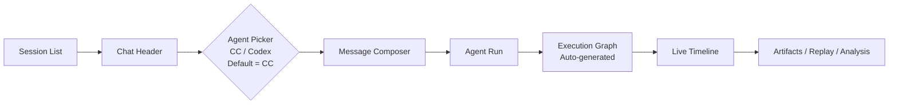

# 30-前端信息架构

## Purpose
定义 CLAW GUI 如何承载聊天主轴和自动执行治理视图，并把可观测与调优能力纳入日常工作流。

## Scope
本文件定义导航、一级工作区、关键用户路径和信息组织方式。
本文件不定义具体视觉设计、组件库或交互像素稿。

## Actors / Owners
- Owner: Frontend
- Readers: 前端、产品、架构

## Inputs / Outputs
- Inputs: Session、Execution Graph、SpecAsset、ReplayDocument、AnalysisReport
- Outputs: 一级导航、工作区结构、用户操作路径

## Core Concepts
- `Chat Axis`: 用自然语言发起、续写、纠偏。
- `Execution Graph Surface`: 从聊天 turn 与 AgentOS 执行自动生成的治理视图，用来查看、调整、拆分和合并任务。
- `Evidence Panels`: 日志、时间线、回放、冲突、文件变化。
- `Spec Panels`: workflow、skills、prompts、policies 的版本视图。
- `Agent Picker`: 聊天界面中的互斥代理选择器，选项仅为 `Claude Code` 与 `Codex`
- `Primary Interactive Agent`: 当前聊天会话绑定的交互主代理

## Behavior / Flow
一级导航采用聊天优先、治理按需展开：

| Axis | Primary Job |
|---|---|
| `Chat` | 发起需求、接管执行、追问结果 |
| `Execution Graph` | 看自动生成的任务关系、Worker 状态、递归拆分和合并 |

辅助工作区：
- `Live Timeline`
- `Files / Diffs`
- `Replay`
- `Analysis`
- `Spec Assets`
- `Conflicts`

建议布局：
- 左侧: Session / Task Tree
- 中央: Chat
- 右侧: Timeline / Details / Conflicts
- 右侧或菜单展开: Execution Graph
- 底部抽屉: Files / Events / Artifacts

聊天主轴布局：

聊天交互规则：
- 聊天界面中的 `Claude Code / Codex` 为二选一，不允许同时激活
- 默认选中 `Claude Code`
- 当前聊天会话始终绑定一个 `Primary Interactive Agent`
- 用户默认只通过聊天输入工作；不要求先手工创建任务节点
- 若需要多 Agent 协作，应在 `Execution Graph` 中治理，而不是在聊天输入框并列发给多个代理
- `Agent Picker` 的选择变化需要形成前端事件，供回放与诊断消费

## Interfaces / Types
前端核心视图模型：
- `SessionViewModel`
- `TaskGraphViewModel`
- `WorkerRunViewModel`
- `TimelineViewModel`
- `ArtifactViewModel`
- `AgentPickerViewModel`

## Failure Modes
- 如果执行治理视图要求用户先手工录入节点，会破坏 chat-first 主路径。
- 如果只有聊天没有执行图，复杂任务会失去可视化编排能力。
- 如果只有任务图没有聊天，用户接管和快速纠偏成本会过高。

## Observability
- 前端操作本身也要形成事件:
  - tab switch
  - task expand/collapse
  - approval decision
  - replay open

## Open Questions / ADR Links
- 具体 UI 组件和状态管理选型由实现阶段决定，不在本文件锁死。
