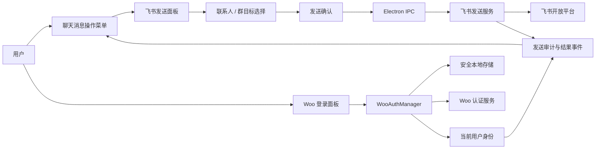

# 本周技术方案：飞书协作、聊天列表、Claude Agent SDK 与 Woo 接入

## 1. 背景与目标

本周围绕 `tech-cc-hub` 从本机 AI 开发客户端向公司内部 AI 工作台演进，完成协作触达、聊天体验、运行时稳定性和企业身份基础能力的收口。

本周目标：

1. 用户可将聊天中的指定消息发送到飞书个人或群。
2. 聊天列表在更多会话、更长标题和更窄窗口下保持可扫描、可操作。
3. 完成 Claude Agent SDK 的升级调研、兼容性适配和回归验证闭环。
4. 完善 Woo 账号体系在桌面端的登录、会话恢复、身份展示和调用归属。
5. 完成 Woo 元数据能力的可接入性调研，为后续 Woo MCP 和后台能力接入建立边界。

## 2. 范围、非目标与交付优先级

### 2.1 本周范围

| 优先级 | 工作项 | 本周交付结果 |
|---|---|---|
| P0 | 聊天消息发送飞书 | 支持发送至个人或群、明确确认、可观测结果与失败提示 |
| P0 | Claude Agent SDK 升级适配 | 固化已升级版本的兼容矩阵、适配改动与 Electron 回归结果 |
| P0 | Woo 账号体系 | 登录、恢复、退出、身份归属与敏感令牌存储链路稳定 |
| P1 | 聊天列表 UI | 高密度会话列表、长文本与窄窗口适配、窗口级 QA |
| P1 | Woo 元数据接入准备 | 基于已完成调研固化接口分层、权限边界、代理契约与后续接入建议 |

### 2.2 本周非目标

- 不建设飞书消息双向同步、群内机器人对话或消息历史拉取。
- 不支持由 Agent 自动向飞书外发消息；所有外发必须由用户在 UI 中显式触发确认。
- 不在本周直接修改 Woo 后台配置、写入生产数据或开放 Woo MCP 高风险操作。
- 不将聊天列表改造成独立任务管理系统；仅改善当前 Session 导航与状态可见性。
- 不在未完成 SDK 兼容矩阵和回归前，将依赖升级直接作为默认发布版本。

## 3. 总体架构与安全边界



### 3.1 基本原则

- **用户发起、显式确认**：飞书外发属于不可逆的外部动作，发送前必须展示目标、正文摘要和附件数量，并要求用户确认。
- **最小权限**：仅申请联系人检索、群信息读取和消息发送所需的飞书用户权限；缺失授权时给出可执行的授权指引。
- **不泄露凭据**：Woo access token、refresh token 和飞书用户令牌不得进入聊天正文、日志正文、诊断截图或渲染进程持久化状态。
- **审计可追溯**：审计记录仅保存必要元数据，包括发起 Woo 用户、飞书目标类型与标识、消息摘要哈希、发送时间、结果和错误分类。
- **主进程执行**：涉及令牌、外部 HTTP 请求和审计落库的操作均在 Electron 主进程执行；渲染进程只发起受类型约束的 IPC 请求并展示脱敏结果。

## 4. 方案一：聊天消息一键发送到飞书个人或群

### 4.1 用户流程

1. 用户在 assistant 或 user 聊天消息的操作菜单中点击“发送到飞书”。
2. 系统提取可发送内容，打开发送面板；默认使用消息的纯文本和 Markdown 表示。
3. 用户搜索联系人或群聊，选择一个目标；可在面板中预览目标名称、头像和消息摘要。
4. 用户点击“发送”，系统展示最终确认信息：目标、内容摘要、是否有附件。
5. 主进程执行发送并返回成功、失败或需重新授权状态。
6. UI 在原消息附近展示一次性结果，不重放完整消息内容；失败时提供重试或重新授权入口。

### 4.2 已有接收对象组件与授权设计

现有 `LarkMessageShareDialog` 已接入消息操作菜单，按“人员 / 群聊”标签搜索可见目标，并通过 `lark-cli` 使用当前登录用户身份发送。当前方案不重复建设目标选择组件，只在其现有契约上扩展发送载荷和确认信息。

| 能力 | 已有实现与本周约束 |
|---|---|
| 个人目标 | 已通过 `searchLarkContacts` 搜索并选择 `ou_` 开头的 `openId`；不支持手动输入 ID，避免向不可验证的对象外发 |
| 群目标 | 已通过 `im +chat-search` 搜索并选择 `oc_` 开头的 `chatId`；保留外部群聊标识，发送前需明确展示 |
| 权限缺失 | 已提供失败提示和“Agent 辅助申请权限”入口；按现有 `lark-cli` 用户授权流程补齐权限 |
| 令牌来源 | 复用已有 `lark-cli` 用户授权与受控运行时环境；不在 UI 输入或保存飞书 token |
| 目标缓存 | 本周不新增本地目标缓存；每次搜索以当前授权用户的实时可见结果为准 |

### 4.3 消息、图片、文件与代码块策略

- 本周范围包含文本、Markdown、代码块、图片和文件，不能以“暂不支持”静默降级或丢弃附件。
- 现有文本发送使用飞书 `post` 消息；代码块、列表、链接继续保留 Markdown 语义，无法映射的样式退化为可读纯文本。
- 图片与文件沿用已有 Lark channel bridge 的 `sendImage`、`sendFile` 主进程能力，发送前校验本地文件路径、存在性、MIME/大小限制和可访问范围；禁止由渲染进程直接上传。
- 发送面板必须按消息实际内容展示文本摘要、代码块数量、图片数量和文件清单；任一载荷不支持或上传失败时整体阻止确认，并逐项说明原因。
- 单次发送仍只允许一个联系人或群；多目标转发留待后续版本，避免误发扩大影响。
- 文本、图片和文件共用一次用户确认与关联请求 ID；每个实际飞书投递使用幂等键，重试前明确提示可能产生重复消息。

### 4.4 IPC 与审计接口

在既有 `sendLarkShareMessage` 基础上扩展为受类型约束的主进程能力：

```ts
type FeishuSendTarget =
  | { kind: "user"; id: string; displayName: string }
  | { kind: "group"; id: string; displayName: string };

type FeishuShareAttachment = {
  kind: "image" | "file";
  sourcePath: string;
  displayName: string;
  mimeType?: string;
  sizeBytes: number;
};

type SendFeishuMessageInput = {
  requestId: string;
  sourceMessageId: string;
  target: FeishuSendTarget;
  content: { format: "markdown" | "text"; text: string };
  attachments: FeishuShareAttachment[];
};

type SendFeishuMessageResult = {
  status: "sent" | "authorization_required" | "failed";
  deliveryId?: string;
  attachmentDeliveryIds?: string[];
  errorCode?: string;
  message?: string;
};
```

审计字段：`requestId`、`sourceMessageId`、Woo 用户稳定标识、飞书目标类型、目标稳定标识、内容摘要哈希、发起时间、完成时间、结果、错误码。审计不保存 access token、refresh token 和完整敏感正文。

### 4.5 验收标准

- 可从一条聊天消息打开飞书发送面板。
- 可使用现有组件搜索并选择一个个人或群聊目标，不提供手动输入收件人 ID 的旁路。
- 文本、代码块、图片和文件均可在确认面板中被完整识别；图片/文件不支持或校验失败时不静默丢失。
- 未确认时不发生任何外发请求。
- 确认后按文本与附件投递结果关联 UI、请求 ID 和审计记录。
- 授权失效、权限不足、网络失败、文件不可读和平台拒绝均有可理解的提示与可恢复路径。
- Electron 真窗口验证个人与群两条路径；至少覆盖纯文本、代码块、图片、文件、取消、授权缺失和失败重试。

## 5. 方案二：聊天列表 UI 适配与信息密度优化

### 5.1 目标

在不改变“workspace-first sidebar”架构的前提下，提升多会话场景的扫描效率，避免标题截断、活动状态丢失和窄窗口操作不可达。

### 5.2 布局规则

| 场景 | 规则 |
|---|---|
| 常规宽度 | 显示会话标题、最后活动时间、运行状态和必要的上下文标识 |
| 长标题 | 标题最多两行；保留 tooltip 或详情入口显示全量文本；不以无意义省略号替代唯一识别信息 |
| 多会话 | 按最近活动优先；固定当前会话可见；分组折叠时保留未读或运行中计数 |
| 窄窗口 | 优先保留标题与状态；次级元信息隐藏到详情或 hover，不挤压主操作区 |
| 运行中 | 使用非颜色唯一的状态表达，例如文本、图标与 aria 标签组合 |
| 空状态 | 只展示当前可执行的创建会话入口，不展示未接入能力的占位宣传 |

### 5.3 性能与可访问性

- 列表项使用稳定 key，避免流式消息更新导致整列重渲染。
- 会话数量较大时引入分页、窗口化或分组懒加载的评估门槛；本周先通过性能基准确认是否需要实施。
- 键盘可聚焦、当前项可识别、状态变化可被辅助技术读取。
- UI 改动必须读取并遵循 `DESIGN.md`，且以 Electron 真窗口截图而非仅浏览器页面作为最终视觉验收。

### 5.4 验收标准

- 覆盖 0、10、50+ 会话及超长标题数据。
- 覆盖侧栏展开、折叠和窄窗口尺寸。
- 当前会话、运行中会话、失败会话和普通历史会话状态可区分。
- `npx tsc --noEmit` 通过，且完成 Electron 窗口级截图比对与键盘导航验证。

## 6. 方案三：Claude Agent SDK 升级与适配

### 6.1 当前基线与适配目标

Claude Agent SDK 已完成较新版本升级；当前仓库固定版本为 `@anthropic-ai/claude-agent-sdk` `0.3.214`。本周工作不是再次选型或升级依赖，而是补齐升级后的适配说明、受影响行为核验与 Electron 回归证据。

1. 以锁定的 `0.3.214` 及当前 lockfile 作为唯一基线，整理已发生的导出类型、消息事件、权限协议、MCP、插件、会话恢复和工具调用适配。
2. 对照当前运行时实现补齐缺失的兼容说明和回归用例，避免将已完成升级重新描述为待决策事项。
3. 若后续再升版本，单独建立升级任务；不将新版本选择混入本周文档交付。

### 6.2 兼容性检查矩阵

| 领域 | 核查项 | 验收证据 |
|---|---|---|
| 类型与构建 | `SDKMessage`、权限类型、上下文用量类型、query/options 导出是否兼容 | TypeScript 编译通过，无不安全 `any` 扩散 |
| 流式消息 | 文本、thinking、工具调用、工具结果、错误与结束事件 | 聊天主路径 smoke 与事件快照 |
| 权限 | 主进程确认、插件授权、拒绝与恢复流程 | 权限接受/拒绝回归 |
| 会话 | 新建、续聊、取消、恢复、历史回放 | `qa:continue` 与会话数据一致性 |
| MCP 与插件 | 工具发现、调用、失败显示、授权边界 | 至少一个已配置 MCP 和插件回归 |
| 上下文与指标 | token、TTFT、耗时、上下文用量展示 | 右侧指标与 SDK 实际事件一致 |
| Electron 打包 | 主进程构建、原生依赖、首次启动与深链 | `transpile:electron`、打包或真窗口 smoke |

### 6.3 回归命令

最小回归集合：

```sh
npm run transpile:electron
npm run build
npm run qa:smoke
npm run qa:continue
npm run qa:slash
npm run qa:chat-ui
```

需要根据实际改动补充 MCP、插件权限和 Woo 登录相关 Electron 验证。

## 7. 方案四：Woo 账号体系接入完善

### 7.1 现有能力与本周补齐点

当前已具备密码、邮箱验证码、第三方浏览器登录、深链回调、登录状态 IPC 以及基于 Electron `safeStorage` 的本地会话存储。本周补齐重点为：

- 登录后的身份在 UI、Agent 调用审计和 Woo 受控能力中使用同一稳定标识。
- access token 到期、refresh token 失效和用户禁用时的状态收敛与安全退出。
- 首次安装、运行时缺少 Woo 配置和浏览器登录超时的可恢复提示。
- 不把 Woo 凭据暴露给渲染进程、聊天消息、技能提示词或普通应用日志。

### 7.2 身份与授权模型

| 对象 | 责任 |
|---|---|
| WooAuthManager | 获取、刷新、清除会话；只在主进程持有令牌明文 |
| 安全存储 | 使用 Electron `safeStorage` 加密保存本地会话；读取失败时视为会话不可用并清理 |
| 渲染进程 | 只接收匿名状态、脱敏用户资料、可用登录方式与可展示错误 |
| Agent / MCP 调用层 | 获取受控的调用身份上下文，记录用户稳定标识；不直接拿到长期令牌 |
| 审计层 | 记录身份、行为、目标服务、结果和风险标识，不记录密钥和完整敏感载荷 |

### 7.3 验收标准

- 新装应用可读取默认 Woo 登录配置并进入登录流程。
- 密码、邮箱验证码和第三方登录能力按服务端配置显隐。
- 应用重启后有效会话可恢复；不可恢复会话清理后回到匿名状态。
- 退出登录后本地会话失效，UI 和受控调用身份同步更新。
- Woo 配置缺失、网络错误、过期与账号不可用均有明确、非敏感的错误提示。

## 8. 方案五：Woo 元数据调研结论与接入准备

### 8.1 已完成调研与权威材料

Woo 元数据与账号接口已完成静态源码盘点，结论以以下材料为准：

- `.tmp/woo-api-inventory/woo-interface-全量接口对接文档.md`：基于 Woo `main` 分支提交 `3411f06ef3667d458a0c701f64277f599c871045` 的 43 个 Controller、94 条路由盘点。
- `.tmp/woo-api-inventory/woo-账号体系实施契约.md`：明确 Woo 是唯一身份与权限权威来源，以及 Electron 的安全接入边界。
- `.tmp/woo-api-inventory/woo-api-index.json`：可用于后续生成受控接口清单的机器可读索引。

调研已确认：公共 `v1` 层适合账号体系；元数据、字典、任务和审计能力位于 `internal` 与 `manage` 层，不能直接暴露给 Electron 渲染进程或 LLM。

### 8.2 已确认的元数据接口分层

| 层级 | 已确认能力 | 本周接入结论 |
|---|---|---|
| `v1` | 认证、当前用户、健康、操作日志 | 作为 Woo 登录与会话恢复唯一首选 |
| `internal` | 元数据实体同步、仓库同步、字典条目、记录版本、用户与权限信息 | 仅可经主进程最小化代理或受控服务端调用；先确认 client token、网络与审计要求 |
| `manage` | 元数据仓库/文件夹/实体/字段/索引、字典、模板、任务与变更记录 | 作为后台管理与元数据查询候选；首期不向渲染进程透传写接口 |
| `main` | 旧版 `/account/*` 账号接口 | 仅迁移兼容参考，新功能不再接入 |

可优先准备的只读元数据能力为：仓库目录（`/manage/metadata/repository/list`）、实体目录/详情（`/manage/metadata/entity/list`、`/manage/metadata/entity/detail`）与字典配置/条目查询（`/manage/dict/dict/list`、受控的字典条目接口）。实际调用前仍须确认目标环境的授权和网关策略。

### 8.3 本周接入准备工作

1. 将 Woo 接口索引纳入受控开发资料，禁止把 `internal/*`、`manage/*` 或 `sso/*` 变成任意 URL/任意 Header 的 IPC 代理。
2. 为后续只读元数据能力定义主进程 DTO、字段脱敏规则、用户/项目隔离键、超时、分页与审计记录。
3. 以 Woo `universalUserId`、项目 ID 与权限快照作为所有元数据查询的前置条件；无项目关系、未知权限或接口失败时默认拒绝。
4. 保持“查询”和“修改”两套权限面独立；本周不启用元数据写入、同步或后台配置变更。

### 8.4 缓存与安全建议

- 仓库和实体目录使用短时缓存，按 Woo 用户、项目与环境隔离。
- 低频字段、枚举和配置目录可采用版本或 ETag 驱动缓存；展示时标注数据更新时间。
- 敏感字段默认不进入 LLM 上下文；确有业务需要时，采用字段级脱敏、最小范围检索和用户可见说明。
- Woo 项目密钥、client secret、access token 与 refresh token 只存在于主进程安全存储或受控服务端配置中。

### 8.5 本周交付标准

- 现有 Woo 接口盘点、账号实施契约和 JSON 索引被作为后续接入的唯一资料基线。
- 输出元数据 API 分层、只读优先级与主进程代理边界，不重复开展全量接口调研。
- 在拿到目标环境授权、网络与审计要求前，不实现对 `internal`、`manage` 或 `sso` 接口的生产调用。
- 下一迭代优先验证三个只读能力：仓库目录、实体目录/详情、字典目录/条目。

## 9. 实施顺序、依赖与风险

### 9.1 推荐顺序

1. 固化 Woo 身份与会话边界，确保所有后续外部调用可归属。
2. 在现有飞书收件人选择组件上补齐文本、代码块、图片、文件、确认与审计链路。
3. 基于当前 SDK `0.3.214` 完成已升级版本的兼容矩阵与受影响路径回归。
4. 完成聊天列表 UI 优化和 Electron 窗口级验证。
5. 复用已完成的 Woo 接口盘点，先定义元数据只读代理契约，再按授权条件推进接入。

### 9.2 主要风险与控制

| 风险 | 影响 | 控制措施 |
|---|---|---|
| 飞书用户授权 scope 不足 | 无法搜索目标或发送消息 | 在发送前做能力探测；将授权缺失作为结构化状态处理 |
| 外发误操作 | 造成信息泄露或重复通知 | 单目标、二次确认、内容预览、请求 ID 与审计 |
| SDK 事件语义变更 | 聊天流、权限或指标显示异常 | 先建兼容矩阵，按主路径、权限、续聊、MCP 分层回归 |
| Woo token 生命周期不一致 | 登录状态漂移或调用失败 | 主进程集中管理、刷新失败即安全降级为匿名状态 |
| Woo 元数据包含敏感字段 | 进入模型上下文后扩散 | 字段分级、默认脱敏、用户身份隔离、只读先行 |
| 列表 UI 只在浏览器可用 | Electron 下布局或交互失真 | 以 Electron 真窗口截图与 smoke 作为关门验证 |

## 10. 本周验收清单

- [ ] 飞书：复用既有消息菜单与人员/群聊选择组件，补齐发送确认、结果提示和审计链路。
- [ ] 飞书：个人与群的纯文本、代码块、图片、文件、取消、授权缺失和失败重试场景验证完成。
- [ ] 聊天列表：多会话、长标题、运行状态、窄窗口和键盘访问验证完成。
- [ ] SDK：已锁定的 `0.3.214` 对应的适配说明、构建和主聊天回归通过。
- [ ] SDK：续聊、权限、MCP/插件、指标展示完成受影响项验证。
- [ ] Woo：登录、恢复、退出、过期处理和身份归属验证完成。
- [ ] Woo 元数据：已完成接口盘点的基础上，形成只读代理 DTO、权限边界与下一迭代验证顺序。
- [ ] 所有 UI 改动均通过 Electron 真窗口验收；所有外部动作均有用户确认与脱敏审计。
