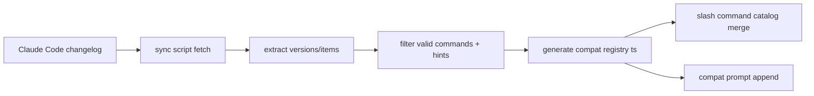
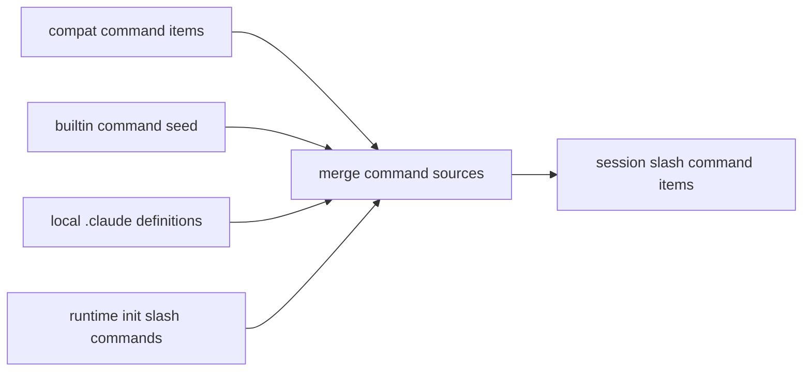
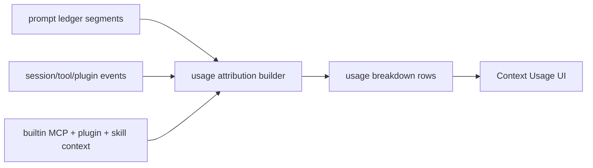
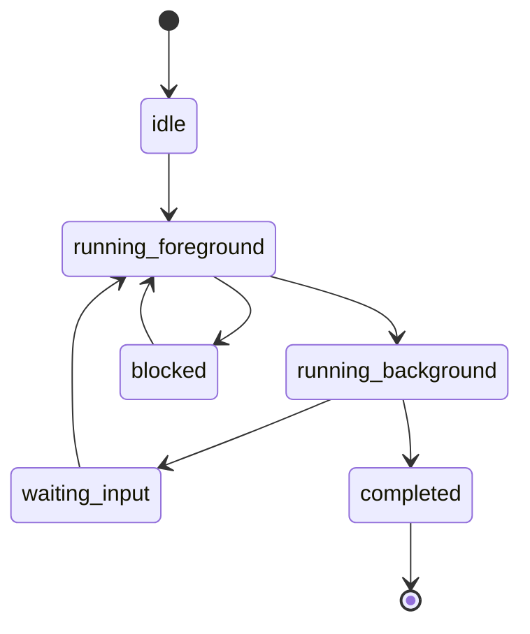

# Claude Code 兼容升级 Spec

## Purpose

定义 `tech-cc-hub` 如何在现有 Claude Agent SDK 执行主链路上，持续吸收 Claude Code 新版本的用户可见能力，而不重做 Claude Code CLI 自身的底层运行时。

本 spec 以 Claude Code `2.1.149` 为当前兼容目标版本。

## Scope

本 spec 约束以下模块：

- changelog -> compat registry 的生成链路
- Claude Code 内置命令面与兼容命令面
- compat prompt/preset 注入
- usage breakdown 来源归因与展示
- agent/background session 语义建模
- plugin details 元数据聚合与展示

本 spec 不约束：

- Claude SDK 外部 provider 路由
- Browser/Figma/CodeGraph 功能细节
- Claude Code CLI 的系统级 daemon 管理

## Actors / Owners

- Owner: `tech-cc-hub Core`
- Reader: Electron runtime maintainer
- Reader: UI maintainer
- Reader: QA / release maintainer

## Inputs / Outputs

### Inputs

- Claude Code changelog 页面内容
- `@anthropic-ai/claude-agent-sdk` 暴露的本地类型与 query 选项
- 本地 `.claude` 命令/skills 定义
- 会话消息、prompt ledger、plugin 安装信息

### Outputs

- `claude-code-compat-registry.ts`
- 会话 slash command 集合
- compat preset 文本
- usage breakdown view model
- session semantic state
- plugin detail view model

## Core Concepts

### Compat Registry

由脚本生成的静态兼容种子，包含：

- `sourceUrl`
- `sourceVersion`
- `sourceDate`
- `generatedAt`
- `commandItems`
- `promptHints`

### Builtin Command Seed

仓库维护的稳定命令种子，用于覆盖 changelog 未明确列出的内置命令，并在 app 首次渲染时提供默认命令面。

### Compat Prompt

由 registry 驱动的兼容提示块，用于提醒运行时当前 Claude Code 版本的关键语义变化。

### Usage Attribution

对上下文/使用量按来源进行归因，而不仅仅按 prompt ledger 文本段落切分。

### Session Semantics

面向 app 的会话状态建模，强调：

- foreground / background
- blocked / waiting-input / completed
- model / effort / permissionMode continuity

### Plugin Detail Model

面向设置页与检查面板的插件详情聚合模型。

## Behavior / Flow

### 1. Compat Sync Flow



规则：

- 版本块必须按 `2.1.x` 提取
- command item 仅允许真实 slash command 或显式兼容概念
- prompt hint 必须是稳定、对用户可见、对 app 有映射意义的提示

### 2. Slash Command Surface Flow



优先级：

1. compat registry 先提供版本修正语义
2. local definitions 可补描述
3. builtin seed 兜底
4. runtime init messages 只补缺项

### 3. Usage Breakdown Flow



规则：

- 分类优先展示用户可理解来源
- 无法精确归因时保留 `unattributed`
- 不能将估算值伪装成精确底账

### 4. Background Session Flow



规则：

- background 是会话呈现语义，不等于必须存在独立 OS daemon
- `resume` 必须保留关键运行参数
- blocker 状态必须对 UI 可见

## Interfaces / Types

### Compat Registry

```ts
type ClaudeCodeCompatRegistry = {
  sourceUrl: string;
  sourceVersion: string;
  sourceDate: string;
  generatedAt: string;
  commandItems: SlashCommandItem[];
  promptHints: string[];
};
```

### Usage Breakdown Category

```ts
type UsageSourceCategory =
  | "system"
  | "project"
  | "skill"
  | "history"
  | "current"
  | "attachment"
  | "tool"
  | "plugin"
  | "mcp"
  | "subagent"
  | "unattributed";
```

```ts
type UsageBreakdownRow = {
  id: string;
  label: string;
  tokens: number;
  category: UsageSourceCategory;
  estimated: boolean;
  sourceIds?: string[];
  fallbackDetail?: string;
};
```

### Session Semantic State

```ts
type SessionExecutionMode = "foreground" | "background";

type SessionSemanticStatus =
  | "idle"
  | "running"
  | "blocked"
  | "waiting_input"
  | "completed"
  | "error";

type SessionSemanticState = {
  sessionId: string;
  executionMode: SessionExecutionMode;
  status: SessionSemanticStatus;
  model?: string;
  effort?: string;
  permissionMode?: string;
  blockerSummary?: string;
};
```

### Plugin Detail View Model

```ts
type PluginDetailModel = {
  id: string;
  source: "local" | "remote" | "unknown";
  version?: string;
  status: "enabled" | "disabled" | "broken" | "unknown";
  authMode?: string;
  mcpServers: string[];
  lspServers: string[];
  toolNames: string[];
  projectedTokenImpact?: string;
  installPath?: string;
};
```

## Functional Requirements

### FR-1 Compat Registry Must Be Refreshable

- 兼容脚本必须能从 changelog 刷新出最新 registry
- parser 必须过滤误抓命令
- registry 必须记录来源版本

### FR-2 Command Surface Must Match Current Claude Code Semantics

- 新命令名必须出现在默认命令面中
- 旧命令 alias 可保留，但不能成为主命名
- 兼容命令与本地 `.claude` 命令可共存

### FR-3 Compat Prompt Must Be Version-Agnostic In Code

- preset 函数名与 label 不得绑定单个历史版本号
- prompt 标题必须由 registry 驱动

### FR-4 Usage Breakdown Must Support Source-Level Attribution

- 除 prompt ledger 外，还必须能按来源分类展示
- 至少支持：skill、plugin、MCP、subagent、system
- 不精确项必须显式标注

### FR-5 Background Session Must Be Visible As A First-Class App State

- app 必须区分 foreground/background
- 背景会话的 blocker / waiting-input / completed 必须可见
- resume 后应保留 model / effort / permissionMode

### FR-6 Plugin Details Must Expose Operationally Useful Metadata

- 必须能看到 source / status / MCP servers
- 应尽量补齐 version / auth / LSP / tool names / token impact

## Non-Goals

- 不模拟 Claude Code TUI
- 不实现 Claude CLI 的进程 pin / idle GC 策略
- 不追求与 Claude Code `/usage` 完全同源的精确计费账本

## Failure Modes

### Parser Over-Capture

问题：

- changelog 中普通文本被误识别为命令

处理：

- 使用有效命令模式过滤
- 用测试锁定真实样本

### Semantic Drift

问题：

- app 误把 CLI 内部行为当作产品语义强行复刻

处理：

- 只实现用户可见语义层
- 在 spec 中明确非目标

### Ambiguous Usage Attribution

问题：

- 某些 token 来源无法可靠分摊

处理：

- 允许 `unattributed`
- UI 上显示估算语义

## Observability

必须可观测：

- compat registry 当前版本
- sync 脚本生成时间
- slash command 合并后的总数
- usage breakdown 是否含 unattributed bucket
- background session 数量与状态分布
- plugin detail 聚合失败次数

建议记录：

- registry refresh log
- parser filter 命中数
- session semantic transition events

## Test Strategy

### Unit

- changelog parser 提取与过滤
- slash command 合并逻辑
- compat preset 标题与内容
- usage breakdown 归因函数
- plugin detail 聚合函数
- session semantic reducer / mapper

### Integration

- registry -> slash catalog -> session command items
- runner state -> activity rail usage summary
- plugin config -> settings page model

### UI

- ActivityRail usage breakdown 展示
- Plugin details 展示
- background session 状态展示

## TDD Checklist

- [x] 为 sync parser 增加失败测试，再改脚本
- [x] 为 slash command 新旧命名增加失败测试，再改 seed
- [x] 为 compat preset 去 `2139` 命名增加失败测试，再改实现
- [x] 为 usage breakdown 来源分类增加失败测试，再改 builder
- [x] 为 background session 语义增加失败测试，再改 state
- [x] 为 plugin details 元数据增加失败测试，再改聚合逻辑

## Acceptance Criteria

- [x] registry 目标版本更新到 `2.1.149`
- [x] 不再生成明显误抓命令
- [x] `2139` 专用 preset 命名被移除
- [x] `/code-review` 与 `/usage-credits` 成为主命名
- [x] usage breakdown 至少出现一个非 prompt-ledger 的来源分类
- [x] background session 在 app 内可见并保留关键参数
- [x] plugin details 显示的元数据明显多于当前实现
- [x] 相关单测与回归测试通过

## Implementation Status

2026-05-28 当前实现已完成 Track 1-6 的主体功能：

- compat sync 已抽出可测 parser / registry renderer，并锁定 Electron-safe shared import path。
- slash command surface 已对齐 `/code-review`、`/usage-credits`，旧命名保留兼容。
- compat prompt 已改为 registry 驱动，不再绑定 `2139` 命名。
- ActivityRail usage 面板已增加 source attribution / source drivers，支持 skill、plugin、MCP、subagent、system 和 unattributed。
- session semantics 已支持 foreground/background、waiting-input/blocker/completed，以及 model / effort / permissionMode 连续性。
- plugin details 已聚合 source、version、status、MCP servers、tool names、auth mode、LSP servers、projected token impact，并在设置页只读展示。

已验证：

- `npm run transpile:electron`
- `npm run build`
- touched-files `eslint`
- focused regression: `claude-code-compat-sync`、`slash-commands`、`system-prompt-presets`、`context-usage-breakdown`、`activity-rail-model`、`session-semantics`、`session-runtime-controls`、`claude-code-plugins`、`plugin-updates`、`sidebar-workspace-drawer`

已知验证限制：

- 全仓 `npm run lint` 仍被 `.tmp/`、`.worktrees/` 和既有未清理文件阻塞，不代表本次触及文件失败。
- `session-archive` 运行时测试被本地 `better-sqlite3` Node ABI 不匹配阻塞；源码和构建已通过。

## Open Questions

- token 来源归因是否要落到持久化事件层，而不是只做 UI 级推导
- `/usage` 视图是否需要单独页面，而不是仅挂在 ActivityRail
- background session 是否需要单独 session list / drawer 入口
