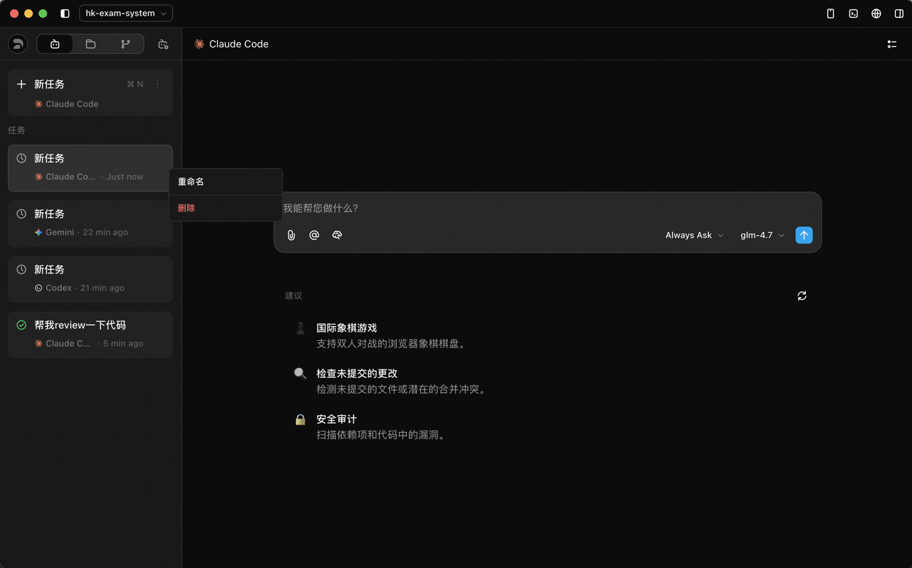
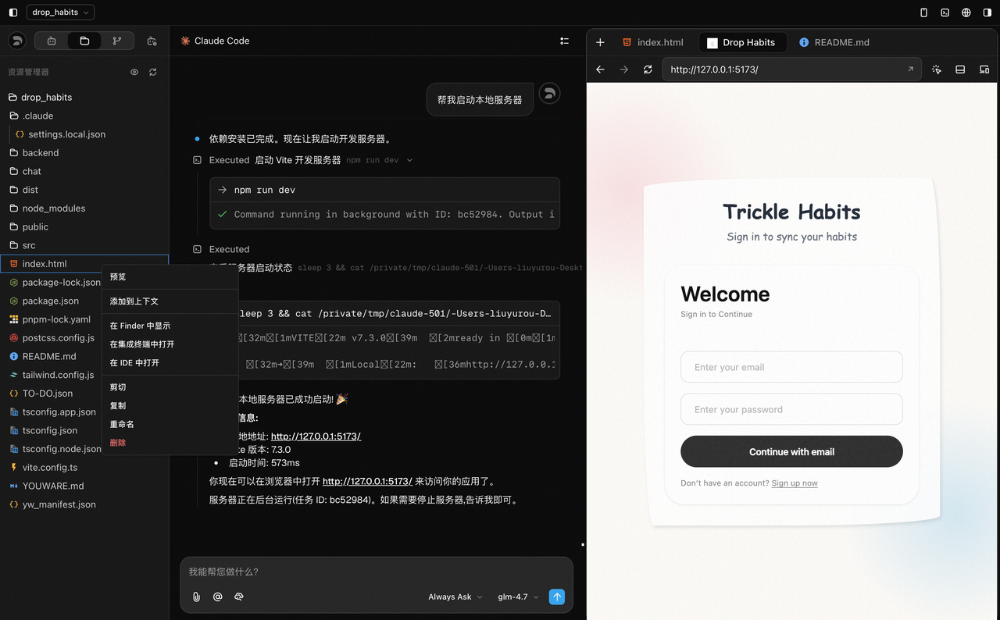
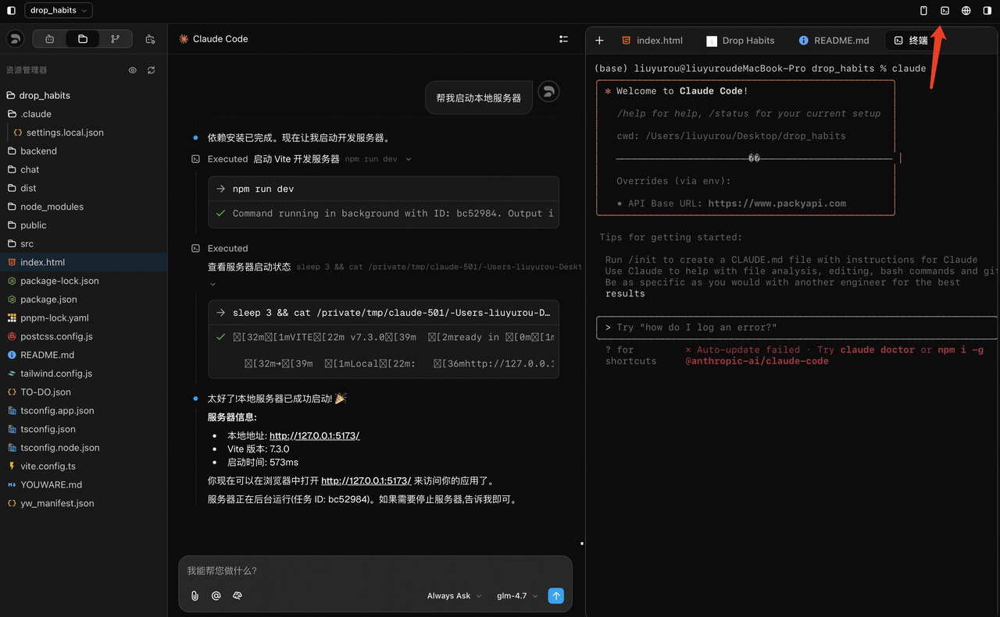
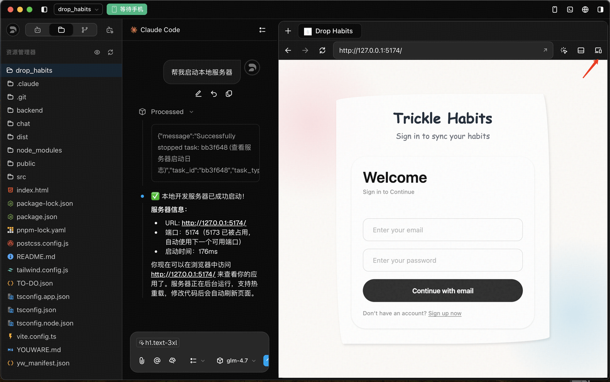
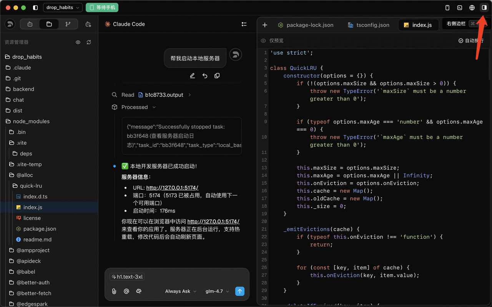

# 03-竞品功能点PRD

## Purpose
把 Z Code 官方文档中的功能结构、交互方式和能力边界整理成一份可执行的产品 PRD，作为我们后续对标实现、排期拆分和页面设计的统一依据。

更细的单功能拆解已经下沉到 [17-竞品功能拆解索引](./10-requirements/17-%E7%AB%9E%E5%93%81%E5%8A%9F%E8%83%BD%E6%8B%86%E8%A7%A3/00-%E7%AB%9E%E5%93%81%E5%8A%9F%E8%83%BD%E7%B4%A2%E5%BC%95.md)，这里保留能力总览和优先级判断。

## Scope
本文件聚焦于 **Agent 能力层** 和 **执行可观测层** 的产品化拆解，同时保留竞品的工作台、插件、命令、Skill、Memory、MCP、历史回放等能力参考。

明确说明:
- 本文件的主要目标不是复刻全部 UI，而是沉淀可实现的功能点和优先级
- `安全操作确认` 和 `移动端远程开发` 作为竞品完整性信息保留，但不作为当前主线
- `执行可观测层` 是我们当前最优先对齐的模块

## Inputs / Outputs
- Inputs:
  - 竞品官方文档入口
  - 竞品文档子页面内容
  - 我们当前产品方向约束
- Outputs:
  - 竞品能力地图
  - 功能点清单
  - 优先级拆分
  - 可直接进入开发的 PRD 条目

## Source Registry
### 原始入口
- 官方文档入口: `https://zhipu-ai.feishu.cn/wiki/Qr2SwyBsTiSlaYkqBECcxCWnn4c`

### 文档顺序
1. `功能介绍`
2. `CLI支持`
3. `Agent 问答交互`
4. `编辑历史对话`
5. `安全操作确认`
6. `版本管理`
7. `智能体开发环境工具`
8. `Agents`
9. `/ command`
10. `Plugin 支持`
11. `Skill支持`
12. `Memory支持`
13. `MCP服务`
14. `Output Style`
15. `快捷键表`
16. `移动端远程开发`
17. `SSH 远程连接支持（Beta）`

## Product Thesis
Z Code 的产品不是单纯聊天，而是把一个可配置的 Agent 工作台做完整:
- 对话输入是入口
- Agent 配置是控制面
- 插件 / Skill / Memory / MCP 是能力扩展面
- 历史编辑与版本回放是可控性保障
- 文件 / Git / 终端 / 浏览器 / 右侧边栏是执行面
- Output Style / CLI 支持 / Agents 是专业化能力面

对我们来说，最值得优先抄的不是“远程控制”或“安全确认”，而是:
- 模型与行为控制
- 可复用指令资产
- 可插拔能力
- 历史可回放
- 工具调用可观察

## Screenshot Appendix
### SA-01 任务管理器与会话列表

**观察点**
- 左侧是任务级会话列表，不是单一聊天流
- 每个任务卡片都承载模型、时间和状态信息
- 任务支持重命名、删除和切换
- 中央输入区仍然是主任务入口，列表只是导航层

**我们要吸收的能力**
- 工作区 / 会话 / 任务三级组织
- 任务最近活跃态
- 任务级别快速重命名与删除
- 中央执行区与左侧导航区解耦

### SA-02 文件管理器与预览区

**观察点**
- 左侧是完整项目文件树
- 文件操作与对话上下文直接联动
- 右侧可以承载 HTML / Markdown / 代码预览
- 预览和对话并列，而不是单独开新页面

**我们要吸收的能力**
- 文件树浏览
- 文件预览 / Diff / 外部打开
- 文件上下文一键注入
- 右侧边栏承接执行相关的辅助视图

### SA-03 浏览器元素选择

**观察点**
- 预览面板内置元素选择器
- 页面元素会直接显示标签、类名、尺寸
- 浏览器和编辑器处于一个连贯工作流里
- 前端修改后可以立即在预览区验证

**我们要吸收的能力**
- 内嵌浏览器
- 元素高亮
- 视口切换
- 前端调试联动

### SA-04 浏览器预览与调试

**观察点**
- 有真实浏览器导航能力
- 能在同一界面完成预览、调试、检查页面状态
- 不是“截图式展示”，而是交互式预览

**我们要吸收的能力**
- 可交互预览
- 页面状态联动
- 调试信息可见

### SA-05 侧栏文件预览

**观察点**
- 右侧边栏支持多标签
- 终端 / 预览 / 文件信息可以共存
- 右栏本身就是一个执行工作区

**我们要吸收的能力**
- 右栏多标签
- 预览、终端、详情统一承载
- 信息高密度、可切换、不中断主流程

### SA-06 移动端远程开发

**观察点**
- 通过二维码或地址连接桌面会话
- 属于完整性功能，不是产品核心主线

**我们当前态度**
- 保留参考
- 不进入当前主线

### SA-07 安全操作确认
**观察点**
- 高风险操作会触发确认
- 允许 / 拒绝 / 始终允许是核心分叉点

**我们当前态度**
- 作为竞品完整性保留
- 不作为当前主线投入

## Capability Gap Matrix
这部分专门记录“竞品有、我们还没有或只有局部”的功能点，后续可以直接转成开发 backlog。

| Competitor Capability | What It Actually Solves | Our Current State | Gap Size | Integration Direction | Priority |
|---|---|---|---|---|---|
| `Agent 选择器` | 把“谁在执行”显式化 | 有执行主线，但缺完整 Agent 池 | High | 做成顶部控制条 + 侧栏管理 | P0 |
| `模型切换` | 把“用什么脑子”显式化 | 需要更稳定的状态表达 | High | 输入区一级入口，不能藏深层设置 | P0 |
| `思考模式` | 平衡速度与质量 | 缺少产品级状态表达 | Medium | 轻量开关，不做复杂心智 | P0 |
| `文件上下文` | 把资料直接带入任务 | 可能有局部支持，缺统一入口 | High | 附件 / @ / 最近文件 / 目录树四入口 | P0 |
| `/Command` | 把重复提示词资产化 | 当前没有完整命令系统 | High | 命令库 + 补全 + 执行历史 | P0 |
| `Skill` | 把方法论沉淀成可复用行为 | 当前缺正式管理面 | High | Skill 库、范围、启用状态、内容预览 | P0 |
| `Memory` | 把项目规范固化 | 缺自动加载与可编辑入口 | High | `.md` 记忆文件 + UI 编辑器 | P0 |
| `MCP` | 把外部工具接入 Agent | 缺统一服务管理层 | High | 服务列表、启用、说明、配置、授权 | P0 |
| `历史编辑` | 改历史节点并重跑 | 当前偏一次性执行 | High | 编辑并重发 + 回滚到节点 | P0 |
| `版本管理` | 让每次输出都可回退 | 我们已有执行轨迹方向，但需更产品化 | High | 自动检查点 + diff + undo + restore | P0 |
| `任务管理器` | 把会话组织成任务资产 | 需要和 session 模型更强绑定 | Medium | 任务/会话/工作区三级映射 | P0 |
| `文件管理器` | 提供完整项目树 | 当前更偏执行结果 | High | 工作台左栏固定文件树 | P1 |
| `终端面板` | 直接执行本地命令 | 需要独立操作面 | High | 右栏或底栏终端面板 | P1 |
| `Git 提交` | 版本控制可视化 | 需要独立 diff/commit 面板 | High | Git 面板 + 差异视图 | P1 |
| `网页浏览器` | 前端实时预览和调试 | 当前以分析为主，缺完整预览面 | High | 预览、元素选取、视口、调试 | P1 |
| `Plugin` | 外部能力市场化 | 当前没有市场化模型 | Medium | 先做能力目录，再做安装市场 | P1 |
| `Output Style` | 控制表达风格 | 当前统一表达偏强 | Medium | 预设风格先行，自定义后置 | P1 |
| `CLI 支持` | 面向高级用户的命令工具链 | 需要更明确的工具入口 | Medium | 高级模式 / 工具选择器 | P1 |
| `快捷键` | 提升高频操作效率 | 不是核心差异点 | Low | 作为完整性补充即可 | P2 |
| `安全确认` | 降低高风险误操作 | 当前不是主线 | Low | 预留接口，不抢首版资源 | P2 |
| `远程开发` | 移动端控制桌面会话 | 明确不做 | Low | 仅作长期参考 | P3 |

### Gap Interpretation
如果只看对我们最有价值的部分，优先级应该这样排:
1. `Agent 选择器 + 模型切换 + 思考模式`
2. `Command + Skill + Memory + MCP`
3. `历史编辑 + 版本管理`
4. `文件上下文 + 任务管理器`
5. `文件管理器 + 终端 + Git + 浏览器`
6. `Plugin + CLI + Output Style`

这意味着我们真正应该先做的是“可控、可复用、可回放”的 Agent workbench，而不是先把外部控制能力做重。

## Functional Areas
### FA-01 任务入口与模型选择
**对标页**: `功能介绍`, `CLI支持`, `Agent 问答交互`

**目标**
让用户在一次提问时就能明确选择模型、运行方式和执行风格，减少“先建任务再操作”的额外心智负担。

**功能点**
- 提问框支持直接发起任务
- 支持切换 AI 模型
- 支持根据任务难度切换 CLI 工具 / 模型组合
- 支持不同 Output Style 或 Agent 类型的入口选择

**交互要求**
- 模型选择必须能在输入前快速切换
- 高级能力不应隐藏在深层设置里
- 当前选择状态必须在输入区显式展示

**优先级**
- `P0`

**验收标准**
1. 用户能在同一输入框里完成提问、模型选择和执行提交。
1. 切换模型后，下一次执行会明确使用新模型。
1. 页面上能看见当前任务的模型和执行模式状态。

---

### FA-02 提示词增强
**对标页**: `功能介绍`

**目标**
系统自动为用户输入补齐上下文、约束和输出格式，让 Agent 更稳定地理解任务。

**功能点**
- 自动补充任务上下文
- 自动补充格式要求
- 自动补充必要的限制条件

**交互要求**
- 用户不需要手工编排复杂 prompt
- 用户应能感知增强后的提示词已被系统处理

**优先级**
- `P0`

**验收标准**
1. 系统会在提交前对输入做增强处理。
1. 增强内容可追溯。
1. 用户可以在需要时查看系统补充了什么。

---

### FA-03 文件上下文引入
**对标页**: `功能介绍`

**目标**
让文件和目录快速进入对话上下文，提升 Agent 对项目的定位效率。

**功能点**
- 附件按钮支持选取本地文件
- `@` 输入支持选择项目内文件
- 支持图片、代码、普通文件等上下文类型

**交互要求**
- 选择文件不应打断主任务流
- 文件上下文必须在输入区可见

**优先级**
- `P0`

**验收标准**
1. 用户可以通过附件或 `@` 引入上下文。
1. 引入后，文件在当前任务中可被 Agent 读取。
1. 上下文来源在任务记录中可回溯。

---

### FA-04 思考模式
**对标页**: `功能介绍`

**目标**
在速度和质量之间提供显式开关。

**功能点**
- 开启 / 关闭思考模式
- 开启时执行前进行额外规划
- 关闭时追求快速响应

**交互要求**
- 状态开关必须直观
- 用户可随时切换

**优先级**
- `P0`

**验收标准**
1. 用户能看到思考模式是否开启。
1. 开启后，任务会先进入规划再执行。
1. 关闭后，系统以最快响应为主。

---

### FA-05 Agent 权限模式
**对标页**: `功能介绍`, `安全操作确认`

**目标**
控制 Agent 的自动化程度。

**竞品能力**
- Always Ask
- Accept Edits
- Plan Mode
- Bypass Permissions

**我们的态度**
- 作为竞品能力保留
- 当前不作为主线重点
- 可降级为轻量提示或环境配置项

**优先级**
- `P2`

**验收标准**
1. 能在产品层表达不同权限模式。
1. 不同模式对文件编辑、命令执行、网络访问有不同约束。
1. 默认模式应能满足大多数日常任务。

---

### FA-06 Agents 体系
**对标页**: `Agents`

**目标**
把不同职责的 AI 助手从单一对话里拆出来，形成可复用、可路由的 Agent 池。

**功能点**
- 内置 Agent 列表
- 支持用户级、项目级、自定义 Agent
- 每个 Agent 有独立上下文、系统提示和工具权限
- 支持按任务自动路由到合适 Agent

**竞品内置 Agent 示例**
- bug-analyzer
- code-reviewer
- dev-planner
- story-generator
- ui-sketcher

**我们的落地建议**
- 先做“角色选择 + 预设配置”
- 后做“自动路由”

**优先级**
- `P0`

**验收标准**
1. 用户能查看和切换 Agent。
1. 每个 Agent 的说明、模型和能力边界清晰可见。
1. 项目内可复用 Agent 配置。

---

### FA-07 /Command 体系
**对标页**: `/ command`

**目标**
把常用复杂提示词变成一键命令，提升重复任务效率。

**功能点**
- `/命令名` 调用命令
- 支持用户级命令目录自动读取
- 支持创建 / 编辑 / 删除命令
- 命令字段至少包括 Name、Prompt

**交互要求**
- 命令应在输入时可被发现
- 命令执行结果可回溯

**优先级**
- `P0`

**验收标准**
1. 用户可以通过 `/xxx` 直接触发命令。
1. 命令配置可保存并复用。
1. 命令入口对重复工作有明确提效。

---

### FA-08 Skill 支持
**对标页**: `Skill支持`

**目标**
用 Markdown 方式描述行为规范，让 Agent 按团队标准工作。

**功能点**
- 支持 User Skill
- 支持 Project Skill
- 支持 Plugin Skill
- 支持技能元数据 + Markdown 指令内容
- 支持自动匹配和手动选择

**交互要求**
- Skill 必须能查看、编辑、启用 / 禁用
- 触发时需明确提示用户

**优先级**
- `P0`

**验收标准**
1. 用户能创建可复用 Skill。
1. Skill 可以影响 Agent 的工作方式。
1. 不同范围的 Skill 有明确优先级。

---

### FA-09 Memory 支持
**对标页**: `Memory支持`

**目标**
把项目约定写进项目级记忆文件，减少重复解释。

**功能点**
- 自动加载项目根目录 Memory
- 支持 `/Init` 创建
- 支持在界面中编辑现有 Memory
- 支持 Markdown 格式

**交互要求**
- Memory 内容需在启动时自动生效
- 用户要能感知当前项目有哪些约束

**优先级**
- `P0`

**验收标准**
1. 项目打开时会自动读取 Memory。
1. 用户可创建和修改 Memory。
1. Memory 能影响后续对话与生成结果。

---

### FA-10 MCP 服务
**对标页**: `MCP服务`

**目标**
把外部工具能力接入到 Agent 流程中。

**功能点**
- 内置 MCP 市场或配置入口
- 支持自定义 MCP
- 支持视觉理解 MCP、联网搜索 MCP、网页读取 MCP 等
- 支持启用 / 关闭 MCP 服务

**交互要求**
- MCP 服务状态必须可见
- 每个服务的用途要能被快速理解

**优先级**
- `P0`

**验收标准**
1. 用户可以查看可用 MCP 列表。
1. 用户可以启用或配置某个 MCP。
1. Agent 能通过 MCP 完成扩展工具调用。

---

### FA-11 Plugin 支持
**对标页**: `Plugin 支持`

**目标**
通过插件市场扩展能力，包括外部服务集成和工作流定制。

**功能点**
- Discover / Marketplace / Installed 三个主要区域
- 支持官方市场和自定义市场
- 支持安装、启用、禁用、卸载
- 支持按范围安装: User / Project / Local

**交互要求**
- 插件应能按范围分组
- 插件详情要能快速理解功能和边界

**优先级**
- `P1`

**验收标准**
1. 用户可以浏览和安装插件。
1. 安装后的插件能在启动时自动生效。
1. 插件能显式区分范围与作用域。

---

### FA-12 CLI 支持
**对标页**: `CLI支持`

**目标**
允许用户在应用中配置和使用不同的命令行 AI 工具。

**功能点**
- 支持多款 CLI 工具
- 支持在创建任务时选择 CLI 工具和模型
- 支持不同任务难度下的工具切换

**优先级**
- `P1`

**验收标准**
1. 用户可以看到可用 CLI 工具列表。
1. 任务创建时可选择目标 CLI。
1. 选择结果会影响后续执行。

---

### FA-13 Output Style
**对标页**: `Output Style`

**目标**
让 Agent 的输出风格可配置，适配不同角色和场景。

**功能点**
- 内置多种 Output Style
- 支持 Default / Explanatory / Learning / Coding Vibes / Structural Thinking
- 可在配置面板中切换或自定义

**交互要求**
- 风格切换不应影响核心执行能力
- 风格应主要影响表达方式和交互策略

**优先级**
- `P1`

**验收标准**
1. 用户可以选择不同输出风格。
1. 风格变化能体现在回答语气和结构上。
1. 核心编码能力保持不变。

---

### FA-14 编辑历史对话
**对标页**: `编辑历史对话`

**目标**
允许用户修改历史消息并重新执行，形成新的分支式交互时间线。

**功能点**
- 编辑历史消息
- 替换 prompt、附件、模型、权限模式
- 重新发送后回滚后续状态

**交互要求**
- 编辑后要明确提示会影响后续内容
- 回滚和重发应是强可见操作

**优先级**
- `P0`

**验收标准**
1. 用户可以编辑任意历史节点。
1. 编辑后能从该节点重新分支执行。
1. 后续变更和消息可被明确回滚。

---

### FA-15 版本管理
**对标页**: `版本管理`

**目标**
把 Agent 产生的文件修改自动映射成版本时间线。

**功能点**
- 自动创建检查点
- Review changes 查看 diff
- Undo 撤销最近变更
- Restore Checkpoint 回到更早节点

**交互要求**
- 版本回退必须与对话消息强关联
- diff 视图要支持多文件

**优先级**
- `P0`

**验收标准**
1. 每轮 Agent 修改都会形成可回溯检查点。
1. 用户可以查看本轮 diff。
1. 用户可以撤销最近一轮或回到历史节点。

---

### FA-16 工作台工具集
**对标页**: `智能体开发环境工具`

**目标**
把文件、Git、终端、浏览器和侧边栏统一成开发工作台。

**功能点**
- 任务管理器
- 文件管理器
- Git 提交面板
- 命令行面板
- 内置网页浏览器
- 右侧边栏文件预览区

**交互要求**
- 工具入口要随任务上下文联动
- 右侧栏应偏高密度预览，不是普通聊天

**优先级**
- `P1`

**验收标准**
1. 用户能在一个窗口内完成文件、Git、终端、预览操作。
1. 任务与工具状态能互相联动。
1. 侧栏支持文件预览和多标签切换。

---

### FA-17 快捷键表
**对标页**: `快捷键表`

**目标**
让高频操作不依赖鼠标。

**功能点**
- 窗口操作快捷键
- 输入框快捷键
- 模式切换快捷键

**优先级**
- `P2`

**验收标准**
1. 常用操作有明确快捷键。
1. 快捷键与面板状态一致。
1. 文档中能查到完整快捷键表。

---

### FA-18 安全操作确认
**对标页**: `安全操作确认`

**目标**
为高风险动作提供人工确认。

**我们的态度**
- 竞品有
- 当前不是主线优先级
- 可以后置为轻量审计或环境控制项

**优先级**
- `P2`

**验收标准**
1. 若启用，系统能在高风险操作前中断并确认。
1. 能区分允许、拒绝、始终允许。

---

### FA-19 移动端远程开发
**对标页**: `移动端远程开发`, `SSH 远程连接支持（Beta）`

**目标**
让移动设备控制桌面或远程开发会话。

**我们的态度**
- 保留为竞品参考
- 不进入当前主线

**优先级**
- `P3`

**验收标准**
1. 能从官方文档中识别其远程控制形态。
1. 当前 PRD 不要求实现。

## Recommended Delivery Priority
### P0
- 任务入口与模型选择
- 提示词增强
- 文件上下文引入
- 思考模式
- Agents 体系
- /Command 体系
- Skill 支持
- Memory 支持
- MCP 服务
- 编辑历史对话
- 版本管理

### P1
- Plugin 支持
- CLI 支持
- Output Style
- 工作台工具集

### P2
- 权限模式
- 安全操作确认
- 快捷键表

### P3
- 移动端远程开发
- SSH 远程连接支持（Beta）

## Product Decisions For Us
我们基于这份竞品拆解，当前产品不优先做的部分:
- 远程开发
- 强安全拦截
- 高成本的移动端控制链路

我们优先要做的部分:
- Agent 能力层
- 执行可观测层
- 历史编辑和版本回放
- 工具与上下文的可组合能力

## Fine-Grained Integration Backlog
### FB-01 Agent 能力层
把竞品的输入区做成我们自己的控制面，至少包括:
- 当前 Agent 名称
- 当前模型
- 当前输出风格
- 当前思考模式
- 当前执行身份或模式
- 当前上下文来源
- 当前任务标题
- 快速切换入口

### FB-02 可复用资产层
把一次性提示词和习惯动作做成长期资产:
- `/Command` 管理
- Skill 创建、编辑、启用、禁用
- Memory 文件自动加载
- Memory 编辑器
- 资产来源范围标识
- 资产预览与生效说明

### FB-03 外部能力层
把工具接入统一管理，而不是散落在流程里:
- MCP 服务列表
- MCP 启用 / 停用
- MCP 配置说明
- Plugin 市场
- CLI 工具选择
- 工具使用边界说明

### FB-04 时间线层
把历史执行变成可编辑、可分支、可回放的时间线:
- 编辑历史对话
- 改写 prompt
- 替换附件
- 切换模型
- 切换模式
- 重新发送生成新分支
- 检查点自动记录
- diff 视图

### FB-05 工作台层
把执行动作收拢到一个窗口里:
- 任务管理器
- 文件树
- 终端
- Git
- 浏览器
- 右侧边栏
- 文件预览
- 节点详情
- 执行分析

### FB-06 执行可观测层
把竞品页面里的“看得见”变成我们的主产品信号:
- 任务步骤
- 原子节点
- 工具输入 / 输出
- 运行指标
- 节点详情抽屉
- 上下文分布
- 任务级与节点级切换
- 详情与原始内容折叠

### FB-07 折叠式优先级
这部分最适合拆进我们的迭代:
- 第 1 层: Agent 能力层
- 第 2 层: 可复用资产层
- 第 3 层: 时间线层
- 第 4 层: 工作台层
- 第 5 层: 外部能力层

## Detailed Acceptance Expansion
### A-01 输入区状态要素
输入区必须同时表达:
- 当前 Agent
- 当前模型
- 当前输出风格
- 当前思考模式
- 当前上下文来源
- 当前执行模式
- 当前任务标题

### A-02 命令资产要求
每条命令至少应有:
- 唯一名称
- 说明
- Prompt 正文
- 提示信息
- 可见范围
- 启用状态

### A-03 Skill 资产要求
每条 Skill 至少应有:
- 名称
- 描述
- 来源类型
- Markdown 内容
- 生效范围
- 是否启用
- 是否可编辑

### A-04 Memory 要求
Memory 至少应有:
- 路径
- 自动加载状态
- 可编辑入口
- 最近更新时间
- 文档内容预览

### A-05 MCP / Plugin 要求
每个外部能力至少应展示:
- 名称
- 类型
- 作用
- 状态
- 配置入口
- 适用场景

### A-06 历史与版本要求
历史编辑和版本管理必须支持:
- 按消息回退
- 按检查点回退
- 当前分支与历史分支区分
- diff 可视化
- 变更摘要

### A-07 执行可观测层要求
右侧执行分析至少需要:
- 任务步骤
- 原子节点
- 工具输入
- 工具输出
- 运行指标
- 节点详情抽屉
- 上下文分布

## Suggested Data Model
### AgentConfig
- `id`
- `name`
- `description`
- `model`
- `style`
- `scope`
- `enabled`

### CommandConfig
- `name`
- `prompt`
- `description`
- `hint`
- `scope`

### SkillConfig
- `name`
- `description`
- `source`
- `enabled`
- `content`

### MemoryDoc
- `path`
- `content`
- `last_loaded_at`

### ExecutionCheckpoint
- `checkpoint_id`
- `turn_id`
- `diff_summary`
- `created_at`

### ToolCallRecord
- `tool_name`
- `input`
- `output`
- `status`
- `cost`
- `duration_ms`

## Acceptance Summary
如果我们要把这份竞品 PRD 变成自己的实现目标，最低应满足以下验收:
1. 用户能直接发起任务并控制模型、风格、上下文与思考模式。
1. Agent 的能力可通过 Agent / Command / Skill / Memory / MCP 组合扩展。
1. 每次执行都有可回放的历史和版本检查点。
1. 文件、Git、终端和浏览器是执行工作台的一部分，而不是额外页面。
1. 右侧必须承载“执行分析”，而不是只做聊天补充。

## Open Questions
- 我们是否将 `权限模式` 降级为仅显示状态，不提供复杂配置入口?
- `Plugin` 与 `MCP` 是否在产品里合并成一个“工具市场”入口?
- `Output Style` 是否只保留少量预设，还是允许用户自定义?
- `版本管理` 是否要与我们当前的执行轨迹模型完全对齐?
