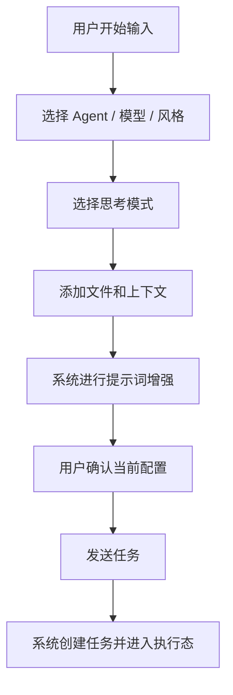

# 01-输入区与任务发起

## Goal
把输入区从“消息输入框”升级为“任务发起控制台”，让用户在一次发送前就能完成任务配置、上下文组织和执行模式确认。

## Problem
普通聊天输入框只能承载文本，但 Agent 产品的真实执行前置条件远不止文本。用户在发起一次任务时，实际同时在决定：
- 由谁执行
- 用什么模型执行
- 是否需要更深思考
- 是否附带文件和上下文
- 期待什么回答风格

如果这些状态隐藏得太深，用户会感觉 Agent “要么太黑盒，要么太啰嗦”，而不是一个可控的工作台。

## User Story
- 作为高频开发者，我希望在发送前就配置好 Agent、模型、风格和上下文，这样我不用先发一句话再四处补配置。
- 作为复杂任务执行者，我希望任务开始前就能看到当前运行状态，这样我知道这次执行是快模式、深思考模式还是某个专业 Agent。
- 作为回溯用户，我希望输入区配置会进入任务历史，这样以后回看时能知道当时是怎么发起的。

## In Scope
- 主输入框
- Agent 选择
- 模型选择
- 输出风格选择
- 思考模式开关
- 上下文附件区
- `/command` 触发入口
- `@文件` 入口
- 任务发送与发送后标题生成

## Out Of Scope
- 任务执行后的详细可观测层
- 任务回放和历史编辑
- 插件市场和工具市场管理页

## Primary Flow

## UI Composition
- `主输入区`
  负责输入自然语言、触发 `/command`、展示当前文本内容。
- `配置条`
  展示当前 Agent、模型、风格、思考模式、上下文数量。
- `上下文区`
  展示已挂载的文件、图片、目录、命令来源等。
- `发送控制区`
  负责提交任务、显示当前是否可发送、是否缺少必需信息。

## Required States
- `idle`
  空白状态，尚未输入任务。
- `drafting`
  已输入文本，但未完成配置。
- `configured`
  Agent / 模型 / 风格 / 模式已选定。
- `has_context`
  已挂载上下文文件或附件。
- `ready_to_send`
  满足发送条件，可提交。
- `running`
  已提交，任务正在执行。
- `blocked`
  因配置冲突、缺失信息或外部限制暂时不能继续。

## Interaction Rules
1. 切换 Agent 时，不应清空已输入文本。
1. 切换模型时，应保留已有上下文和命令内容。
1. 切换输出风格时，只影响表达策略，不应重置任务内容。
1. 切换思考模式时，应即时更新配置条中的状态。
1. 增加附件时，输入区应折叠显示上下文 chip，而不是把主输入挤没。
1. 输入 `/` 时，应优先弹出命令建议，而不是普通输入补全。
1. 输入 `@` 时，应优先弹出文件选择器。
1. 发送后，当前配置必须写入任务元数据，供后续详情页和时间线使用。

## Edge Cases
- 当附件过多时，输入区必须进入折叠态，只显示数量和关键项。
- 当模型不支持多模态但用户加了图片时，应显示能力边界提示。
- 当 Agent 与模型组合不兼容时，应提示降级或自动切换默认模型。
- 当用户切换到另一会话再切回来时，未发送草稿应保留。
- 当命令注入的 Prompt 很长时，输入区应显示“来自命令”的摘要，而不是全部展开。

## Data To Persist
- `task_id`
- `draft_text`
- `selected_agent_id`
- `selected_model_id`
- `selected_output_style`
- `thinking_mode`
- `context_items`
- `command_source`
- `created_at`

## Telemetry
- `composer_focused`
- `composer_agent_changed`
- `composer_model_changed`
- `composer_style_changed`
- `composer_thinking_toggled`
- `composer_context_added`
- `composer_context_removed`
- `composer_command_invoked`
- `task_submitted`

## Related Screenshot
- [任务管理器](../../assets/zcode-competitor/01-task-manager.png)

## Acceptance
1. 用户无需离开输入区即可完成一次任务配置。
1. 当前 Agent、模型、风格、思考模式、上下文数量在发送前可见。
1. 输入内容不会因切换 Agent、模型、风格而丢失。
1. 上下文和命令来源会进入任务元数据。
1. 当模型能力和上下文类型冲突时，界面能明确提示。
