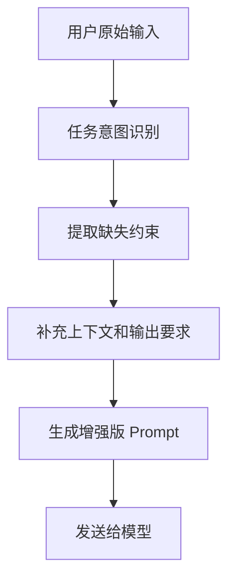

# 02-提示词增强

## Goal
用系统级增强补齐用户没写全的上下文、输出要求和执行约束，让 Agent 在不增加用户心智负担的前提下提高命中率。

## Problem
用户往往只描述目标，不会完整描述边界、输出格式、环境条件和依赖关系。没有增强时，模型容易：
- 理解偏题
- 输出结构不稳定
- 忽略重要约束
- 重复向用户追问

## User Story
- 作为普通用户，我希望一句话也能得到较稳定的执行结果。
- 作为高频用户，我希望系统自动补我懒得写但又很重要的上下文。
- 作为可回溯用户，我希望知道模型实际收到的 prompt 长什么样。

## Scope
- 任务背景补全
- 输出格式补全
- 角色与语气补全
- 环境约束补全
- 上下文摘要注入
- 最终 prompt 可查看

## Flow

## Detail
- 增强应优先补充任务目标、交付物格式、上下文边界和执行约束。
- 增强逻辑应根据任务类型差异化处理，例如解释型问题和执行型任务不能共用完全相同模板。
- 当上下文来自文件、命令或 Memory 时，增强逻辑应优先引用这些来源，而不是重复编造新约束。

## Rules
1. 不应把原始输入改写到失去用户语义。
1. 当原始输入已经足够完整时，不应继续冗长增强。
1. 增强内容应可追溯到来源，例如来自 Memory、Skill 或系统默认策略。

## Edge Cases
- 无法判断意图时，应退回最轻增强版本。
- 当增强后 token 成本过高时，应先压缩上下文摘要。
- 多个来源冲突时，应优先显示冲突提示，而不是静默拼接。

## Telemetry
- `prompt_enhancement_started`
- `prompt_enhancement_completed`
- `prompt_enhancement_fallback`
- `prompt_enhancement_preview_opened`

## Acceptance
1. 系统会在提交前执行增强逻辑。
1. 用户可以查看最终送入模型的版本。
1. 增强后的 prompt 不会明显拖慢主流程。

