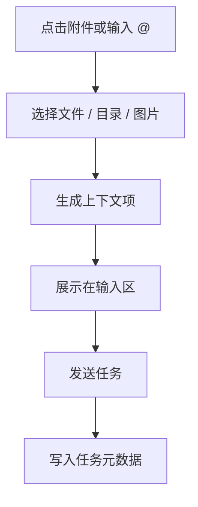

# 03-文件上下文与附件

## Goal
让本地文件、项目文件、图片和目录以低摩擦方式进入任务上下文，缩短 Agent 的定位路径。

## Problem
没有文件上下文时，用户需要手动描述路径、内容和关系，效率低且容易遗漏。竞品通过附件和 `@` 文件两种入口，把“找文件”和“发任务”合成了一个动作。

## User Story
- 作为开发者，我希望把某个文件直接拖进任务，而不是手写路径。
- 作为前端开发者，我希望附图之后模型知道我要说的是页面哪一块。
- 作为复盘用户，我希望知道一次任务到底引用了哪些文件。

## Scope
- 本地附件
- 项目内文件选择
- 图片上下文
- 目录级上下文
- 上下文摘要显示
- 上下文来源追踪

## Flow

## Detail
- 附件按钮适合本地文件和图片。
- `@` 更适合项目内文件和目录选择。
- 每个上下文项至少应显示名称、来源、类型和摘要。
- 多个上下文项同时存在时，输入区应进入折叠态而不是纵向撑开。

## State Model
- `empty`
- `adding`
- `ready`
- `overflow`
- `invalid`
- `removed`

## Interaction Rules
1. 上下文项应支持单独移除。
1. 同名文件必须带路径。
1. 图片上下文应提示模型能力边界。
1. 目录上下文应展示“目录摘要”而不是全部文件清单。

## Edge Cases
- 超大文件必须被截断或只取摘要。
- 不可读文件必须提示权限或编码问题。
- 多个同类上下文过多时应提示成本上升。

## Data To Persist
- `context_id`
- `context_type`
- `context_name`
- `context_source`
- `context_path`
- `context_summary`

## Related Screenshot
- [文件管理器与预览](../../assets/zcode-competitor/02-file-preview.png)

## Acceptance
1. 用户能通过附件或 `@` 快速挂上下文。
1. 上下文在输入区可见、可删、可替换。
1. 上下文来源在任务历史里可回溯。

