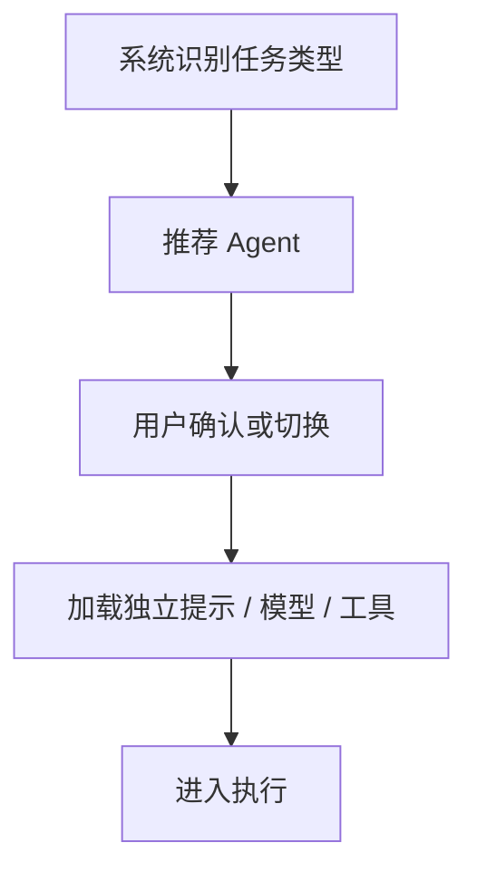

# 05-Agents体系

## Goal
把不同职责的 AI 助手做成可复用、可路由、可配置的 Agent 池。

## Problem
一个统一大模型很难在产品层解释“为什么这次像调试专家、下一次像规划专家”。竞品把角色显式抽成 Agent，降低了黑盒感，也提高了复用度。

## User Story
- 作为开发者，我希望复杂调试任务交给更擅长调试的 Agent。
- 作为团队成员，我希望自定义 Agent 能跨项目复用。
- 作为产品用户，我希望知道当前是谁在执行，而不是笼统地“AI 正在工作”。

## Scope
- 内置 Agent
- 用户级 Agent
- 项目级 Agent
- 自定义 Agent
- Agent 描述、模型、提示、工具边界展示
- Agent 推荐和手动切换

## Flow

## Detail
- 每个 Agent 应展示唯一标识、描述、推荐场景、默认模型、工具权限和来源范围。
- 需要支持内置 Agent 和用户自定义 Agent 共存。
- 当前阶段可先做手动选择，自动路由作为增强。

## State Model
- `available`
- `selected`
- `recommended`
- `custom`
- `disabled`

## Interaction Rules
1. 切换 Agent 不应清空草稿。
1. 当前 Agent 必须在输入区可见。
1. 同名 Agent 必须按来源区分。

## Edge Cases
- 当前模型不兼容 Agent 能力边界时需提示降级。
- 项目级 Agent 缺失时要能回退到默认 Agent。

## Telemetry
- `agent_picker_opened`
- `agent_selected`
- `agent_switched`
- `agent_recommended`

## Acceptance
1. 用户可查看并切换 Agent。
1. Agent 的用途、范围、能力边界清晰可见。
1. 项目内可保存和复用 Agent 配置。

