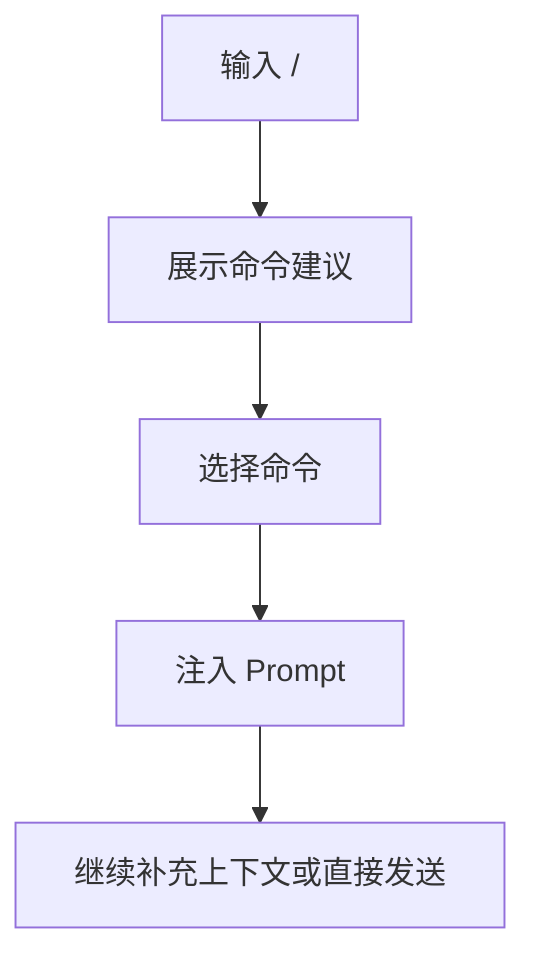

# 06-Command体系

## Goal
把重复性的复杂 prompt 做成可调用命令资产。

## Problem
高频任务会不断重复相似 prompt。没有命令系统时，用户要么反复输入，要么依赖外部笔记，不够产品化。

## Scope
- `/` 命令触发
- 命令自动补全
- 命令元数据
- 命令维护
- 命令来源范围

## Flow

## Required Fields
- `name`
- `prompt`
- `description`
- `hint`
- `scope`
- `enabled`

## Detail
- 命令建议应按最近使用、名称匹配和范围优先级排序。
- 命令执行后需要在任务元数据中记录来源，方便回溯。
- 命令不应只是一段文本插入，还应是可管理资产。

## Edge Cases
- 空匹配时要有空状态。
- 长 Prompt 要摘要显示。
- 同名命令按范围区分。

## Acceptance
1. 输入 `/` 可发现命令。
1. 命令可保存、修改、删除。
1. 命令来源会写入任务元数据。

