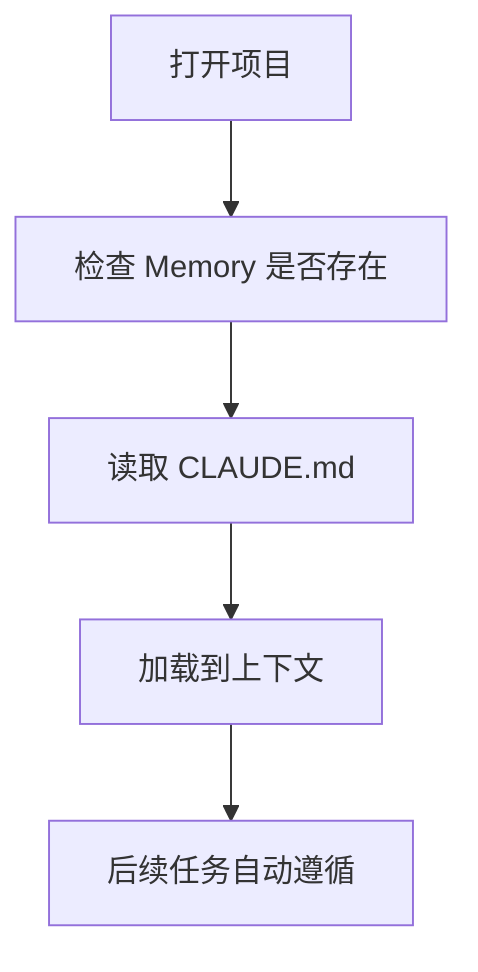

# 08-Memory支持

## Goal
让项目规范、目录约定和常见操作以项目级 Memory 形式自动进入上下文。

## Problem
项目知识如果不进入上下文，就要靠用户每次重复解释。竞品把 `CLAUDE.md` 产品化，本质是在解决“项目记忆如何稳定存在”。

## Scope
- 自动加载 Memory
- `/Init` 创建 Memory
- 编辑和保存 Memory
- 展示路径和更新时间
- Memory 生效反馈

## Flow

## Required Fields
- `path`
- `content`
- `scope`
- `last_loaded_at`
- `last_modified_at`

## Detail
- Memory 与 Skill 的区别在于：Memory 是项目持久背景，Skill 是任务级方法论。
- Memory 要支持最小可见性，让用户知道“当前项目已经加载了哪些规则”。
- 保存后至少要在下一轮任务生效。

## Edge Cases
- 文件缺失时应提供初始化入口。
- 文件过长时应提供摘要视图。
- 路径冲突时应明确优先位置。

## Acceptance
1. 项目打开时会自动检查并加载 Memory。
1. 用户可创建、编辑、保存 Memory。
1. Memory 会影响后续对话和生成结果。

