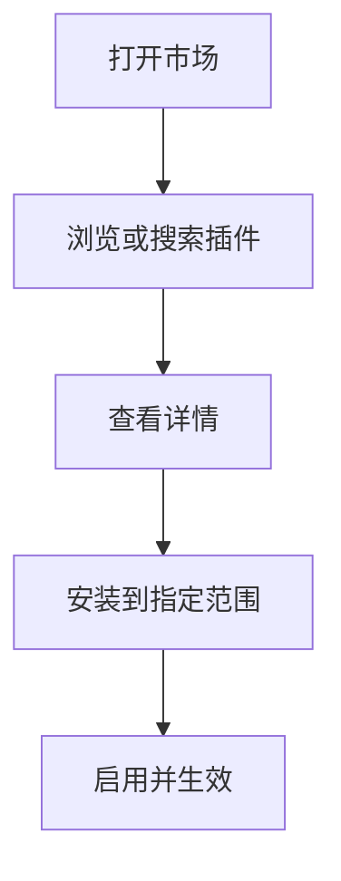

# 10-Plugin支持

## Goal
通过插件市场扩展 Agent 工作台的能力边界。

## Problem
Plugin 解决的是“还能接什么能力”，而 Skill 解决的是“如何做”。没有插件层，能力扩展只能靠内置实现，成长性很差。

## Scope
- 市场浏览
- 插件安装
- 插件启用 / 禁用
- 插件卸载
- 插件范围管理
- 插件详情页

## Flow

## Range Model
- `User`
- `Project`
- `Local`

## Detail
- 最少要有 Discover、Marketplace、Installed 三个视图。
- 插件详情要说明用途、依赖、范围和状态。
- 已安装插件应支持临时禁用，而不是只有卸载。

## Edge Cases
- 私有市场或私有仓库需要认证时要明确提示。
- 缺失依赖时应能看到安装前置条件。

## Acceptance
1. 用户能浏览和安装插件。
1. 用户能按范围管理插件。
1. 插件状态和用途在界面中清晰可见。

