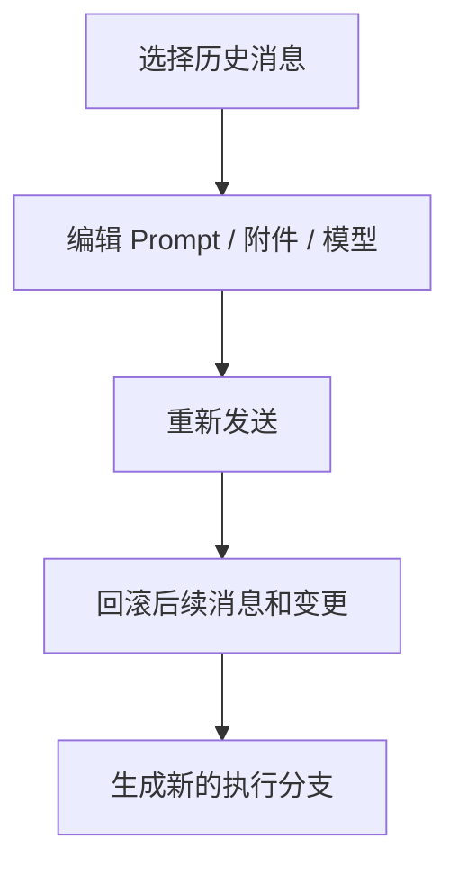

# 11-历史对话编辑

## Goal
允许用户回到任意历史消息修改输入，并从该节点重新分支执行。

## Problem
复杂任务一旦走偏，继续追问只会带着错误上下文越走越远。竞品把“编辑历史消息”做成主流程，是在解决上下文污染。

## Scope
- 历史消息选择
- Prompt 编辑
- 附件替换
- 模型切换
- 模式切换
- 重新发送
- 后续内容回滚

## Flow

## Detail
- 这不是简单编辑文本，而是“回到某个历史节点重新开始”。
- 历史编辑必须和文件状态回滚绑定。
- 编辑页需要展示“会影响哪些后续内容”。

## State Model
- `selected`
- `editing`
- `warning`
- `resubmitting`
- `branched`

## Edge Cases
- 当前有未保存草稿时应提示。
- 回滚范围必须清楚，不应模糊为“可能影响后续”。
- 若编辑的是很早节点，系统应提示成本较高。

## Acceptance
1. 用户能编辑历史消息。
1. 编辑后可从该节点重新分支执行。
1. 后续消息和文件变更可被回滚。

