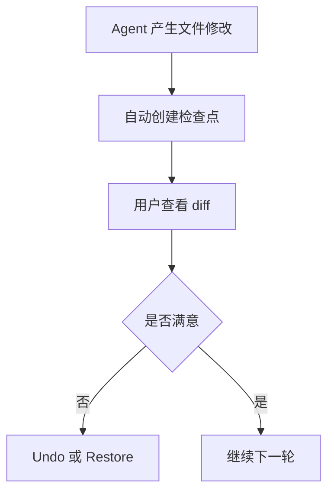

# 12-版本管理

## Goal
把每轮 Agent 修改都沉淀为检查点，支持 diff、undo 和 restore。

## Problem
如果没有产品化版本管理，用户只能把 Agent 当成一次性输出工具，无法“稳步推进”。竞品把每次对话和代码变更关联成检查点，解决的是可控性。

## Scope
- 自动检查点
- Review changes
- Undo
- Restore Checkpoint
- 多文件 diff
- 检查点与消息绑定

## Flow

## Detail
- 检查点应绑定当前对话轮次。
- diff 视图需要支持多文件。
- Undo 用于最近一轮快速回退，Restore 用于回到任意历史检查点。

## Edge Cases
- 没有文件变化时不应创建空检查点。
- 多次回退后要能清楚区分当前状态所在节点。

## Telemetry
- `checkpoint_created`
- `diff_review_opened`
- `checkpoint_undo`
- `checkpoint_restore`

## Acceptance
1. 每次 Agent 修改都有检查点。
1. 用户能查看本轮 diff。
1. 用户能撤销最近变更或恢复到历史检查点。

