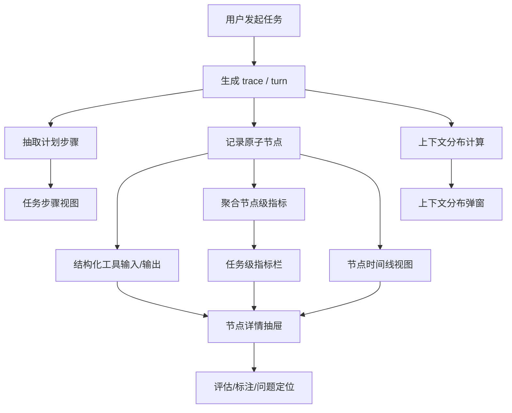

# 13-执行可观测层

## Goal
把 Agent 执行过程从“聊天黑盒”变成“可复盘、可解释、可定位、可优化”的执行工作台。右栏不是装饰，不是消息补充，也不是调试面板的堆砌，而是用户理解 Agent 是否靠谱的第一现场。

## Why This Matters
执行可观测层是竞品里最值得我们抄的一层，因为它同时解决了四个问题：

1. `信任问题`
用户不只想知道答案是什么，还想知道 Agent 做了什么、看了什么、调了什么工具、为什么失败。

2. `排障问题`
没有任务步骤、原子节点、工具输入输出和指标，用户与研发都只能盯着最终回复猜原因。

3. `优化问题`
没有分层指标和上下文分布，就无法知道一次任务为什么慢、为什么贵、为什么绕远路。

4. `产品差异问题`
普通聊天产品默认把“过程”藏起来；Agent 工作台的核心价值恰恰是把“过程”结构化地公开出来。

## Problem
传统聊天界面只关心最终回复，但 Agent 产品的真实价值来自执行过程。竞品这层的关键不是视觉效果，而是它能让用户立刻回答下面这些问题：

- 做了哪些任务步骤
- 哪些步骤是计划，哪些步骤真实执行了
- 调用了哪些工具、文件、检索、浏览器、终端动作
- 每个节点的输入是什么、输出是什么、有没有错误
- 花了多少时间、多少上下文、多少输出、多少成本
- 问题出在哪个节点、哪一段上下文、哪一个工具调用

## Product Thesis
我们的执行可观测层应该坚持以下判断：

1. `会话` 是用户入口，但 `执行轨迹` 才是 Agent 价值主体。
2. `任务步骤` 用来解释“意图推进”，`原子节点` 用来解释“真实执行”。
3. `指标` 不是单独页面，而是每个任务、每个节点都应该自带的二级语言。
4. `详情` 不应该沉到底部打断阅读，而应该通过右侧二级抽屉按需展开。
5. `上下文分布` 不是后端埋点附属报表，而是帮助用户理解“为什么这次调用变贵、变慢、变乱”的产品视图。

## Resource Registry
当前这一功能点已经有一批可以直接参考的外部资源，后续继续深挖时优先从这些入口继续：

| 类型 | 资源 | 我们能借什么 |
|---|---|---|
| 官方竞品来源 | [Z Code 官方 wiki](https://zhipu-ai.feishu.cn/wiki/Qr2SwyBsTiSlaYkqBECcxCWnn4c) | 竞品功能口径、命名、页面范围 |
| 官方 Agent tracing | [OpenAI Agents SDK Tracing](https://openai.github.io/openai-agents-python/tracing/) | trace/span 模型、默认采集范围、group_id 设计 |
| 官方 trace 评估 | [OpenAI Trace Grading](https://developers.openai.com/api/docs/guides/trace-grading) | trace 级评分、错误定位、回归验证 |
| 追踪数据模型 | [LangSmith Observability Concepts](https://docs.langchain.com/langsmith/observability-concepts) | trace/run/thread 三层模型 |
| 交互式调试形态 | [LangSmith Studio Observability](https://docs.langchain.com/langsmith/observability-studio) | 节点级调试、从 trace 回到 node |
| LLM 观测工作台 | [Langfuse Observability Overview](https://langfuse.com/docs/observability/overview) | trace 详情、sessions、timeline、cost |
| 会话重放 | [Langfuse Sessions](https://langfuse.com/docs/observability/features/sessions) | 跨 trace 的 session replay |
| 成本与 token 口径 | [Langfuse Token & Cost Tracking](https://langfuse.com/docs/observability/features/token-and-cost-tracking) | token/cost 统计维度 |
| 观察对象模型 | [Langfuse Data Model](https://langfuse.com/docs/observability/data-model) | observation-centric 模型 |
| MCP 链路串联 | [Langfuse MCP Tracing](https://langfuse.com/docs/observability/features/mcp-tracing) | client/server trace 串联 |
| Agent 图形视图 | [Langfuse Agent Graphs](https://langfuse.com/docs/observability/features/agent-graphs) | agent 图推断和嵌套呈现 |
| AI 观测与评估 | [Phoenix Tracing Tutorial](https://arize.com/docs/phoenix/tracing/tutorial) | trace + session + eval 三联动 |
| tracing 基础原理 | [Phoenix How Tracing Works](https://arize.com/docs/phoenix/tracing/concepts-tracing/how-tracing-works) | instrumentation/exporter/collector |
| 高密度事件分析 | [ADK BigQuery Agent Analytics](https://adk.dev/integrations/bigquery-agent-analytics/) | 事件 schema、trace_id/span_id、tool provenance |
| 云端 tracing | [ADK Cloud Trace](https://adk.dev/integrations/cloud-trace/) | 云上 trace 归集与分布式串联 |
| 观测平台接入 | [ADK Freeplay](https://adk.dev/integrations/freeplay/) | 观测、prompt、eval 一体化入口 |
| 企业平台观测 | [Azure AI Foundry Tracing](https://learn.microsoft.com/en-us/azure/foundry-classic/how-to/develop/trace-agents-sdk) | 多框架 tracing 接入口径 |
| 通用 trace 产品形态 | [Grafana Explore Traces](https://grafana.com/whats-new/2024-09-24-explore-traces/) | RED 指标、查询less 下钻、异常对比 |
| 通用 trace 联动 | [Grafana Trace View](https://grafana.com/docs/grafana/latest/visualizations/explore/trace-integration/) | trace-to-logs / metrics / profiles |
| 长文本 trace 详情 | [W&B Weave Traces](https://wandb.ai/site/traces/) | 长文本 popout、chat view、trace tree |
| trace 对象定义 | [W&B Ops / Calls / Traces](https://docs.wandb.ai/weave/guides/tracking/tracing) | call/tree/thread 的对象关系 |
| 语义标准 | [OpenTelemetry GenAI Attributes](https://opentelemetry.io/docs/specs/semconv/registry/attributes/gen-ai/) | tool args/result、messages、system、retrieval |
| MCP 标准 | [OpenTelemetry MCP Semantic Conventions](https://opentelemetry.io/docs/specs/semconv/gen-ai/mcp/) | MCP 工具 span 命名与状态 |
| AI 观测标准 | [OpenInference Specification](https://arize-ai.github.io/openinference/spec/) | AI span kind taxonomy |

更多带解释的资源拆解见：

- [13-执行可观测层-资源附录.md](./13-执行可观测层-资源附录.md)

## User Roles
执行可观测层不只是给研发看的。它至少服务四类角色：

| 角色 | 关注点 | 最常用区域 |
|---|---|---|
| 普通用户 | Agent 做了什么、卡在哪、要不要继续等 | 任务步骤、当前节点、耗时、失败节点 |
| 高级用户 | 工具是否真的被调用、参数是否合理、返回是否可信 | 原子节点、工具输入输出、原始内容 |
| 研发/测试 | 哪个模型回合、哪个工具、哪段上下文导致问题 | 节点详情抽屉、上下文分布、错误节点 |
| PM/运营 | 整体是否稳定、慢在哪、贵在哪、哪个流程最常失败 | 运行指标、任务级聚合、会话重放 |

## Scope
当前主线必须覆盖：

- 任务步骤
- 原子节点
- 工具输入 / 输出
- 运行指标
- 节点详情抽屉
- 上下文分布
- 原始内容折叠
- 节点与步骤联动
- 任务级与会话级聚合

## Non-goals
当前不放进这一版主线的：

- 强制权限确认与安全拦截
- 远程开发链路
- 单独的新页面报表系统
- 完整的分布式 tracing 后端平台替换
- 企业级监控告警后台

## External Benchmark Conclusions
基于外部资料，当前最值得抄的不是某一家产品，而是几种稳定模式：

1. `Trace / Span / Thread` 三层模型已经是行业共识。
LangSmith 用 trace / run / thread，OpenAI 用 trace / span / group_id，Weave 用 trace / call / thread，本质是同一个结构。

2. `Observation / Run / Span` 是原子节点的稳定命名方式。
也就是说我们自己的“原子节点”完全可以在数据层对齐 span / observation，在产品层继续保留中文“节点”。

3. `Session Replay` 很重要。
Langfuse 和 Phoenix 都强调跨 trace 的 session 视角。对我们来说，这直接对应“整轮会话”的复盘能力。

4. `Trace Detail + Long Text Popout` 是成熟交互。
W&B Weave 直接强调长文本查看与弹出层，Langfuse 走 observation-centric 详情，说明大 payload 不能铺在主列表里。

5. `Trace + Eval` 是下一层自然延伸。
OpenAI Trace Grading、Phoenix、LangSmith Studio 都说明可观测层最终会与评估体系打通，所以我们在数据结构上要预留评分和标注位。

6. `RED metrics from traces` 可以直接借。
Grafana Explore Traces 强调用 Rate / Errors / Duration 从 trace 反推问题，这对我们右栏的任务聚合视图非常有帮助。

## Experience Architecture

## Information Architecture
右栏建议固定拆成三层：

1. `任务层`
展示当前任务摘要、成功状态、耗时、输入/上下文/输出、步骤数量、节点数量。

2. `轨迹层`
默认展示步骤时间线与原子节点列表。步骤更偏“为什么做”，节点更偏“到底做了什么”。

3. `深钻层`
点击节点进入二级详情抽屉，在抽屉里再看结构化字段、原始内容、关联上下文、错误信息和指标。

## Core Object Model
建议把这一层的数据模型稳定下来，后面 UI 和评估、导出、回放都复用这套对象。

### Trace
表示一次完整的 agent turn / workflow run。

推荐字段：

- `traceId`
- `sessionId`
- `threadId`
- `workflowName`
- `workspaceId`
- `conversationId`
- `startedAt`
- `endedAt`
- `status`
- `model`
- `metrics`
- `contextDistribution`

### Step
表示用户可读的任务步骤，是“计划层对象”。

推荐字段：

- `stepId`
- `traceId`
- `index`
- `title`
- `detail`
- `status`
- `source`
- `planRound`
- `nodeIds`
- `startedAt`
- `endedAt`

### Node
表示最小执行单元，是“真实执行层对象”。

推荐字段：

- `nodeId`
- `traceId`
- `parentNodeId`
- `stepId`
- `kind`
- `subtype`
- `title`
- `summary`
- `status`
- `startedAt`
- `endedAt`
- `durationMs`
- `toolName`
- `provider`
- `provenance`
- `inputRef`
- `outputRef`
- `errorRef`
- `metricRef`

### Detail
表示节点详情抽屉的组合视图对象。

推荐字段：

- `overview`
- `fields`
- `inputStructured`
- `outputStructured`
- `rawInput`
- `rawOutput`
- `rawError`
- `linkedContext`
- `relatedNodes`

### Metric
表示任务级和节点级都能复用的指标对象。

推荐字段：

- `inputTokens`
- `contextTokens`
- `outputTokens`
- `inputChars`
- `contextChars`
- `outputChars`
- `durationMs`
- `queueMs`
- `toolCount`
- `retryCount`
- `errorCount`
- `costUsd`
- `success`

### ContextBucket
表示上下文分布的一个桶。

推荐字段：

- `bucket`
- `chars`
- `tokens`
- `percent`
- `count`
- `items`

## Node Taxonomy
原子节点不应该只分“成功/失败”，而应该建立稳定类型体系，后面才能做差异化渲染。

建议至少支持：

| 类型 | 用途 |
|---|---|
| `plan` | 计划文本、步骤拆解、执行前意图 |
| `assistant` | 非工具型模型回复节点 |
| `tool_input` | 工具调用参数 |
| `tool_output` | 工具返回结果 |
| `retrieval` | 检索、搜索、RAG 命中 |
| `file_read` | 读文件 |
| `file_write` | 写文件 / patch / diff |
| `terminal` | 命令执行 |
| `browser` | 页面访问、点击、选择元素 |
| `handoff` | agent 交接、多 agent 协作 |
| `memory` | 记忆读写 |
| `mcp` | MCP client/server 调用 |
| `evaluation` | 评分、标注、校验 |
| `error` | 失败节点 |
| `omitted` | 为节流而折叠的节点 |

## Detailed Requirements

### 1. 任务步骤
任务步骤是给人看的第一层解释，不能等同于工具节点列表。

详细要求：

- 从显式计划中抽步骤，如 `1. 先检查 2. 再修改 3. 最后验证`
- 没有显式计划时，也能根据节点簇推断“隐式步骤”
- 每个步骤必须有状态：`pending / running / completed / failed / drifted`
- 步骤要与实际节点联动，点击步骤时能高亮对应节点
- 步骤层需要支持“计划与执行偏移”识别
- 同一轮任务如果发生重试，需要显示是“重跑步骤”还是“补充步骤”
- 要支持折叠成一行摘要，避免右栏过长

### 2. 原子节点
原子节点是这一层的核心资产，必须高密度、可扫描、可下钻。

详细要求：

- 每个 tool call 都必须拆成独立节点
- 每个重要模型调用也应成为独立节点，而不是只有工具节点
- 节点列表必须按时间排序
- 节点要支持父子结构或同组折叠
- 节点行至少显示：类型、标题、状态、耗时、摘要
- 错误节点要醒目，但不能只有红色标签，必须能解释错因
- 同类节点要有差异化摘要，例如 `Read` 显示文件路径，`Edit` 显示改动摘要，`Bash` 显示命令
- 超长输出不能直接撑爆列表，默认展示摘要和关键字段

### 3. 工具输入 / 输出
这是竞品最容易被用户感知价值的一层，也是最容易做糟的一层。

详细要求：

- 工具节点默认先显示结构化摘要，不默认展示原始 JSON
- 优先显示“对人有意义”的字段，不优先显示 transport payload
- 输入区和输出区分开展示
- 针对常见工具类型做专门渲染：
- `read` 显示路径、行数、命中摘要
- `edit` 显示目标文件、操作类型、diff 摘要
- `bash` 显示命令、退出码、关键输出
- `browser` 显示 URL、动作、元素、结果
- `mcp` 显示 server、method、resource、tool
- 原始内容使用折叠展开，并提供长文本查看器
- 原始内容区域必须有可靠的背景、边框和换行，不允许再次出现“看起来像空白”的体验问题

### 4. 运行指标
指标不是单独报表，而是任务列表与节点详情都要自带的产品语言。

详细要求：

- 任务级默认展示单行指标栏：`输入 | 上下文 | 输出 | 耗时 | 成败`
- 节点级默认展示：`duration | success | tool count / retry / error`
- 如果拿得到 token，就优先展示 token；拿不到时退回 chars
- 成本不是当前必做字段，但数据结构需要预留
- 指标必须支持聚合到 trace、step、session 三层
- 指标要支持“由 trace 反推问题”的视图，借鉴 RED 方法
- 需要为后续 `rate / error / duration` 聚合预留字段

### 5. 节点详情抽屉
详情抽屉是深钻区，不应该和主轨迹混在一起。

详细要求：

- 点击节点后从右侧拉出抽屉，而不是沉到底部
- 抽屉至少包含：
- `概览`
- `结构化字段`
- `输入`
- `输出`
- `错误`
- `原始内容`
- `关联上下文`
- 抽屉标题应直接显示节点标题和类型
- 抽屉顶部应有指标摘要
- 抽屉里要支持跳转到前后关联节点
- 长文本字段支持代码/文本/markdown 多视图切换是加分项，W&B Weave 的 popout 值得参考

### 6. 上下文分布
上下文分布是我们这一版的差异化机会，不只是“token breakdown”，而是“上下文资源为什么被吃掉”的解释。

建议至少拆成：

- `用户提示`
- `系统指令`
- `AI 计划`
- `工具输入`
- `工具输出`
- `检索结果`
- `附件 / 文件内容`
- `最终结果`

详细要求：

- 支持按 `trace` 查看单次任务分布
- 支持按 `session` 查看多轮会话累计分布
- 支持 `chars` 与 `tokens` 双口径
- 显示占比、原始值、桶内项数
- 允许点击某个 bucket 反查对应节点
- 当某个 bucket 过大时，给出“膨胀来源”提示，例如某次 `Read`、某段 `tool_output`、某组 `retrieval documents`

## External Standards We Should Reuse
这一层不要自造标准，能借成熟语义就借成熟语义。

### OpenAI Traces / Spans
OpenAI 已经把 Agent 执行默认采集范围定义得很清楚：`LLM generations`、`tool calls`、`handoffs`、`guardrails`、`custom events` 都在 trace 里。我们可以直接借它的 `trace + span + group_id` 思路作为内部模型命名参考。

### LangSmith Trace / Run / Thread
LangSmith 明确了 `trace` 是一次操作，`run` 是一次离散执行，`thread` 是多轮对话，这正好对应我们现在右栏需要的 `任务 / 节点 / 会话` 三层结构。

### OpenTelemetry GenAI Attributes
OpenTelemetry 已经给出 `gen_ai.input.messages`、`gen_ai.output.messages`、`gen_ai.system_instructions`、`gen_ai.retrieval.documents`、`gen_ai.tool.call.arguments`、`gen_ai.tool.call.result` 等属性，这正好能支撑我们的上下文分布和工具输入输出拆桶逻辑。

### OpenInference Span Kinds
OpenInference 给了 `LLM / AGENT / CHAIN / TOOL / RETRIEVER / RERANKER / EMBEDDING / GUARDRAIL / EVALUATOR / PROMPT` 的 AI 观测类型体系，适合直接映射到我们原子节点类型。

### MCP Semantic Conventions
OpenTelemetry 的 MCP 语义约定明确了 MCP 工具 span 的命名方式和错误状态规范，这意味着后面我们做 MCP 可观测层时不需要重新发明命名方案。

## Current Product Gaps
结合外部资料和我们当前实现，差距主要在这些地方：

1. `trace / session / node` 数据层虽然已初步成型，但标准命名和可扩展字段还不够稳定。
2. `步骤层` 和 `节点层` 已经拆开，但“计划偏移”和“步骤-节点双向联动”还不够强。
3. `工具输入 / 输出` 已做结构化展示，但还缺少更细的工具类型专属渲染器。
4. `指标层` 已有单行指标，但距离 RED、成本、会话级聚合还差一层。
5. `上下文分布` 现在更偏 UI 视图，还没有完全绑定外部标准语义字段。
6. `trace -> eval` 的下一跳还没接上，后面如果做 QA 和回归，这里会成为核心枢纽。

## Delivery Priority

### P0
- 稳定 trace / step / node / metric / context 数据结构
- 强化步骤与节点联动
- 强化工具输入 / 输出结构化渲染
- 完善节点详情抽屉
- 完善上下文分布桶口径

### P1
- 节点长文本 popout
- 节点间跳转与关联上下文
- session 级回放 / 聚合
- 成本与 token 详细统计
- 更细的工具 provenance

### P2
- trace 级评分与标注
- trace-to-logs / trace-to-metrics 联动
- 跨服务 / MCP server 链路串联
- 导出与分享

## Telemetry
产品埋点建议至少包含：

- `activity_trace_opened`
- `activity_step_parsed`
- `activity_step_link_clicked`
- `activity_node_opened`
- `activity_node_type_filtered`
- `activity_drawer_opened`
- `activity_structured_input_opened`
- `activity_structured_output_opened`
- `activity_raw_expanded`
- `activity_context_distribution_opened`
- `activity_context_bucket_clicked`
- `activity_error_node_opened`

## Acceptance
1. 用户能从单次任务中清楚看到 `步骤 -> 节点 -> 详情 -> 指标 -> 上下文分布` 的完整链路。
2. 每个工具调用都能作为独立节点被查看，且默认显示结构化摘要而不是原始 JSON。
3. 节点详情必须使用右侧抽屉，不允许重新回到底部堆叠模式。
4. 任务级指标必须以高密度单行呈现，节点级指标必须可在详情中查看。
5. 上下文分布必须能解释至少 `用户提示 / 系统指令 / 工具输入 / 工具输出 / 检索结果 / 最终结果` 六类来源。
6. 原始内容的可读性必须稳定，长文本区域不能再出现视觉上“像空白”的情况。
7. 数据模型需要为后续 `trace grading / eval / session replay / MCP 串链` 预留字段，不允许做成死结构。

## Related Docs
- [13-执行可观测层-资源附录.md](./13-执行可观测层-资源附录.md)
- [63-实施计划-会话执行分析与右栏增强.md](../../40-delivery/63-实施计划-会话执行分析与右栏增强.md)
- [64-实施计划-执行可观测层详细开发方案.md](../../40-delivery/64-实施计划-执行可观测层详细开发方案.md)
- [14-工作台工具集.md](./14-工作台工具集.md)
