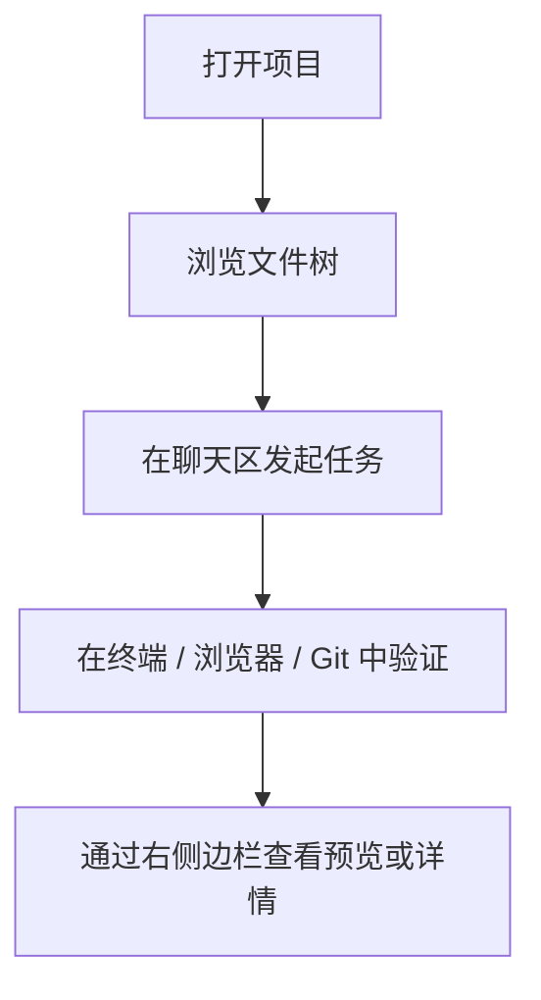

# 14-工作台工具集

## Goal
把文件、Git、终端、浏览器、预览和侧栏整合成一个真正的开发工作台。

## Problem
如果这些能力散落在多个窗口或多个产品里，Agent 就只是聊天外壳。竞品真正强的地方，是把“做事所需的环境”带进了主工作区。

## Scope
- 任务管理器
- 文件管理器
- 终端面板
- Git 提交面板
- 浏览器预览
- 元素选择
- 右侧边栏多标签
- 代码 / Markdown / HTML 预览

## Flow

## UI Composition
- `左侧工作区`
  任务管理器和文件树。
- `中央工作区`
  对话、执行流和主交互。
- `右侧工作区`
  预览、终端、浏览器、节点详情、多标签切换。

## Detail
- 文件树不应只是导航，而应支持预览、上下文注入和文件操作。
- 浏览器不应只是截图区，而应支持元素选择和页面预览。
- 右侧边栏应是复合工具区，而不是单一信息区。

## Edge Cases
- 多工具同时开启时不能挤压主工作流。
- 右侧边栏关闭后应能快速恢复上次标签态。

## Related Screenshot
- [文件管理器与预览](../../assets/zcode-competitor/02-file-preview.png)
- [浏览器元素选择](../../assets/zcode-competitor/04-browser-element-select.png)
- [浏览器预览](../../assets/zcode-competitor/06-browser-preview.png)

## Acceptance
1. 用户可在单窗口内完成多数开发动作。
1. 文件、终端、Git、浏览器和右侧边栏彼此联动。
1. 工作台布局不会打断中央对话主流程。
