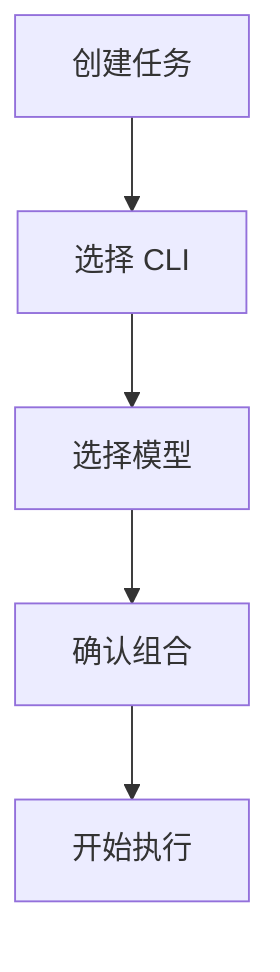

# 15-CLI支持

## Goal
让用户在任务创建时选择不同 CLI 工具和模型组合，适配不同复杂度场景。

## Problem
竞品不是只绑定一种执行器，而是把不同 CLI 当成不同执行后端。这样做解决的是速度、成本、能力之间的平衡问题。

## Scope
- CLI 列表
- CLI 描述
- CLI 与模型组合
- CLI 选择状态
- CLI 生效反馈

## Flow

## Detail
- CLI 至少要展示名称、适用场景、性能倾向和默认模型。
- CLI 选择应属于高级配置，但不能完全埋进深层设置。

## Edge Cases
- CLI 不可用时应提示降级方案。
- CLI 与当前 Agent 冲突时应给出兼容提示。

## Acceptance
1. 用户可看到并选择 CLI。
1. CLI 选择会影响后续执行。
1. 当前 CLI 状态在任务元数据中可回溯。

