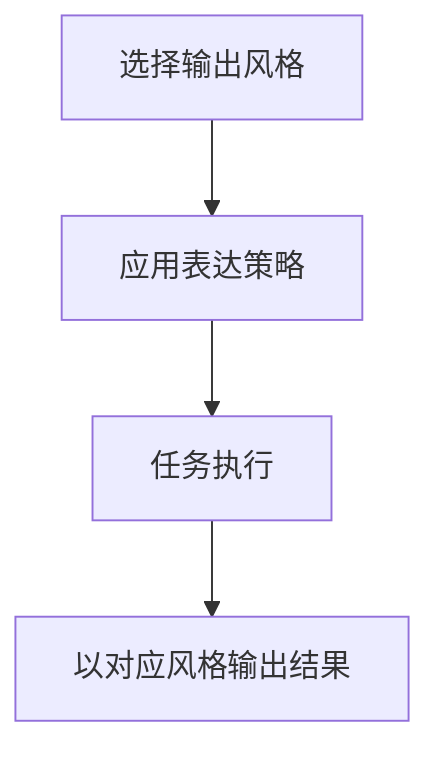

# 16-OutputStyle

## Goal
让 Agent 的表达风格和交互方式可配置，而不改变核心执行能力。

## Scope
- 预设风格列表
- 风格选择
- 风格生效反馈
- 自定义风格入口

## Flow

## Detail
- 预设风格至少包括默认、解释型、学习型、轻松型、结构化型。
- 输出风格影响表达方式、解释程度和交互语气，不应影响工具能力。

## Acceptance
1. 用户可切换输出风格。
1. 风格变化能体现在回答方式上。
1. 执行能力不会因风格变化而丢失。

