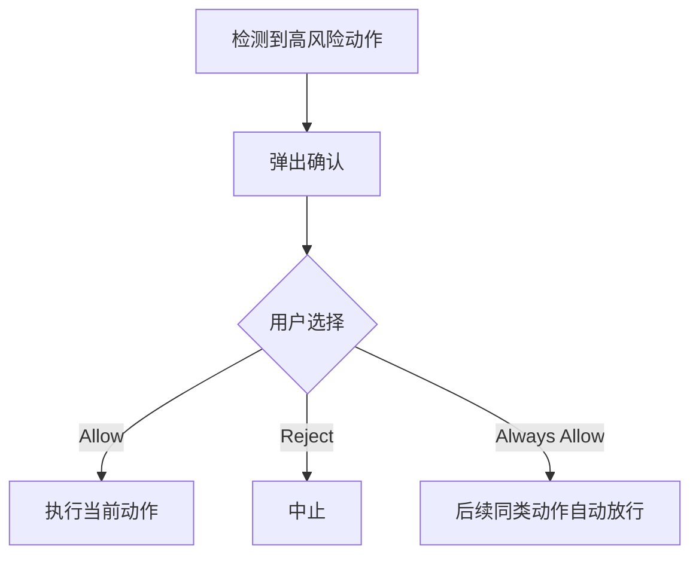

# 18-安全操作确认

## Goal
对高风险动作提供人工确认，避免 Agent 越权或误操作。

## Problem
高风险动作如果完全自动执行，会带来强烈不信任感。竞品用确认弹层解决的是“谁对关键动作做最后决策”。

## Scope
- 高风险动作识别
- 确认弹层
- Allow / Reject / Always Allow

## Flow

## Detail
- 这是竞品完整性能力。
- 当前我们的主线不优先做，但未来可以接成轻量治理层。

## Acceptance
1. 高风险动作前能触发确认。
1. 三种决策可区分。
1. 当前版本可不实现，但文档需保留。

