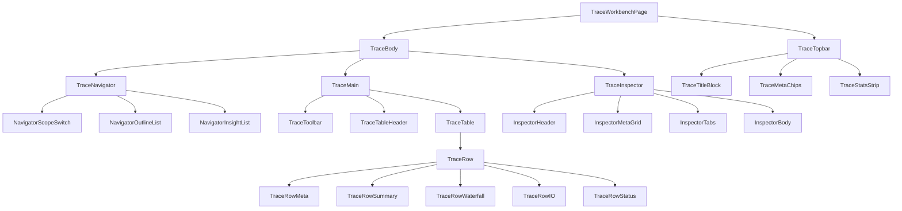
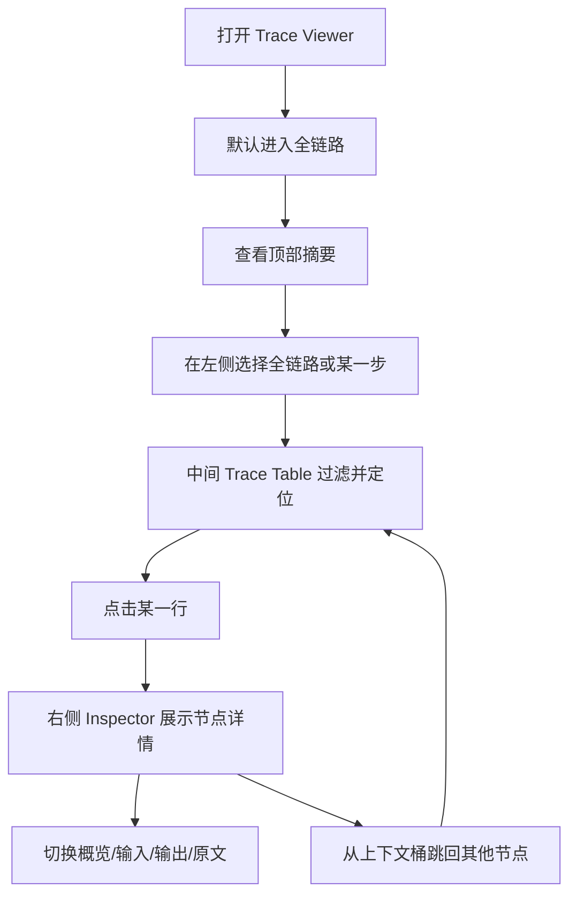

# 18-PRD-Trace Workbench参考图拆解与页面重构

## Purpose
把 `Trace Viewer` 从“右栏分析页的延伸版”重定义成一个真正的页面级 `Trace Workbench`。  
本文件不是泛泛的竞品分析，也不是直接的实现方案，而是先把目标参考图拆成可执行的页面 PRD，再作为后续开发与截图验收的唯一对齐基线。

## Why This Doc Exists
当前实现已经具备“三栏结构”的雏形，但用户最新截图已经明确证明：

1. 结构虽然变成了三栏，但整体仍然是“柔和大卡片页面”，不像 `Langfuse Trace Detail` 或 `MLflow Trace Debugging`
2. 中间主体仍然更像卡片列表，而不是 `trace table / waterfall workbench`
3. 右侧 `Inspector` 仍然更像“统计卡 + 摘要区”，不像真正的调试面板
4. 顶部仍然过度强调大数字卡片，缺少 reference UI 那种“紧凑、专业、分析型”的信息组织
5. 行级信息密度不够，导致“有数据但看起来不专业、不像 trace 产品”

因此，本次不能继续靠局部改动逼近目标，必须先把目标图拆解成：

- 布局层
- 组件层
- 信息层
- 交互层
- 验收层

然后再按 PRD 开发。

## Source Registry
本轮只认以下四个参考源：

1. `Langfuse` 官方 Trace Detail 参考图  
   [Langfuse Observability Overview](https://langfuse.com/docs/observability/overview)  
   [Trace Detail Image](https://langfuse.com/images/docs/tracing-overview.png)

2. `MLflow` 官方 Trace Debugging 参考图  
   [MLflow GenAI Tracing](https://mlflow.org/docs/latest/genai/tracing/)  
   [Trace Debugging Image](https://mlflow.org/docs/latest/assets/images/genai-trace-debug-405f9c8b61d5f89fb1d3891242fcd265.png)

3. 当前产品已有的执行可观测需求  
   [13-FR-事件流回放与分析.md](./13-FR-%E4%BA%8B%E4%BB%B6%E6%B5%81%E5%9B%9E%E6%94%BE%E4%B8%8E%E5%88%86%E6%9E%90.md)

4. 当前工程已经沉淀的执行可观测开发方案  
   [64-实施计划-执行可观测层详细开发方案.md](../40-delivery/64-%E5%AE%9E%E6%96%BD%E8%AE%A1%E5%88%92-%E6%89%A7%E8%A1%8C%E5%8F%AF%E8%A7%82%E6%B5%8B%E5%B1%82%E8%AF%A6%E7%BB%86%E5%BC%80%E5%8F%91%E6%96%B9%E6%A1%88.md)

## Target Definition
本次目标不是“做一个新页面”，而是做一个满足以下定义的页面：

- 它必须首先像 `Trace Product`
- 它必须默认服务于“复盘、分析、调试”，不是“聊天阅读”
- 它必须能承载大体量 session，而不会因为节点多就失控
- 它必须让用户在第一页就理解：`看什么`、`点哪里`、`为什么慢/为什么错`

## Reference Merge Strategy
两张目标图不是二选一，而是取长合并：

### 取自 Langfuse 的部分
- 页面级 `Trace Detail` 视角
- 左侧目录 / span tree / trace tree 的“导航感”
- 顶部元信息栏和轻量标签
- 右侧 `Input / Output / Metadata` 型详情区
- 整体“偏专业工具，而不是内容产品”的视觉秩序

### 取自 MLflow 的部分
- 中间时间轴 / waterfall 语义
- span 条形块的时序表达
- Debugging 气质强、结构清晰的 inspector
- 输入输出分区的工程感

### 我们保留自己的部分
- 左侧主应用导航仍然是工作区 / 会话列表
- 界面文案继续使用简体中文
- 数据模型继续基于 `buildActivityRailModel(...)`
- 入口继续从会话页进入 `Trace Viewer`

## Current Deviation Diagnosis
以下偏差直接来自用户最新截图的观察结果，是后续整改的硬约束：

### D-01 顶部区偏差
- 当前顶部是一组体量较大的柔和统计卡
- 参考图顶部更像“工具栏 + 标签行 + 紧凑状态摘要”
- 当前顶部抢占视觉重心，导致用户第一眼看到的是“大盘”，不是 trace 本身

### D-02 左侧区偏差
- 当前左栏仍然像两张独立卡片：`执行目录` + `上下文与洞察`
- 参考图左侧更像一个持续可浏览的导航区，而不是多个营销式卡片
- 当前左栏卡片感太强，缺少 tree / outline / trace navigator 的连贯结构

### D-03 中间主体偏差
- 当前主体仍然是“大白卡里面放列表”
- 行高偏大，圆角过多，阴影过重
- 节点行不像 `trace row`，更像内容卡片
- 时序表达不够主导，waterfall 没成为主阅读对象
- 某些摘要在狭窄列里出现接近“竖排挤压”的观感

### D-04 右侧 Inspector 偏差
- 当前 inspector 仍然先展示四个统计卡，再看详情
- 参考图中 inspector 的核心是内容和结构，不是统计卡
- 当前详情更像“摘要面板”，不像调试面板

### D-05 整体视觉偏差
- 当前仍然是“大圆角 + 柔和阴影 + 大面积留白”的工作台美术风格
- 参考图更偏向“工具产品”，强调秩序、密度、对齐、表格和调试语义
- 当前的视觉调性更像产品首页，不像 observability console

## Product Thesis
`Trace Workbench` 必须满足以下一句话：

> 用户进入页面后，不需要先读说明，就能自然地从左到右完成 `定位范围 -> 浏览执行 -> 检查详情`。

## Information Architecture
页面只允许三块主区域：

1. `Trace Topbar`
2. `Trace Navigator`
3. `Trace Main`
4. `Trace Inspector`

其中 `Trace Main` 内部再分为：

1. `Trace Toolbar`
2. `Trace Table Header`
3. `Trace Table / Waterfall Rows`

## Layout Spec

### Global Layout
- 页面为独立分析页，不再嵌入聊天滚动容器
- 外层背景应为低对比中性灰，不再强调白色大卡
- 页面主体使用 `3-column` 布局

### Column Width
- 左列：`260px ~ 300px`
- 中列：`自适应，优先吃满`
- 右列：`340px ~ 380px`

### Height Behavior
- 页面主体必须吃满剩余可视高度
- 左列自己滚动
- 中列自己滚动
- 右列 inspector 自己滚动
- 顶部区固定，不能跟着中间表格一起滚

### Visual Tokens
- 主容器圆角：`12px ~ 16px`
- 行级圆角：`10px ~ 12px`
- 避免 `20px+` 的大圆角
- 阴影只保留极弱分层阴影
- 边框优先，阴影辅助
- 默认底色比聊天页更冷、更中性

## Page Component Tree

## Component Decomposition

### C-01 TraceTopbar
#### Role
承载 trace 的标题、状态、返回、关键元信息和紧凑型统计条。

#### Must Have
- 页面标题
- 会话状态 badge
- 返回按钮
- 模型标签
- 总耗时
- 输入 / 上下文 / 输出规模
- 节点总数 / 工具数 / 轮次数

#### Must Not
- 不允许使用大块“数据卡片墙”
- 不允许把顶部做成 dashboard 首页

#### Visual Rule
- 顶部最多两层信息
- 第一层：标题、状态、动作
- 第二层：紧凑统计条

### C-02 TraceNavigator
#### Role
让用户快速决定“我现在看全链路还是某一步”。

#### Must Have
- `全链路` 入口
- 步骤目录列表
- 每步的状态、节点数、耗时
- 当前选中态
- 上下文洞察列表
- 从上下文桶跳到对应节点

#### Visual Rule
- 更像 `outline / navigator`
- 不要像多个平级营销卡片
- 导航区的主阅读对象是“列表”，不是“卡片”

### C-03 TraceToolbar
#### Role
控制中间 trace 表的查看范围和过滤方式。

#### Must Have
- 当前 scope 提示
- 回到全链路
- filter chips
- 当前可见节点数

#### Future Extension
- 视图模式切换：`全链路 / 仅命中 / 最相关`
- 排序模式切换：`时序 / 工具 / 文件`

### C-04 TraceTableHeader
#### Role
让页面一眼看起来就是 trace table。

#### Columns
1. `节点`
2. `摘要`
3. `时序`
4. `输入/输出`
5. `状态`

#### Rule
- Header 要有明显表头感
- Header 固定在 trace 列表顶部
- 不能继续做成“无表头的大内容卡”

### C-05 TraceRow
#### Role
一行承载一个 timeline node。

#### Row Content
- 节点类型
- round / sequence
- 标题
- 预览摘要
- chips
- waterfall 条
- duration / context
- input / output
- status

#### Row Height
- 标准高度：`72px ~ 96px`
- 严禁像内容卡片那样无限长高
- 长文本必须折叠或截断

#### Selection
- 点击整行进入 inspector
- 选中态要明显，但不能像整张卡浮起

### C-06 Waterfall Cell
#### Role
把时序感真正做出来。

#### Must Have
- 相对位置
- 相对宽度
- 当前耗时标签
- 失败节点要更醒目

#### Rule
- Waterfall 是行里的核心可视对象
- 不是一个“装饰进度条”

### C-07 TraceInspector
#### Role
承载节点级调试与复盘内容。

#### Must Have
- 节点标题
- 状态
- 节点基础元信息
- tabs: `概览 / 输入 / 输出 / 原文`
- 可滚动的详情区

#### Must Not
- 不要先放一堆统计卡再放内容
- 不要把 inspector 做成第二个 dashboard

### C-08 DetailSection
#### Role
承载结构化明细。

#### Must Have
- section title
- summary
- key/value rows
- raw expandable block

#### Rule
- 原文块必须可读
- 背景、文字、边框对比必须可靠

## Data Binding Mapping
以下字段映射必须在 PRD 阶段就固定：

| UI 区域 | 数据来源 | 说明 |
|---|---|---|
| 页面标题 | `session.title` | 当前会话名 |
| 模型 | `model.summary.modelLabel` | 顶部元信息 |
| 总耗时 | `model.summary.durationLabel` | 顶部元信息 |
| 输入 / 上下文 / 输出 | `model.summary.*` | 顶部统计条 |
| 步骤目录 | `model.planSteps` 优先，否则 `model.executionSteps` | 左侧目录 |
| Trace rows | `model.timeline` | 中间主体 |
| 节点 chips | `item.chips` | 行级附加语义 |
| 节点类型 | `item.nodeKind` | 行级主标签 |
| 时序宽度 | `item.metrics.durationMs` + 相对总时长 | waterfall |
| Inspector 输入输出 | `item.detailSections` | 右侧详情 |
| 上下文跳转 | `contextDistribution.buckets[].sourceNodeIds` | 左侧洞察联动 |

## Interaction Flow

## State Rules

### S-01 页面初始态
- 默认选中 `全链路`
- 默认选中第一条可见节点
- 默认 inspector tab 为 `概览`

### S-02 步骤切换
- 切到某一步时，中间表格只显示该步相关节点
- 若该步没有节点，展示空态说明

### S-03 过滤切换
- filter 只作用于当前 scope
- 若当前 filter 下为空，保留表头并给出空态，不要整体塌掉

### S-04 Inspector Tab
- 若某 tab 没有数据，不展示该 tab
- `概览` 必须始终存在

## Non-goals
本轮明确不做：

1. 多 trace 对比页
2. 可拖拽自定义列
3. 可视化 DAG 关系图独立页
4. 评分 / 标注 / dataset 操作
5. 完整的 observability 全站导航

## Detailed Acceptance

### A-01 顶部接受标准
1. 顶部视觉中心是标题和状态，而不是大数字卡片
2. 顶部最多两层信息，不能继续膨胀成 dashboard
3. 顶部统计能在一屏内读完，不需要滚动

### A-02 左栏接受标准
1. 左栏第一眼必须像导航，不像多个平级大卡片
2. `全链路` 入口必须明显
3. 每个步骤项至少展示：状态、节点数、耗时
4. 上下文洞察支持跳转到节点

### A-03 中间主体接受标准
1. 中间区第一眼必须像 trace table
2. 表头固定存在
3. 行高明显收紧
4. 长文本不得挤成“竖排观感”
5. waterfall 必须成为主视觉对象之一

### A-04 Inspector 接受标准
1. Inspector 第一屏先看到内容结构，而不是统计卡
2. `概览 / 输入 / 输出 / 原文` 切换清晰
3. 原文区可读，不出现“像空白”的问题
4. Inspector 自己滚动，不影响中间表

### A-05 一致性接受标准
1. 截图一眼看上去必须更像 `Langfuse / MLflow`，而不是“我们自己的旧卡片页”
2. 页面圆角、阴影、留白、表格密度必须整体收紧
3. 新页面必须被判定为“工具台”，不是“内容页”

## Screenshot Consistency Review Protocol
后续每次开发完成后，必须按下面流程核对：

1. 在 Electron 真窗口打开 `Trace Viewer`
2. 固定窗口尺寸截图
3. 与目标图逐项对照
4. 只要有以下任一项不满足，就不能自称“已经对齐”

### Consistency Checklist
- 顶部还是不是大卡片墙
- 左栏还是不是平级大卡片堆叠
- 中间主体是不是已经像 trace table
- row 的密度是不是足够高
- waterfall 是否真的显眼
- inspector 是否更像 debug panel
- 页面是否仍然有“营销 UI”感
- 与参考图相比，是否还有明显的软糯大圆角风格

## Delivery Sequence
正确顺序必须是：

1. 先按本 PRD 重构页面骨架
2. 再按本 PRD 调整样式与密度
3. 再用 Electron 真窗口截图
4. 再按 `Consistency Checklist` 逐项核对
5. 最后才允许继续做下一轮细化

## Engineering Note
在本 PRD 生效前，不允许再把 `Trace Viewer` 当成“从旧组件慢慢长出来”的页面。  
后续实现可以继续复用数据模型，但页面层必须按独立工作台来组织。
