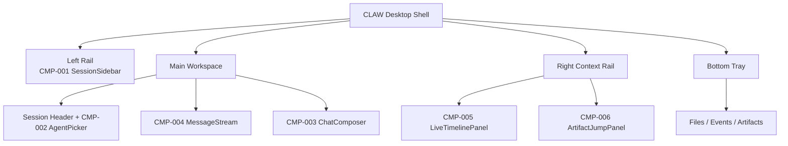
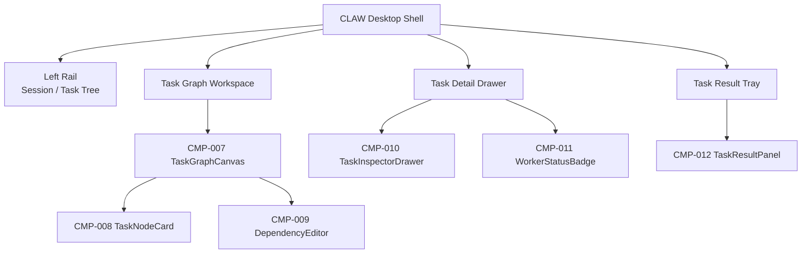
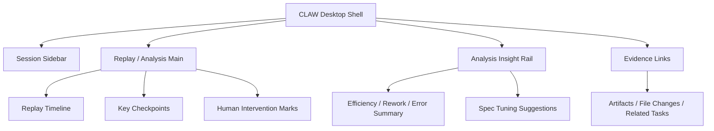

# 56-桌面工作台屏幕线框

## Purpose
用屏幕级线框把 CLAW 首版桌面工作台的区域关系、组件落位和阅读顺序固定下来，作为 Figma 高保真设计的直接前置输入。

## Scope
本文件覆盖：
- `Chat Workspace`
- `Task Graph Workspace`
- `Replay / Analysis Expanded`

本文件不替代组件文档，不定义像素细节。

## Inputs / Outputs
- Inputs:
  - [55-Figma首版设计Brief.md](./55-Figma%E9%A6%96%E7%89%88%E8%AE%BE%E8%AE%A1Brief.md)
  - [44-页面与交互映射.md](./44-%E9%A1%B5%E9%9D%A2%E4%B8%8E%E4%BA%A4%E4%BA%92%E6%98%A0%E5%B0%84.md)
  - [48-组件索引.md](./48-%E7%BB%84%E4%BB%B6%E7%B4%A2%E5%BC%95.md)
- Outputs:
  - 屏幕线框
  - 区域与组件映射
  - 设计阅读顺序

## Core Concepts
- `Shell First`: 先固定外壳，再填内部工作区
- `Evidence Visible`: 证据侧信息必须默认可见
- `Workspace Identity`: 不同主轴必须一眼可辨

## Behavior / Flow
### Screen-01 Chat Workspace

阅读顺序：
1. 左侧找到 Session
2. 中央确认当前 Agent 与上下文
3. 在消息流中阅读执行轨迹
4. 右侧打开 Timeline 和证据入口
5. 底部抽屉查看文件与产物

### Screen-02 Task Graph Workspace

阅读顺序：
1. 左侧选中任务树上下文
2. 中央浏览依赖和节点状态
3. 右侧查看节点详情和 Worker 信息
4. 底部查看最近结果与失败原因

### Screen-03 Replay / Analysis Expanded

阅读顺序：
1. 中央先看时间线和关键节点
2. 右侧理解结论和建议
3. 底部跳转回具体证据

## Interfaces / Types
### Screen to Component Mapping

| Screen | Primary Components |
|---|---|
| `Chat Workspace` | `CMP-001`, `CMP-002`, `CMP-003`, `CMP-004`, `CMP-005`, `CMP-006` |
| `Task Graph Workspace` | `CMP-007`, `CMP-008`, `CMP-009`, `CMP-010`, `CMP-011`, `CMP-012` |
| `Replay / Analysis Expanded` | `CMP-001`, `CMP-005`, `CMP-006` + future replay-specific components |

### Screen to State Emphasis

| Screen | Primary State |
|---|---|
| `Chat Workspace` | `interactive` |
| `Task Graph Workspace` | `running / blocked / failed` |
| `Replay / Analysis Expanded` | `completed / reviewed / tuning` |

## Failure Modes
- 如果线框里右侧上下文面板被弱化，证据闭环会失去存在感。
- 如果底部托盘缺席，文件与产物会再次退化成隐藏功能。
- 如果 3 个屏幕没有共用外壳，产品会像 3 个拼出来的工具。

## Observability
- 每个线框都必须保留：
  - 一个主目标区
  - 一个状态反馈区
  - 一个证据跳转区

## Open Questions / ADR Links
- 后续如果补 `Replay` 专属组件，可在 `48-组件索引` 下扩展 `CMP-013+`。
