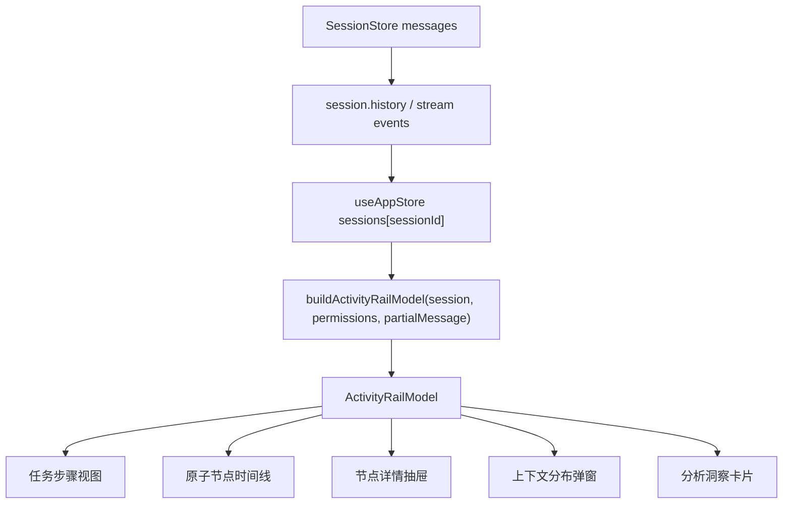

# 64-实施计划-执行可观测层详细开发方案

## Purpose
把 `13-执行可观测层` 从产品 PRD 继续下压成可以直接拆给前端、共享模型层、Electron 主进程和 QA 执行的实施方案。本文不是竞品分析，也不是泛泛需求说明，而是围绕当前代码现状，给出实际开发路径、文件改造清单、任务切片、验收方式和交付顺序。

## Positioning
这份文档与已有文档的关系如下：

| 文档 | 作用 | 关系 |
|---|---|---|
| [13-执行可观测层.md](../10-requirements/17-%E7%AB%9E%E5%93%81%E5%8A%9F%E8%83%BD%E6%8B%86%E8%A7%A3/13-%E6%89%A7%E8%A1%8C%E5%8F%AF%E8%A7%82%E6%B5%8B%E5%B1%82.md) | 定义产品目标、能力边界和资源入口 | 本文的需求来源 |
| [13-执行可观测层-资源附录.md](../10-requirements/17-%E7%AB%9E%E5%93%81%E5%8A%9F%E8%83%BD%E6%8B%86%E8%A7%A3/13-%E6%89%A7%E8%A1%8C%E5%8F%AF%E8%A7%82%E6%B5%8B%E5%B1%82-%E8%B5%84%E6%BA%90%E9%99%84%E5%BD%95.md) | 保留外部资源与可抄点 | 本文的外部基线 |
| [63-实施计划-会话执行分析与右栏增强.md](./63-%E5%AE%9E%E6%96%BD%E8%AE%A1%E5%88%92-%E4%BC%9A%E8%AF%9D%E6%89%A7%E8%A1%8C%E5%88%86%E6%9E%90%E4%B8%8E%E5%8F%B3%E6%A0%8F%E5%A2%9E%E5%BC%BA.md) | 更偏第一阶段实现计划 | 本文在其基础上扩写并细化 |

## Goal
在不改变项目 `chat-first` 主交互形态的前提下，把右侧栏演进成一个高密度、可复盘、可分析、可扩展的 `agent workbench`，让用户能够在单会话内完成以下动作：

1. 看清任务步骤和真实执行节点。
2. 点开任意节点查看结构化详情与原始内容。
3. 在任务级看到输入、上下文、输出、耗时和成败。
4. 在上下文分布里理解 token / chars 是怎么被吃掉的。
5. 在错误节点、慢节点和长上下文节点之间快速定位问题。

## Delivery Principles
本轮实施必须遵守以下原则：

1. `不新建独立分析页，先把右栏做透`
当前版本优先把主界面右侧的执行可观测层打磨完整，不先引入新的路由页。

2. `共享模型先稳定，再做 UI 花活`
如果 `activity-rail-model` 的对象定义不稳定，所有 UI 改造都会反复返工。

3. `默认高密度，按需展开`
主列表只展示摘要和关键指标，深内容放进抽屉、弹窗和长文本查看器。

4. `优先对齐行业对象模型，不重新造轮子`
内部命名可以中文化，但数据语义尽量贴近 `trace / step / node / observation / span / session`。

5. `Electron 真窗口验收优先于纯构建成功`
尤其是原始内容区、抽屉层级、滚动体验、虚拟列表和明暗对比，必须在 Electron 真窗口确认。

## Current Baseline
结合当前代码与项目接力上下文，现状如下。

### 已有实现
- 右栏已有 `ActivityRail` 主组件。
- 已有 `VirtualizedRailList` 支撑大列表滚动。
- `buildActivityRailModel` 已能生成 `timeline`、`taskSteps`、`executionSteps`、`analysisCards`、`contextDistribution`。
- 节点详情已从底部区域迁移到右侧抽屉。
- 工具详情已从直接展示 JSON 改为结构化 `detailSections`。
- 指标已用单行表格式展示 `输入 | 上下文 | 输出 | 耗时 | 成败`。
- 上下文分布弹窗已存在。

### 已知问题
- `ActivityRail.tsx` 仍偏大，渲染职责混在一个文件里。
- 原子节点类型虽然已有 tone / layer / filterKey / stageKind，但缺少更稳定的 `node kind taxonomy`。
- 结构化详情的工具类型特化还不够细，`Read / Edit / Bash / Browser / MCP` 的摘要仍有提升空间。
- 上下文分布目前更偏 UI 模型，尚未完全对齐外部语义标准。
- 会话级聚合和 session replay 还没有真正做起来。
- 指标层还没有成本、重试、error rate、tool provenance 等更细维度。

### 当前关键文件
| 文件 | 当前角色 | 本轮责任 |
|---|---|---|
| `src/shared/activity-rail-model.ts` | 共享模型层，负责从消息流构建右栏 view model | 本轮核心改造文件 |
| `src/ui/components/ActivityRail.tsx` | 右栏 UI 容器与大部分渲染逻辑 | 本轮需要拆分职责 |
| `src/ui/components/VirtualizedRailList.tsx` | 通用虚拟列表组件 | 需要适配滚动定位与动态高度场景 |
| `src/ui/store/useAppStore.ts` | SessionView 与消息流状态承载 | 需要承接更稳定的右栏输入 |
| `src/electron/ipc-handlers.ts` | 会话历史和事件流分发 | 需要评估是否补充会话级 analytics 事件 |
| `src/electron/libs/session-store.ts` | better-sqlite3 存储层 | 需要评估是否记录额外聚合字段 |
| `src/electron/types.ts` | 前后端事件与消息类型 | 需要预留可观测层事件契约 |
| `src/electron/activity-rail-model.test.ts` | 当前模型层单测 | 需要扩容更多 case |

## Target Deliverables
本轮交付物不是一个组件，而是一整套执行可观测层能力包。

### 必交付
- 稳定的 `ActivityRailModel` 对象模型
- 高密度 `任务步骤 + 原子节点` 双层视图
- 结构化 `工具输入 / 输出` 详情
- 统一的 `节点详情抽屉`
- 可点击的 `上下文分布`
- 更细的模型层单测
- Electron 真窗口 QA 清单与截图验证结论

### 建议一并交付
- 节点专属摘要生成器
- 节点长文本查看器
- session 级聚合底座
- 成本 / provenance 预留字段

## External Borrow Strategy
不是所有外部能力都要现在做，但实现时应该有明确借法。

| 来源 | 我们直接借的东西 | 本轮是否落地 |
|---|---|---|
| OpenAI Tracing | `trace / span / group_id` 语义 | 是，落到内部模型命名 |
| LangSmith | `trace / run / thread` 三层关系 | 是，落到任务/节点/会话分层 |
| Langfuse | observation-centric 模型、sessions、agent graph | 是，先落 observation-centric 思路与 session 预留 |
| OpenTelemetry GenAI | tool args/result、messages、system、retrieval 属性 | 是，落到 detail 和 context 分布 |
| OpenInference | `LLM / TOOL / AGENT / RETRIEVER ...` 节点类型体系 | 是，落到 node taxonomy |
| ADK Agent Analytics | `trace_id / span_id / tool provenance / flat views` | 部分，先落字段预留 |
| W&B Weave | long text popout、chat view、trace tree | 部分，先落长文本查看器和抽屉 |
| Grafana | RED 指标与 trace 联动 | 部分，先落 duration / error / success 聚合 |

## Implementation Boundary

### In Scope
- 单会话右栏执行可观测层
- 任务步骤
- 原子节点
- 工具详情
- 指标条
- 节点详情抽屉
- 上下文分布弹窗
- 模型层单测
- Electron QA

### Out of Scope
- 独立 observability 页面
- 企业级 tracing 后台
- 远程开发
- 强制权限确认
- 跨服务 trace collector
- 真正的在线评估平台

## Target Architecture

### 总体数据流


### 分层原则
| 层级 | 责任 | 禁止做什么 |
|---|---|---|
| `SessionStore / IPC` | 保证消息流和时间戳完整、稳定可回放 | 不做 UI 摘要和中文文案拼装 |
| `shared/activity-rail-model` | 负责消息语义解析、节点生成、指标聚合、详情结构化 | 不做 React 状态控制 |
| `ActivityRail` UI 容器层 | 负责面板布局、局部交互状态、组件组合 | 不重新解析消息语义 |
| 子组件层 | 负责纯展示和简单交互 | 不直接读 store 原始消息 |

## Domain Model Plan
本轮建议把共享模型层对象稳定成下面六类。

### 1. Trace View Model
表示一次活动轨迹在 UI 中的最外层对象。

建议字段：
- `traceId`
- `sessionId`
- `summary`
- `timeline`
- `taskSteps`
- `executionSteps`
- `analysisCards`
- `contextDistribution`
- `contextSnapshot`
- `filters`

映射位置：
- 继续由 `ActivityRailModel` 承担。

### 2. Step View Model
表示用户可读步骤。

建议字段：
- `id`
- `title`
- `detail`
- `status`
- `round`
- `kind`
- `timelineIds`
- `sourceTimelineId`
- `metrics`
- `drifted`
- `planStepIds`

说明：
- 当前已有 `taskSteps` / `executionSteps`，本轮要统一它们的字段口径，并在 UI 上明确“任务步骤”和“执行步骤”的差异。

### 3. Node View Model
表示原子节点。

建议新增或明确：
- `nodeKind`
- `nodeSubtype`
- `toolName`
- `provider`
- `provenance`
- `startedAt`
- `endedAt`
- `status`
- `summary`
- `chips`
- `metrics`
- `detailSections`
- `rawInput`
- `rawOutput`
- `errorMessage`

映射位置：
- 当前可基于 `ActivityTimelineItem` 扩展。

### 4. Detail View Model
节点详情抽屉专用对象。

建议字段：
- `header`
- `overview`
- `metrics`
- `sections`
- `rawContentGroups`
- `relatedNodeIds`
- `linkedContextBuckets`

映射方式：
- 不必单独新增顶层类型，但 `detailSections` 需要更稳定的 section 类型。

### 5. Metrics View Model
统一任务级和节点级指标。

建议字段：
- `inputChars`
- `contextChars`
- `outputChars`
- `inputTokens`
- `outputTokens`
- `durationMs`
- `successCount`
- `failureCount`
- `totalCount`
- `retryCount`
- `toolCount`
- `status`
- `costUsd`

说明：
- `retryCount`、`toolCount`、`costUsd` 可以先预留，第二阶段补齐。

### 6. Context Distribution View Model
建议字段：
- `bucketId`
- `label`
- `chars`
- `tokens`
- `ratio`
- `messageCount`
- `sample`
- `sourceNodeIds`
- `tone`

说明：
- 当前只有 `chars` 和 `ratio` 等基础字段，本轮要为“点击 bucket 反查节点”预留 `sourceNodeIds`。

## Node Taxonomy Plan
这是本轮最关键的数据标准化动作之一。

### 标准节点类型
| nodeKind | 说明 | 典型来源 |
|---|---|---|
| `plan` | 计划文本、拆步骤 | assistant 文本中的步骤块 |
| `assistant_output` | 普通回答或中间解释 | assistant text |
| `tool_input` | 工具调用参数 | tool_use |
| `tool_output` | 工具返回 | tool_result |
| `retrieval` | 搜索 / 检索 / 命中文档 | ToolSearch / 检索工具 |
| `file_read` | 读文件 | Read / Grep / Search |
| `file_write` | 写文件 | Edit / MultiEdit / apply_patch |
| `terminal` | 终端 / 脚本 | Bash / shell |
| `browser` | 浏览器 | open / click / screenshot 等 |
| `memory` | 记忆读写 | memory 类工具 |
| `mcp` | MCP 工具与资源调用 | MCP tool/resource |
| `handoff` | 多 agent / worker 交接 | 后续多 agent 场景 |
| `evaluation` | 评估、评分、验证 | verify / grader |
| `error` | 失败结果 | error tool_result |
| `omitted` | 节流折叠的内容 | 大输出被压缩后的占位节点 |

### 节点摘要策略
本轮要把摘要生成器做成策略函数，而不是散落在 JSX 里。

建议新增内部 helper：
- `summarizeReadNode()`
- `summarizeWriteNode()`
- `summarizeTerminalNode()`
- `summarizeBrowserNode()`
- `summarizeMcpNode()`
- `summarizeErrorNode()`

## UI Decomposition Plan
`ActivityRail.tsx` 不应继续吞下所有渲染职责。本轮建议拆成以下组件。

| 文件 | 类型 | 职责 |
|---|---|---|
| `src/ui/components/ActivityRail.tsx` | 容器 | 拼装模型、管理 active 节点、抽屉开关、弹窗开关 |
| `src/ui/components/activity-rail/ActivityRailHeader.tsx` | 展示组件 | 状态摘要、模型、最新结果、总指标 |
| `src/ui/components/activity-rail/ActivityRailFilterBar.tsx` | 展示组件 | filter chips |
| `src/ui/components/activity-rail/ActivityStepPanel.tsx` | 展示组件 | 任务步骤和执行步骤列表 |
| `src/ui/components/activity-rail/ActivityTimelinePanel.tsx` | 展示组件 | 原子节点时间线 |
| `src/ui/components/activity-rail/ActivityTimelineRow.tsx` | 展示组件 | 单节点卡行 |
| `src/ui/components/activity-rail/ActivityMetricStrip.tsx` | 展示组件 | 任务级/节点级指标表 |
| `src/ui/components/activity-rail/ActivityDetailDrawer.tsx` | 展示组件 | 节点详情抽屉 |
| `src/ui/components/activity-rail/ActivityDetailSection.tsx` | 展示组件 | 详情里的 section |
| `src/ui/components/activity-rail/ActivityRawContentBlock.tsx` | 展示组件 | 原始输入/原始输出的折叠区 |
| `src/ui/components/activity-rail/ActivityContextDistributionModal.tsx` | 展示组件 | 上下文分布弹窗 |
| `src/ui/components/activity-rail/ActivityLongTextViewer.tsx` | 展示组件 | 长文本 popout |

### 局部状态归属
| 状态 | 建议归属 |
|---|---|
| `activeFilter` | `ActivityRail.tsx` |
| `activeTaskStepId` | `ActivityRail.tsx` |
| `activeTimelineId` | `ActivityRail.tsx` |
| `detailDrawerOpen` | `ActivityRail.tsx` |
| `contextModalOpen` | `ActivityRail.tsx` |
| `expandedRawSections` | `ActivityDetailDrawer` 或 `ActivityRawContentBlock` 局部 |
| `longTextViewerPayload` | `ActivityRail.tsx` |

## Backend / IPC Plan
本轮目标不是重做后端，但需要明确哪些地方先不动，哪些地方要预留。

### 保持不动的部分
- `session.history` 仍作为右栏的主输入来源。
- 消息持久化仍通过 `SessionStore.messages` 表。
- 右栏 view model 继续在渲染端通过共享模型计算。

### 需要补齐的部分
1. 保证所有消息都带稳定 `capturedAt`。
2. 明确 tool_result 的错误和成功字段提取口径。
3. 评估是否在 `ServerEvent` 中预留 `session.analytics`。
4. 若后续要做 session replay，评估是否将聚合缓存写入 sqlite。

### 暂不引入的部分
- 新的 analytics 表
- 独立 trace 表
- 后端侧预聚合 materialized views

## File-Level Change Plan

### A. `src/shared/activity-rail-model.ts`
本轮最大头。

详细改造项：
1. 统一 `taskSteps` 与 `executionSteps` 字段口径。
2. 为 `ActivityTimelineItem` 增加更明确的 `nodeKind / nodeSubtype / toolName / provenance`。
3. 把工具摘要逻辑从 JSX 抽回模型层 helper。
4. 把 `detailSections` 的组装函数按工具类型拆开。
5. 统一 metrics 生成函数，避免任务级和节点级重复拼装。
6. 补 `contextDistribution` 的 `sourceNodeIds` 预留。
7. 为大输出节点增加 `omitted` 或 `truncated` 语义。
8. 为后续 session 聚合预留 trace/session identifiers。

### B. `src/ui/components/ActivityRail.tsx`
改造成纯容器层。

详细改造项：
1. 只保留 `buildActivityRailModel` 调用、局部状态和组件拼装。
2. 把 `MetricsStrip` 等内联组件抽成独立文件。
3. 把行级节点渲染抽成 `ActivityTimelineRow`。
4. 把详情抽屉抽成独立文件。
5. 把原始内容折叠块抽成独立文件。
6. 把上下文分布弹窗抽成独立文件。
7. 保留 `VirtualizedRailList` 的接入点，不在容器层写滚动细节。

### C. `src/ui/components/VirtualizedRailList.tsx`
本轮不是主战场，但需要增强。

详细改造项：
1. 支持 `scrollToKey` 对齐当前节点与步骤切换。
2. 验证动态高度变化时不会跳动。
3. 确保抽屉打开不影响列表测量。
4. 为大输出折叠/展开后的高度重测留出稳定机制。

### D. `src/ui/store/useAppStore.ts`
本轮需要保证右栏输入稳定。

详细改造项：
1. 明确 `SessionView` 中与右栏直接相关的字段。
2. 评估是否新增 `analyticsHydrated` 或缓存字段。
3. 保持 `messages` 的顺序和 `capturedAt` 完整。

### E. `src/electron/ipc-handlers.ts`
本轮以“预留”为主。

详细改造项：
1. 统一消息补时间戳策略。
2. 明确 late events 的丢弃逻辑不会破坏右栏回放。
3. 评估新事件 `session.analytics` 的必要性，暂不强制落地。

### F. `src/electron/libs/session-store.ts`
本轮以“最小补丁”为主。

详细改造项：
1. 确保消息按 `created_at` 回放时不乱序。
2. 评估是否需要补字段存储 `tool provenance`，当前可以先不持久化。
3. 保持对旧会话数据的兼容。

### G. `src/electron/types.ts`
本轮需要做类型预埋。

详细改造项：
1. 若新增 analytics 事件，在此定义类型。
2. 为前后端后续传输 trace/session 元数据预留结构。

## Work Package Breakdown
下面按实际研发切片拆分工作包。

### WP-01 共享模型标准化
**目标**
把 `activity-rail-model` 从“能跑”提升到“稳定可扩展”。

**输入**
- `StreamMessage[]`
- `PermissionRequest[]`
- 当前 partial message

**输出**
- 稳定的 `ActivityRailModel`
- 明确的 node taxonomy

**文件**
- `src/shared/activity-rail-model.ts`
- `src/electron/activity-rail-model.test.ts`

**详细任务**
1. 把节点类型体系从隐式判断提炼成显式枚举。
2. 为 timeline item 增加 `nodeKind`、`toolName`、`provenance`。
3. 重构 plan / task / execution step 的生成逻辑。
4. 拆出 `buildNodeMetrics()`、`mergeMetrics()`、`buildContextBuckets()` 等纯函数。
5. 统一成功/失败/进行中状态口径。
6. 为 raw content 增加 `isTruncated` 或 `rawState` 标识。

**验收**
1. 单测能覆盖至少 `Read / Edit / Bash / 错误 tool_result / 纯 assistant 步骤 / 附件 prompt` 六类 case。
2. `ActivityRailModel` 不再依赖 UI 层二次推断节点类型。

### WP-02 右栏容器瘦身
**目标**
把 `ActivityRail.tsx` 从大杂烩改造成容器。

**文件**
- `src/ui/components/ActivityRail.tsx`
- 新增 `src/ui/components/activity-rail/*`

**详细任务**
1. 抽出头部组件。
2. 抽出 filter bar。
3. 抽出任务步骤面板。
4. 抽出原子节点面板。
5. 抽出详情抽屉。
6. 抽出上下文分布弹窗。
7. 抽出原始内容块组件。

**验收**
1. `ActivityRail.tsx` 不再包含大量业务细节 helper。
2. 各展示组件尽量纯 props 驱动。

### WP-03 节点专属摘要与详情
**目标**
把用户最常看的部分做成人话，而不是 transport payload。

**文件**
- `src/shared/activity-rail-model.ts`
- `src/ui/components/activity-rail/ActivityDetailSection.tsx`
- `src/ui/components/activity-rail/ActivityRawContentBlock.tsx`

**详细任务**
1. 为 `Read` 节点显示文件路径、行数、命中摘要。
2. 为 `Edit` 节点显示目标文件、改动类型、diff 摘要。
3. 为 `Bash` 节点显示命令、退出码、关键输出。
4. 为 `Browser` 节点显示 URL、动作、元素。
5. 为 `MCP` 节点显示 server、method、resource/tool。
6. 错误节点显示错误原因、上游输入摘要、相关节点入口。

**验收**
1. 主列表默认不展示大 JSON。
2. 详情里优先看见结构化字段，再按需展开原始内容。

### WP-04 指标层增强
**目标**
让指标真正成为产品语言，而不是装饰。

**文件**
- `src/shared/activity-rail-model.ts`
- `src/ui/components/activity-rail/ActivityMetricStrip.tsx`

**详细任务**
1. 稳定任务级 `输入 | 上下文 | 输出 | 耗时 | 成败` 口径。
2. 增加节点级 `duration / success / failure / total`。
3. 为 `retryCount / toolCount / costUsd` 预留字段。
4. 为后续 RED 聚合预留 `errorCount / totalCount / durationMs`。

**验收**
1. 任务级和节点级都使用统一 metrics type。
2. 指标展示在列表与详情中保持一致。

### WP-05 上下文分布增强
**目标**
把上下文分布做成问题定位工具。

**文件**
- `src/shared/activity-rail-model.ts`
- `src/ui/components/activity-rail/ActivityContextDistributionModal.tsx`

**详细任务**
1. 统一 bucket 划分规则。
2. 预留 `sourceNodeIds`，支持从 bucket 反查节点。
3. 增强 `sample` 展示逻辑，避免只显示无意义截断。
4. 预留 token 口径字段。

**验收**
1. 至少支持 `用户提示 / 附件 / AI 计划 / 工具输入 / 工具输出 / 最终结果` 六类桶。
2. 点击 bucket 后能高亮或跳转对应节点，是加分项。

### WP-06 长文本查看器
**目标**
解决大输出、代码片段、超长原始内容的阅读问题。

**文件**
- `src/ui/components/activity-rail/ActivityLongTextViewer.tsx`
- `src/ui/components/activity-rail/ActivityRawContentBlock.tsx`

**详细任务**
1. 支持从原始内容块打开长文本 viewer。
2. 支持文本、代码、markdown 三种展示模式。
3. 支持复制、全选、折行控制。
4. 保证 viewer 在 Electron 真窗口中层级正确。

**验收**
1. 长文本不再挤压抽屉布局。
2. 原始输入/输出可读性明显提升。

### WP-07 Session 底座预留
**目标**
虽然本轮不做完整 replay，但要把底座埋好。

**文件**
- `src/shared/activity-rail-model.ts`
- `src/electron/types.ts`
- `src/electron/ipc-handlers.ts`
- `src/electron/libs/session-store.ts`

**详细任务**
1. 在 model 中保留 `traceId / sessionId / threadId` 语义。
2. 评估 analytics event 契约。
3. 评估 sqlite 中是否需要缓存聚合结果。
4. 保证多轮消息 history 可被稳定回放。

**验收**
1. 不改数据库结构也不阻塞本轮功能。
2. 后续做 session replay 不需要重写所有对象模型。

### WP-08 QA 与验收
**目标**
让这层能力不是“本地感觉差不多”，而是有明确验收口径。

**文件**
- `src/electron/activity-rail-model.test.ts`
- `scripts/qa/*`
- 文档补充

**详细任务**
1. 扩充模型层单测。
2. Electron 真窗口验证抽屉、原始内容、虚拟列表、上下文分布。
3. 形成截图或操作记录。
4. 对慢列表、长文本、错误节点做回归。

**验收**
1. `transpile/build/eslint` 通过。
2. Electron 真窗口人工验收通过。
3. 不再出现“展开原始输入/返回像空白”的问题。

## Detailed Task Matrix
下面给出可以直接拆给研发的任务单。

| ID | 工作包 | 文件 | 任务 | 完成定义 |
|---|---|---|---|---|
| `OBS-001` | WP-01 | `src/shared/activity-rail-model.ts` | 增加 `nodeKind` 字段 | timeline item 都带稳定类型 |
| `OBS-002` | WP-01 | `src/shared/activity-rail-model.ts` | 增加 `toolName` / `provenance` 字段 | 工具节点不再只靠 title 推断 |
| `OBS-003` | WP-01 | `src/shared/activity-rail-model.ts` | 拆出节点摘要 helper | JSX 不再写复杂摘要逻辑 |
| `OBS-004` | WP-01 | `src/shared/activity-rail-model.ts` | 重构 step 生成逻辑 | `taskSteps` / `executionSteps` 口径统一 |
| `OBS-005` | WP-01 | `src/electron/activity-rail-model.test.ts` | 新增 Read/Edit/Bash/error case | case 跑通 |
| `OBS-006` | WP-02 | `src/ui/components/ActivityRail.tsx` | 抽出 Header | 容器层瘦身 |
| `OBS-007` | WP-02 | `src/ui/components/activity-rail/ActivityStepPanel.tsx` | 抽出步骤面板 | 任务步骤区独立 |
| `OBS-008` | WP-02 | `src/ui/components/activity-rail/ActivityTimelinePanel.tsx` | 抽出 timeline 面板 | 节点列表独立 |
| `OBS-009` | WP-02 | `src/ui/components/activity-rail/ActivityDetailDrawer.tsx` | 抽出详情抽屉 | 详情不再内嵌 ActivityRail |
| `OBS-010` | WP-02 | `src/ui/components/activity-rail/ActivityContextDistributionModal.tsx` | 抽出上下文分布弹窗 | 弹窗逻辑独立 |
| `OBS-011` | WP-03 | `src/shared/activity-rail-model.ts` | 实现 `summarizeReadNode` | Read 节点可读 |
| `OBS-012` | WP-03 | `src/shared/activity-rail-model.ts` | 实现 `summarizeWriteNode` | Edit 节点可读 |
| `OBS-013` | WP-03 | `src/shared/activity-rail-model.ts` | 实现 `summarizeTerminalNode` | Bash 节点可读 |
| `OBS-014` | WP-03 | `src/shared/activity-rail-model.ts` | 实现 `summarizeBrowserNode` | Browser 节点可读 |
| `OBS-015` | WP-03 | `src/shared/activity-rail-model.ts` | 实现 `summarizeMcpNode` | MCP 节点可读 |
| `OBS-016` | WP-03 | `src/ui/components/activity-rail/ActivityRawContentBlock.tsx` | 统一 raw 展开块样式 | 原始内容稳定可读 |
| `OBS-017` | WP-04 | `src/shared/activity-rail-model.ts` | 统一 metrics 聚合函数 | 任务级/节点级指标同源 |
| `OBS-018` | WP-04 | `src/ui/components/activity-rail/ActivityMetricStrip.tsx` | 抽出指标条组件 | 统一指标展示 |
| `OBS-019` | WP-05 | `src/shared/activity-rail-model.ts` | 增加 context bucket source refs | 支持 bucket 反查 |
| `OBS-020` | WP-05 | `src/ui/components/activity-rail/ActivityContextDistributionModal.tsx` | 增强 bucket 列表 | 显示占比/样本/计数 |
| `OBS-021` | WP-06 | `src/ui/components/activity-rail/ActivityLongTextViewer.tsx` | 新增长文本查看器 | 支持查看超长原始内容 |
| `OBS-022` | WP-06 | `src/ui/components/activity-rail/ActivityRawContentBlock.tsx` | 接入 popout | 长文本可深钻 |
| `OBS-023` | WP-07 | `src/electron/types.ts` | 预留 analytics 类型 | 后续 session 聚合可接 |
| `OBS-024` | WP-07 | `src/electron/ipc-handlers.ts` | 评估 analytics event | 契约评审完成 |
| `OBS-025` | WP-07 | `src/electron/libs/session-store.ts` | 评估聚合缓存策略 | 是否落库有结论 |
| `OBS-026` | WP-08 | `src/electron/activity-rail-model.test.ts` | 扩充错误和长输出回归 case | 单测通过 |
| `OBS-027` | WP-08 | `scripts/qa` | Electron 真窗口验证 | 有回归记录 |
| `OBS-028` | WP-08 | 文档 | 更新验收记录 | 产出结论文档 |

## Suggested PR Slices
建议不要一次性把所有改动堆在一个 PR 里。

| PR | 范围 | 目标 |
|---|---|---|
| `PR-01` | shared model standardization | 稳定 node/step/metrics 结构 |
| `PR-02` | ActivityRail component split | 降低组件复杂度 |
| `PR-03` | tool summaries and detail sections | 提升可读性 |
| `PR-04` | detail drawer and raw content viewer | 深钻体验成型 |
| `PR-05` | context distribution and metrics enhancement | 分布与指标成型 |
| `PR-06` | session groundwork and QA | 为后续 replay 铺底并完成验收 |

## Testing Strategy

### 单测
优先覆盖纯模型层，不急着引入复杂前端测试框架。

建议新增 case：
1. 用户 prompt 带附件。
2. assistant 先计划后执行。
3. 工具成功返回。
4. 工具失败返回。
5. 长输出被截断。
6. 多步骤映射同一任务。
7. 上下文分布桶划分正确。
8. 指标聚合正确。

### 构建与静态检查
建议命令：
```bash
npm run transpile:electron
node --test dist-electron/electron/activity-rail-model.test.js
npx eslint src/ui/components/ActivityRail.tsx src/shared/activity-rail-model.ts src/electron/activity-rail-model.test.ts
npm run build
```

### Electron 真窗口 QA
必须验证：
1. 指标是否是一行表格。
2. 详情是否在右侧抽屉。
3. 工具输入/输出是否结构化可读。
4. 原始输入/输出展开是否可读。
5. 虚拟列表滚动是否稳定。
6. 切换步骤时节点定位是否正确。
7. 上下文分布弹窗是否可关闭、可滚动、可读。

## Acceptance Checklist
开发完成后，以下项全部满足才算这一期完成：

1. `ActivityRailModel` 的核心类型稳定，组件层不再重新推断节点语义。
2. `ActivityRail.tsx` 成为容器，关键展示块被拆分为独立组件。
3. `Read / Edit / Bash / Browser / MCP / Error` 节点都有专属摘要策略。
4. 详情抽屉能稳定展示结构化 section 和原始内容。
5. 原始内容块在 Electron 中可读，不再出现“看起来像空白”的问题。
6. 上下文分布至少覆盖六类 bucket，并预留 source refs。
7. 单测新增覆盖通过。
8. `eslint / build / transpile` 通过。
9. Electron 真窗口验收通过。

## Risks And Mitigations
| 风险 | 说明 | 应对 |
|---|---|---|
| `ActivityRail.tsx` 拆分时 UI 回归 | 现有逻辑分散在文件内部 helper | 先抽纯展示组件，再抽状态 |
| 消息语义解析不稳定 | SDK 消息类型复杂，tool/result 组合多 | 单测优先覆盖消息组合 |
| 原始内容渲染继续出视觉问题 | 主题色、边框、层级容易踩坑 | Electron 真窗口强制验收 |
| 组件拆分后性能变差 | 虚拟列表与抽屉联动复杂 | 保留 `VirtualizedRailList`，只换 row 渲染 |
| 过早引入 session 聚合拖慢本轮 | 容易从右栏优化扩成平台建设 | 本轮只预留字段，不强推落库 |

## Recommended Order Of Execution
最稳妥的执行顺序如下：

1. 先做 `WP-01`，把共享模型层标准化。
2. 再做 `WP-02`，把 UI 容器瘦身并拆组件。
3. 接着做 `WP-03`，把节点摘要与结构化详情做透。
4. 再做 `WP-04` 和 `WP-05`，补指标与上下文分布。
5. 然后做 `WP-06`，增强长文本查看体验。
6. 最后做 `WP-07` 和 `WP-08`，补 session 底座预留和 QA。

## What Success Looks Like
当这一轮做完时，用户打开右栏，应该会立刻感觉到：

1. 这不是聊天记录右边的一块说明文字，而是一个真的执行工作台。
2. 我可以看清 Agent 计划了什么、执行了什么、哪里出错、为什么慢。
3. 我不需要看一大片 JSON，也能理解工具做了什么。
4. 如果我愿意深挖，原始内容、上下文来源和长文本也都能看。

## Related Files
- `src/shared/activity-rail-model.ts`
- `src/ui/components/ActivityRail.tsx`
- `src/ui/components/VirtualizedRailList.tsx`
- `src/ui/store/useAppStore.ts`
- `src/electron/ipc-handlers.ts`
- `src/electron/libs/session-store.ts`
- `src/electron/types.ts`
- `src/electron/activity-rail-model.test.ts`
