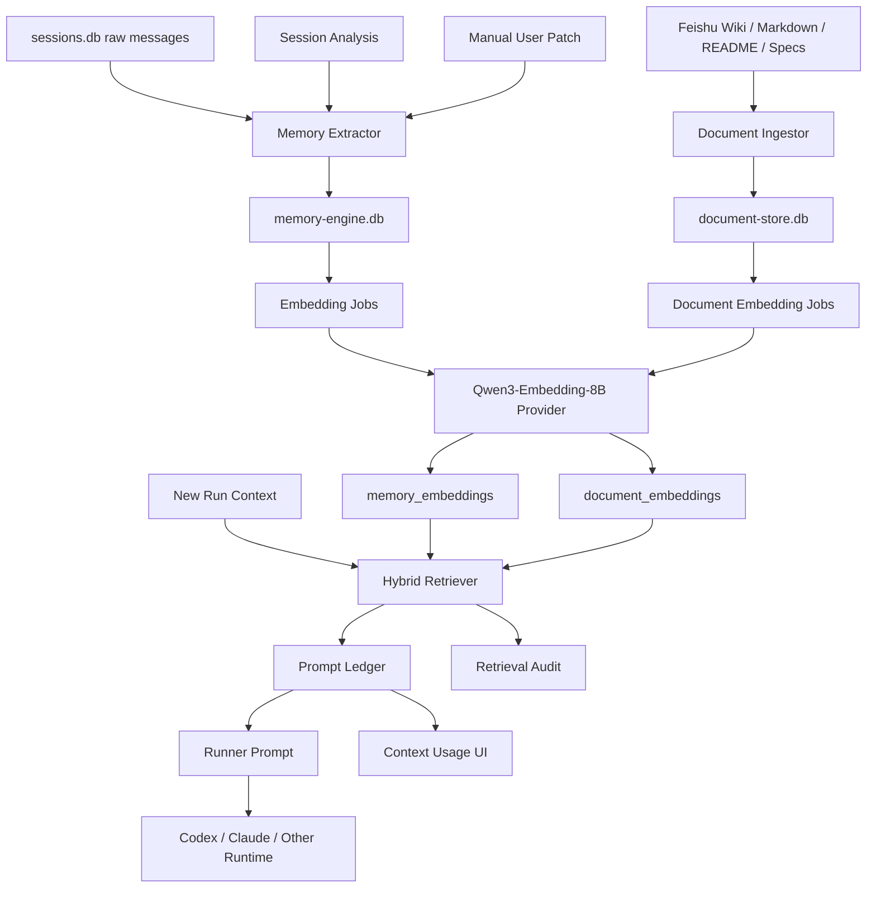

# Qwen3 Memory Engine 计划书

## 0. 计划状态

- 日期: 2026-05-13
- 分支: `codex/qwen-memory-engine-plan`
- 阶段: 方案评审前
- 本文目标: 给 `tech-cc-hub` 设计一套可落地的长期记忆引擎, 使用用户已具备的 `Qwen3-Embedding-8B` 向量模型, 并明确把"对话记忆"和"文档数据"分库存储。
- 当前承诺: 本阶段只写方案和数据设计, 不进入实现。等你确认方向后再开实现。

## 1. 背景

飞书文档里讨论的是 Agent 时代的"记忆引擎": 系统不能只靠最近几轮对话和长上下文硬塞历史, 而要把历史经历沉淀成可检索、可追踪、可演化的记忆。这个方向和 `tech-cc-hub` 当前能力高度相关, 因为本项目已经有以下基础:

- 原始对话历史: `sessions.db` 保存 session 和 message。
- 续跑摘要: session 有 `continuation_summary`, 继续任务时会构造无状态上下文。
- Prompt Ledger: 当前 prompt 的系统、工具、历史、memory、附件等来源已经可以分类展示。
- Learning Store: 已有学习记录表和 FTS, 但当前更偏"捕获/统计", 缺少自动召回注入。
- Session Analysis: 已能把一次任务拆成 Rules / Skills / Memory Patch Proposal。
- Skill Manager: 已有技能库、场景、目标映射, 可以承接从经验到技能的沉淀。

目前缺口不是"完全没有记忆", 而是缺一层可持续工作的 Memory Engine:

- 从历史中自动抽取稳定经验。
- 用向量模型做语义召回。
- 给每条记忆保留来源、证据、置信度、有效期、作用域。
- 在 Runner 构造 prompt 时精准注入少量高价值记忆。
- 把文档、wiki、需求、方案这类知识和对话记忆分开存, 避免混用、污染和权限失控。
- 后续可以演进到图谱, 但第一期不被图谱复杂度拖住。

## 2. 核心判断

### 2.1 `Qwen3-Embedding-8B` 的位置

`Qwen3-Embedding-8B` 适合作为本项目的统一向量模型:

- 中文、代码、长任务上下文都更贴近我们的实际使用场景。
- 可以统一支持对话记忆、文档 chunk、需求条目、技能摘要的 embedding。
- 只要把 provider 做成接口, 未来也能换成本地 GGUF、OpenAI-compatible endpoint、企业内网服务或其他 embedding 模型。

第一期建议不要把向量模型做成"业务逻辑核心", 而是做成可替换的基础设施:

- 存储表记录 `provider`, `model`, `dimension`, `embedding_version`。
- 查询时只比较同一 `embedding_version` 和同一维度的数据。
- 支持重新 embedding 的后台任务。
- 向量服务不可用时, 退回 FTS 和规则召回, 不阻塞 Codex 运行。

### 2.2 向量维度建议

推荐默认维度:

- MVP 默认: `1024`
- 质量不足时: `2048`
- 不建议第一期直接全量 `4096`, 除非机器资源和召回质量评测证明值得。

理由:

- 本项目记忆卡片和文档 chunk 多数是 300 到 1200 字符, 1024 维足以做第一期验证。
- SQLite BLOB 做 exact scan 时, 维度越高 CPU 和磁盘压力越明显。
- 先把抽取质量、作用域过滤、prompt 注入治理做好, 比盲目堆维度更重要。

### 2.3 为什么文档数据必须单独存

文档数据和对话记忆不是一种东西:

- 对话记忆是"我们在某次任务中学到的事实、偏好、失败经验、决策"。
- 文档数据是"被导入的知识源", 比如飞书 wiki、设计文档、README、接口文档、规范、会议纪要。
- 对话记忆通常由 Agent 抽取并持续修订。
- 文档数据通常要保留原文版本、来源 URL、权限、版本 hash、chunk 边界和重新索引记录。

如果混在一张表里, 后面会出现几个问题:

- 无法判断注入 prompt 的内容是经验判断还是文档事实。
- 文档权限和对话记忆权限边界不清。
- 文档更新后无法独立失效旧 chunk。
- Session Analysis 生成的 memory patch 和 wiki 片段会互相污染。
- 后续做图谱时, document entity 和 memory claim 的生命周期不同, 混表会很痛。

所以本方案明确:

- `sessions.db`: 继续保存原始对话历史。
- `memory-engine.db`: 单独保存从对话、分析、人工确认中沉淀出来的记忆卡片。
- `document-store.db`: 单独保存文档源、文档版本、chunk、文档卡片、文档 embedding。
- `skill-manager.db`: 继续保存技能、场景和目标映射。
- Prompt Ledger 展示层把 Memory 和 Document 分成两个来源桶。

## 3. 目标

### 3.1 产品目标

1. 用户不需要每次重新解释项目背景、偏好、坑点和历史决策。
2. Agent 能在相关任务开始前自动召回高价值经验, 但不把全部历史塞进上下文。
3. Session Analysis 的产物不只是文本建议, 可以进入候选记忆、规则、技能流程。
4. 文档知识可导入、可索引、可召回, 但和对话记忆独立治理。
5. 用户能看到本次 prompt 为什么注入这些记忆, 并能删除、禁用、确认或修正。

### 3.2 工程目标

1. 保持当前 session 存储和 continue/resume 逻辑兼容。
2. 不引入重量级框架作为第一期核心依赖。
3. 支持没有向量服务时的降级运行。
4. 所有自动注入必须进入 Prompt Ledger, 可审计。
5. 关键路径有 fake embedding provider 的确定性测试。
6. 新数据和现有用户数据隔离, 可以安全回滚。

### 3.3 第一阶段非目标

1. 不实现完整 Graph Memory。
2. 不做跨用户云端同步。
3. 不把所有历史消息直接 embedding。
4. 不自动把每条 Session Analysis 建议写入长期记忆。
5. 不把文档导入做成万能爬虫。
6. 不在没有评审的情况下把记忆注入影响所有模型运行。

## 4. 当前代码落点

### 4.1 原始历史层

当前 `session-store.ts` 已经承担 raw history:

- session 表保存标题、路径、摘要、workflow 状态、模型等。
- message 表保存 role、content、tool_use、tool_result、metadata、token 等。
- `recordMessage` 是所有消息落库的关键入口。

计划:

- 不改变 `messages` 作为事实源的定位。
- 不在 `sessions.db` 里新增大量 memory 表。
- Memory Engine 通过 session id 和 message id 引用原始历史。

### 4.2 Prompt Ledger 层

当前 `prompt-ledger.ts` 已经定义了 source kind 和展示结构:

- `memory`
- `history`
- `tool`
- `attachment`
- `system`
- `user`

计划:

- 增加或明确 `document` 来源类型。
- Memory cards 注入到 `memorySources`。
- Document cards 注入到 `documentSources` 或新的 prompt bucket。
- Context Usage UI 分开展示:
  - Memory Cards
  - Document Cards
  - History
  - Tool Payload

### 4.3 Runner 注入层

当前 Runner 已经支持追加 project memory prompt:

- 读取 Claude 项目 memory。
- 按 runtime profile 判断是否注入。
- 组装到 system prompt append。

计划:

- 不把新 Memory Engine 硬塞进 `claude-project-memory`。
- 新增独立模块 `memory-engine`.
- 在 `buildPromptLedgerForRun` 或 runner prompt 组装之前执行检索。
- 检索结果进入 ledger, 再由 prompt builder 统一构造。

### 4.4 Stateless Continuation 层

当前 `stateless-continuation.ts` 会在无法远程 resume 时压缩历史:

- 使用 summary。
- 选最近 turns。
- 按 token budget 剪裁。

计划:

- Continuation 仍负责"当前 session 的上下文恢复"。
- Memory Engine 负责"跨 session 的经验召回"。
- 两者不能互相替代。
- 如果 continuation summary 和 memory card 都命中, 由 Prompt Ledger 去重展示。

### 4.5 Learning Store 层

当前 learning store 有:

- `learnings`
- FTS
- session stats
- hooks 捕获 `[LEARN]` 或 correction pattern

计划:

- 不直接删除现有 learning store。
- 第一阶段可以把它作为历史能力兼容。
- 新的 memory card 表更明确支持:
  - source provenance
  - confidence
  - scope
  - embedding version
  - injection audit
  - review status
- 后续迁移时, learning store 可转为 Memory Engine 的一个 legacy source。

### 4.6 Session Analysis 层

当前 Session Analysis Prompt 已经要求输出:

- Root cause category
- Rules
- Skills
- Memory Patch Proposal

计划:

- 增加 UI/IPC action:
  - Save as Memory
  - Convert to Rule
  - Convert to Skill
  - Ignore
- Memory Patch Proposal 默认进入 `pending_review`, 不自动生效。
- 用户确认后写入 `memory-engine.db` 并触发 embedding job。

## 5. 总体架构



## 6. 分层设计

### 6.1 History 层

职责:

- 保存原始对话。
- 保证可追溯。
- 不做长期记忆语义判断。

数据源:

- `sessions.db.sessions`
- `sessions.db.messages`

写入:

- 现有消息记录流程。

读取:

- Extractor 以 session 或 message window 为单位读取。

边界:

- 不给所有 raw messages 直接做 embedding。
- 不在 History 层做知识去重。

### 6.2 Memory 层

职责:

- 把对话历史中的稳定经验转成 memory card。
- 对 memory card 做 embedding。
- 支持人工审核、失效、合并、降权。

记忆卡片粒度:

- 一条卡片只表达一个事实、偏好、决策或教训。
- 300 到 800 字符为宜。
- 必须包含来源引用。
- 必须包含作用域。

卡片类型:

- `fact`: 项目事实, 例如某个 DB 路径、命令入口。
- `preference`: 用户偏好, 例如不要主动提远端分支。
- `decision`: 已确认的技术或产品决策。
- `workaround`: 已验证的临时绕行方案。
- `failure`: 失败模式和排查结论。
- `tool_lesson`: 工具使用经验。
- `rule_candidate`: 可转规则的候选。
- `skill_candidate`: 可转技能的候选。
- `handoff`: 跨任务延续信息。

### 6.3 Document 层

职责:

- 保存外部文档和项目文档的可检索知识。
- 保留文档来源和版本。
- 对 chunk 和文档卡片做 embedding。

文档源类型:

- `feishu_wiki`
- `feishu_docx`
- `markdown`
- `repo_file`
- `pdf`
- `web_page`
- `manual_note`

文档数据必须独立存储:

- 文档源、版本、chunk、embedding 全部在 `document-store.db`。
- Memory Engine 只能通过 retrieval API 使用文档结果。
- 不允许把原文 chunk 复制到 `memory_cards`。
- 如果从文档中提炼出某条长期项目事实, 也要作为 memory card 另行保存, 并保留 `derived_from_document_card_id`。

### 6.4 Retrieval 层

职责:

- 根据当前任务构造 query。
- 同时检索 memory cards 和 document cards。
- 进行作用域过滤、混合排序、预算裁剪。
- 给 Prompt Ledger 输出可解释结果。

Query 组成:

- 当前用户输入。
- cwd / repo slug。
- 最近 1 到 3 条用户意图。
- 文件路径、错误信息、接口名等结构化 signal。
- 当前 workflow 或 skill 名称。

Memory 检索策略:

1. 作用域硬过滤:
   - `user_id`
   - `workspace_id`
   - `repo_slug`
   - `cwd_hash`
   - `visibility`
   - `status`
2. FTS 候选:
   - 关键词、路径、错误码、接口名。
3. 向量候选:
   - Qwen query embedding。
4. 混合排序:
   - vector score
   - lexical score
   - recency
   - importance
   - confidence
   - scope exactness
5. 注入预算:
   - 默认最多 5 条 memory card。
   - 默认最多 1200 tokens。

Document 检索策略:

1. 文档源硬过滤:
   - project scope
   - repo path
   - source type
   - permission status
   - version active
2. Chunk 候选:
   - FTS + vector。
3. 文档卡片优先:
   - 优先注入 summary card、requirement card、decision card。
   - 只有必要时才注入原文 chunk。
4. 注入预算:
   - 默认最多 3 条 document card。
   - 默认最多 1500 tokens。

### 6.5 Prompt 注入层

注入顺序建议:

1. System prompt 基础规则。
2. Project rules / AGENTS.md。
3. Current task。
4. Memory Cards: 少量、明确、带来源。
5. Document Cards: 与当前任务直接相关的文档片段。
6. Recent History / Continuation summary。
7. Tool outputs / attachments。

实际实现要服从当前 prompt builder 的结构, 不在多个地方拼接字符串。

Memory 注入格式建议:

```text
Relevant long-term memories:
- [decision | high | repo:D:\tool\tech-cc-hub] Use a separate worktree for plan-heavy changes. Source: session <id>, 2026-05-13.
- [preference | medium | user] Do not ask for confirmation on obvious reversible next steps. Source: AGENTS.md.
```

Document 注入格式建议:

```text
Relevant document knowledge:
- [feishu_wiki | active | title:...] The memory-engine proposal separates History, Memory, and Graph layers. Source: <url>, version <hash>.
```

关键要求:

- 每条注入都要进入 Prompt Ledger。
- Prompt Ledger 中必须能点开来源。
- 超预算时宁可少注入, 不要塞满。

## 7. 模块拆分

### 7.1 `src/electron/libs/memory-engine/`

建议新增:

- `index.ts`: 对外 API。
- `db.ts`: SQLite 连接和迁移。
- `schema.ts`: 类型定义。
- `repositories.ts`: CRUD。
- `extractor.ts`: session 到 memory candidate。
- `embedding-provider.ts`: provider interface。
- `qwen-embedding-provider.ts`: Qwen endpoint adapter。
- `fake-embedding-provider.ts`: 测试 provider。
- `retriever.ts`: hybrid retrieval。
- `scoring.ts`: 排序和预算。
- `prompt-ledger.ts`: 转成 ledger source。
- `jobs.ts`: embedding / extraction job orchestration。
- `redaction.ts`: secret / PII scanner。

### 7.2 `src/electron/libs/document-store/`

建议新增:

- `index.ts`: 对外 API。
- `db.ts`: SQLite 连接和迁移。
- `schema.ts`: 类型定义。
- `repositories.ts`: source/version/chunk/card CRUD。
- `ingestors/feishu.ts`: Feishu 文档导入适配。
- `ingestors/markdown.ts`: Markdown 文件导入。
- `chunker.ts`: 文档分块。
- `card-extractor.ts`: 从 chunk 生成 doc card。
- `embedding-provider.ts`: 复用 memory engine provider interface。
- `retriever.ts`: 文档检索。
- `jobs.ts`: ingestion / reindex / reembedding。

### 7.3 `src/electron/libs/embedding/`

如果不想让 Memory 和 Document 互相依赖, 可以抽公共层:

- `provider.ts`
- `qwen-provider.ts`
- `serialization.ts`
- `similarity.ts`
- `versioning.ts`
- `settings.ts`

推荐第一期抽公共层, 因为文档和记忆都会用 embedding。

### 7.4 IPC

建议新增或扩展:

- `memory.search`
- `memory.list`
- `memory.updateStatus`
- `memory.createFromAnalysis`
- `memory.reembed`
- `document.import`
- `document.search`
- `document.listSources`
- `document.reindex`
- `embedding.healthCheck`
- `embedding.settings.get`
- `embedding.settings.update`

所有 IPC 需要:

- 参数 schema 校验。
- 错误结构统一。
- 不把 embedding BLOB 返回 UI。
- 重要写操作记录 audit。

### 7.5 UI

建议位置:

- Settings: Embedding provider 配置。
- Session Analysis: Memory Patch 操作入口。
- Activity Rail / Context Usage: 展示注入的 Memory 和 Document。
- 新页面: Memory Center。
- 新页面: Document Knowledge Center。

Memory Center 最小功能:

- 搜索 memory cards。
- 按 project / repo / type / status 过滤。
- 查看来源 session。
- 启用、禁用、删除、改权重。

Document Knowledge Center 最小功能:

- 导入文档。
- 查看源、版本、chunk 数、embedding 状态。
- 搜索文档卡片。
- 重新索引。

## 8. Qwen3 Embedding Provider 设计

### 8.1 Provider Interface

```ts
export interface EmbeddingProvider {
  readonly id: string;
  readonly model: string;
  readonly dimension: number;
  readonly version: string;

  embedDocuments(input: EmbeddingInput[]): Promise<EmbeddingResult[]>;
  embedQuery(input: EmbeddingQueryInput): Promise<EmbeddingResult>;
  healthCheck(): Promise<EmbeddingHealth>;
}
```

### 8.2 输入类型

```ts
export interface EmbeddingInput {
  id: string;
  text: string;
  kind: 'memory_card' | 'document_chunk' | 'document_card';
  metadata?: Record<string, unknown>;
}

export interface EmbeddingQueryInput {
  text: string;
  cwd?: string;
  repoSlug?: string;
  intent?: string;
}
```

### 8.3 Qwen 指令模板

Qwen3 embedding 对 query 和 document 可以使用不同指令。第一期建议把模板放配置:

Memory card document template:

```text
Represent this long-term agent memory for retrieval in coding and project operations:
{text}
```

Document chunk template:

```text
Represent this project document passage for retrieval by an AI coding agent:
{text}
```

Query template:

```text
Retrieve memories and project documents useful for the following coding-agent task:
{text}
```

模板需要可配置, 因为不同部署方式可能已经在服务端包了一层 instruction。

### 8.4 Endpoint 支持

第一期支持两种 shape:

1. OpenAI-compatible:
   - `POST /v1/embeddings`
   - body: `model`, `input`, `dimensions`
2. Custom local service:
   - 配置 `endpointUrl`, `headers`, `requestTemplate`, `responsePath`

推荐先实现 OpenAI-compatible, 再用 adapter 兼容自定义返回。

### 8.5 失败策略

向量服务失败时:

- 不影响聊天运行。
- job 标记 `failed`, 保存错误摘要。
- 检索退回 FTS。
- UI 显示 provider unhealthy。
- 不重复无限重试, 使用 backoff。

## 9. 数据策略摘要

完整 DDL 写在独立文档:

- `docs/superpowers/specs/2026-05-13-qwen-memory-engine-data-design.md`

本计划只列关键表:

`memory-engine.db`:

- `memory_cards`
- `memory_card_sources`
- `memory_embeddings`
- `memory_extraction_jobs`
- `memory_retrieval_events`
- `memory_review_events`

`document-store.db`:

- `document_sources`
- `document_versions`
- `document_chunks`
- `document_cards`
- `document_embeddings`
- `document_ingestion_jobs`
- `document_retrieval_events`

共享概念:

- `embedding_version`: provider + model + dimension + template version。
- `source_ref`: 可回查 session/message/document version。
- `status`: pending_review / active / disabled / archived / superseded。
- `visibility`: user / workspace / repo / global。

## 10. 详细实施阶段

### Phase 0: 方案评审

目标:

- 确认本文架构。
- 确认文档数据单独存储。
- 确认 Qwen endpoint 形态。
- 确认第一期是否做 UI。

产出:

- 本计划书。
- 数据设计文档。
- 用户决策清单。

退出条件:

- 你确认可以进入实现。

### Phase 1: 数据基础和 provider

目标:

- 建立 `memory-engine.db` 和 `document-store.db`。
- 建立 embedding provider interface。
- 提供 fake provider 测试。
- 提供 Qwen provider 初版。

任务:

1. 新建 `src/electron/libs/embedding`.
2. 实现 Float32Array 序列化和反序列化。
3. 实现 cosine similarity。
4. 新建 `memory-engine` DB 迁移。
5. 新建 `document-store` DB 迁移。
6. 实现 repository 单元测试。
7. 实现 provider health check。

验收:

- fake embedding provider 下测试稳定。
- DB 文件能在 `%APPDATA%\tech-cc-hub\` 独立生成。
- schema version 可读。
- provider down 不影响 app 启动。

### Phase 2: Memory extraction

目标:

- 从 session 和 Session Analysis 产物生成 memory candidate。
- 人工确认后入库。
- 自动 embedding。

任务:

1. 建立 session extractor。
2. 建立 memory card JSON schema。
3. 支持从 Session Analysis 的 Memory Patch Proposal 保存。
4. 支持 `[LEARN]` hook 写入 pending memory。
5. 支持 manual memory create。
6. 建立 embedding job queue。
7. 支持禁用和删除 memory。

验收:

- 单个 session 可生成候选 memory。
- 未审核 memory 不会自动注入。
- 审核通过后有 embedding。
- 删除或禁用后不会被召回。

### Phase 3: Memory retrieval injection

目标:

- 新任务开始时召回相关 memory。
- 注入 Prompt Ledger。
- UI 可解释。

任务:

1. 构造 query context。
2. 实现 FTS + vector hybrid retrieval。
3. 实现 scope filter。
4. 实现 token budget。
5. 接入 `buildPromptLedgerForRun` 或 runner prompt 组装点。
6. Context Usage UI 展示 Memory Cards。
7. 记录 retrieval event。

验收:

- 同 repo 任务优先命中同 repo memory。
- 相关 memory 注入, 不相关 memory 不注入。
- Ledger 能显示来源、分数、原因。
- 服务失败时可降级。

### Phase 4: Document Store

目标:

- 文档数据独立存储。
- 支持导入 Markdown / Feishu 文档。
- 支持文档检索和独立注入。

任务:

1. 建立 document source/version/chunk/card 表。
2. Markdown ingestor。
3. Feishu ingestor 接口层。
4. 文档 chunker。
5. 文档 card extractor。
6. 文档 embedding job。
7. Document Knowledge Center 基础 UI。
8. Prompt Ledger 展示 Document Cards。

验收:

- 文档原文和 chunk 存在 `document-store.db`。
- 文档 embedding 不写入 `memory-engine.db`。
- 文档更新后生成新 version。
- 旧 version 可失效。
- 当前任务能召回相关文档卡片。

### Phase 5: Review loop and quality control

目标:

- 防止坏记忆污染长期系统。
- 让用户可以快速纠错。

任务:

1. UI 增加 thumbs up/down。
2. 记录"本次注入有用/无用"。
3. 对低质量 memory 降权。
4. 支持合并重复 memory。
5. 支持 memory supersede。
6. 增加评估脚本。

验收:

- 用户能在一次运行后纠正注入。
- 重复记忆不会无限增长。
- 过期决策能被 supersede。

### Phase 6: Graph-ready extension

目标:

- 不急着做图谱, 但表结构能支持后续演进。

任务:

1. 增加 entity extraction prototype。
2. 设计 `memory_entities` / `memory_edges`。
3. 设计 document entity linking。
4. 评估是否值得引入图数据库。

验收:

- Graph 是独立增强, 不影响第一期 memory retrieval。

## 11. 召回排序方案

### 11.1 Memory score

建议:

```text
score =
  vector_score * 0.55 +
  lexical_score * 0.20 +
  scope_score * 0.10 +
  importance_score * 0.08 +
  recency_score * 0.05 +
  confidence_score * 0.02
```

解释:

- vector_score: Qwen embedding cosine。
- lexical_score: FTS BM25 归一化。
- scope_score: cwd/repo/user/workspace 匹配度。
- importance_score: 人工或系统权重。
- recency_score: 最近使用和最近确认。
- confidence_score: 抽取置信度。

硬规则:

- `status != active` 不注入。
- `visibility` 不允许则不注入。
- `expires_at < now` 不注入。
- `embedding_version` 不匹配则只能 FTS, 不能向量比较。

### 11.2 Document score

建议:

```text
score =
  vector_score * 0.50 +
  lexical_score * 0.25 +
  source_priority * 0.10 +
  freshness_score * 0.08 +
  section_score * 0.04 +
  permission_score * 0.03
```

文档 source priority 可配置:

- 当前 repo docs: 高。
- 用户刚发的 Feishu URL: 高。
- 历史导入但很久未更新: 中。
- archived document: 不参与。

## 12. Token 预算

默认预算建议:

- Memory cards: 800 到 1200 tokens。
- Document cards: 1000 到 1500 tokens。
- 单条 memory card 最大 220 tokens。
- 单条 document card 最大 360 tokens。
- 原文 chunk 默认不注入, 除非 query 明确要求文档细节。

超预算处理:

1. 先按 score 排序。
2. 去掉同源重复。
3. 优先保留 decision / workaround / preference。
4. 文档优先保留 summary / requirement / API contract。
5. 截断时保留 source citation。

## 13. 安全和隐私

### 13.1 本地优先

第一期默认:

- 所有 DB 在本机 `%APPDATA%\tech-cc-hub\`。
- Qwen embedding endpoint 由用户配置。
- 不主动上传文档或记忆到第三方。

### 13.2 Secret redaction

Embedding 前做轻量扫描:

- API key。
- token。
- password。
- private key。
- cookie。
- Authorization header。
- 数据库连接串。

命中策略:

- 默认 redacted 后 embedding。
- 原文 source 仍由原系统保存, 不复制敏感值到 memory card。
- 高风险内容进入 `pending_review`。

### 13.3 权限边界

文档权限不能因为被 embedding 而消失:

- document source 记录 `access_scope`。
- query 时检查当前 workspace / user。
- document version 可以被禁用。
- Feishu 文档保留 source URL 和 token hash, 不把授权凭据写入 chunk。

## 14. UI 体验草案

### 14.1 Memory Center

列表字段:

- Type
- Title
- Scope
- Confidence
- Importance
- Last used
- Status
- Source

操作:

- Enable / Disable
- Edit
- Merge
- Supersede
- Delete
- Open source session
- Re-embed

### 14.2 Document Knowledge Center

列表字段:

- Source title
- Type
- Active version
- Chunk count
- Card count
- Embedding status
- Last indexed
- Scope

操作:

- Import
- Refresh
- Disable source
- Reindex
- Search within source
- Open source URL/file

### 14.3 Context Usage Panel

新增展示:

- Long-term Memory
  - card title
  - reason
  - score
  - source session
- Document Knowledge
  - source title
  - section
  - version
  - score

用户纠错:

- This helped
- Not relevant
- Never use this here
- Edit memory

## 15. 测试计划

### 15.1 Unit tests

- embedding serialization roundtrip。
- cosine similarity。
- provider request/response parsing。
- score calculation。
- token budget trimming。
- DB migrations。
- memory repository CRUD。
- document repository CRUD。
- redaction。

### 15.2 Integration tests

- fake provider 下创建 memory, embedding, retrieval。
- Session Analysis 产物保存成 pending memory。
- 审核 active 后可被召回。
- disabled memory 不召回。
- Markdown 文档导入、chunk、embedding、检索。
- document update 生成新 version。
- provider failure fallback FTS。

### 15.3 UI tests

- Memory Center 显示和过滤。
- Document Knowledge Center 显示。
- Context Usage Panel 分开展示 Memory / Document。
- Save as Memory 流程。

### 15.4 手工验证

1. 配置 Qwen endpoint。
2. 导入一篇 Feishu 文档。
3. 对同主题发起任务。
4. 检查 Prompt Ledger 是否出现 document card。
5. 从 Session Analysis 保存一条 memory。
6. 新 session 中发起相关任务。
7. 检查 memory card 是否命中。
8. 禁用该 memory。
9. 再次任务确认不再命中。

## 16. 风险

### 16.1 抽取质量风险

风险:

- LLM 把临时上下文误判为长期事实。

缓解:

- pending_review 默认。
- card type 和 scope 强约束。
- 必须有 source 引用。
- 高风险类型不自动 active。

### 16.2 召回噪音风险

风险:

- 相关性不够, prompt 被无关记忆污染。

缓解:

- scope filter 优先。
- topK 小。
- Context Usage 可反馈。
- retrieval event 用于分析。

### 16.3 数据膨胀风险

风险:

- 对所有消息和所有文档 chunk 做 embedding 后 DB 过大。

缓解:

- 对话只 embed memory card。
- 文档 chunk 控制粒度。
- 支持 source disable 和 vacuum。
- 支持 embedding dimension 1024 起步。

### 16.4 Provider 不稳定风险

风险:

- 本地 Qwen 服务未启动或接口变更。

缓解:

- health check。
- job retry。
- FTS fallback。
- UI 状态提示。

### 16.5 权限风险

风险:

- 文档导入后越权召回。

缓解:

- document store 独立权限字段。
- retrieval 强过滤。
- source 级禁用。
- 不共享默认本地数据。

## 17. 关键决策点

进入实现前建议你确认:

1. Qwen endpoint 是 OpenAI-compatible 还是自定义接口?
2. 第一阶段维度是否采用 `1024`?
3. 文档导入第一批是否只做 Markdown + Feishu?
4. Memory candidate 是否默认必须人工确认后才 active?
5. 第一阶段是否做 UI, 还是先做后台和 Prompt Ledger?
6. 是否允许增加 `document` 作为新的 Prompt Ledger source kind?
7. 是否允许新增两个 DB 文件:
   - `%APPDATA%\tech-cc-hub\memory-engine.db`
   - `%APPDATA%\tech-cc-hub\document-store.db`

我的建议:

- 1: 先支持 OpenAI-compatible, 再兼容自定义。
- 2: 先用 1024。
- 3: 先做 Markdown + Feishu。
- 4: 默认人工确认, 低风险 `[LEARN]` 可配置自动 active。
- 5: 做最小 UI, 否则用户无法治理记忆。
- 6: 允许新增 `document`。
- 7: 允许新增两个 DB, 这是本方案关键边界。

## 18. 第一版实施清单

如果你批准后, 建议第一批 PR 做这些:

1. 新建 embedding 公共模块。
2. 新建 `memory-engine.db` 和 `document-store.db` schema。
3. 新建 fake provider 测试。
4. 新建 Qwen provider health check。
5. 新建 memory CRUD + embedding job。
6. 新建 document source/version/chunk CRUD。
7. 新建 hybrid retrieval 纯函数和测试。
8. 接 Prompt Ledger 但先 behind feature flag。
9. UI 只显示 Context Usage 的 Memory/Document 来源。
10. 再做 Memory Center / Document Knowledge Center。

## 19. 成功标准

MVP 成功不是"记住很多东西", 而是:

- 每次注入都少而准。
- 用户能知道为什么注入。
- 用户能纠错。
- 文档和记忆边界清晰。
- Qwen provider 可替换。
- 服务不可用时不影响主流程。
- 数据可迁移、可禁用、可清理。

## 20. 本阶段停止点

这份计划书和数据设计文档完成后, 我会停在评审点, 不继续写代码。

你可以直接改其中几个决策:

- 维度选 1024 还是 2048。
- 文档第一批导入源。
- 是否必须人工确认。
- UI 范围。
- 是否先做后台 MVP。

确认后再进入实现, 这样这块不会一上来就写成不可控的大泥球。
