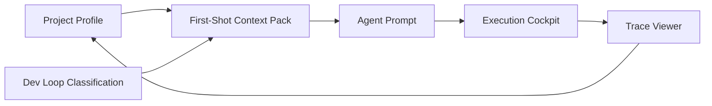

# Project Development Runtime 设计

## 背景

`tech-cc-hub` 的定位不是一个单独被开发的项目，而是用户用来开发其他项目的 cowork agent runtime。它需要像 Cursor Composer 一样，把当前项目、当前任务、运行环境和验证反馈绑定起来，让 Agent 第一次输出就更贴近项目真实上下文。

现有 `Default Dev Loop` 已经实现了任务分类、Prompt 注入和 Trace 节点展示，但它仍偏“通用提醒”。下一层需要把能力挂到每个 `cwd` 上：系统先理解目标项目怎么开发，再决定给 Agent 什么上下文、怎么启动、怎么验证、怎么沉淀经验。

## 产品目标

1. 每个项目自动拥有一份可复用的 `Project Profile`。
2. 开发任务开始前，系统基于 `cwd` 生成 `First-Shot Context Pack`。
3. 常见验证动作由 hub 默认接管：启动、测试、构建、页面预览、截图。
4. 项目经验可持续沉淀，后续任务越来越准。
5. 保持 chat-first，不要求用户手工创建复杂任务。

## 非目标

1. 第一版不做完整 IDE 替代。
2. 第一版不要求支持所有语言生态的深度运行器。
3. 第一版不自动改写项目配置文件。
4. 第一版不强制每个任务都启动服务或截图。
5. 第一版不把项目画像写进业务仓库，除非用户显式选择 repo-local 模式。

## 核心设计

### 1. Project Profile

`Project Profile` 是挂在 `cwd` 上的持久项目画像。它描述“这个项目怎么开发”。

建议默认存放在 hub 自己的数据库或用户数据目录中，避免污染业务仓库。后续可提供“导出到仓库”的选项。

字段建议：

```ts
type ProjectProfile = {
  id: string;
  cwd: string;
  displayName: string;
  detectedAt: number;
  updatedAt: number;
  confidence: number;
  source: "auto" | "user-edited" | "imported";
  stack: ProjectStack[];
  packageManagers: string[];
  commands: ProjectCommand[];
  previewTargets: PreviewTarget[];
  testTargets: TestTarget[];
  entrypoints: ProjectEntrypoint[];
  importantFiles: ImportantFile[];
  guardrails: ProjectGuardrail[];
  notes: ProjectProfileNote[];
};
```

### 2. Stack Detection

系统进入项目时，轻量扫描常见文件：

- `package.json`
- `vite.config.*`
- `next.config.*`
- `electron-builder.*`
- `pom.xml`
- `build.gradle`
- `requirements.txt`
- `pyproject.toml`
- `README*`
- `AGENTS.md`
- `CLAUDE.md`
- `.claude/skills`
- `.cursor/rules`

识别结果不追求一次完美，但必须带置信度和来源。

示例：

```ts
type ProjectStack = {
  kind: "frontend" | "backend" | "electron" | "java" | "node" | "python" | "docs" | "unknown";
  name: string;
  confidence: number;
  evidence: string[];
};
```

### 3. Commands

Profile 要提取常见命令，并按用途分类：

```ts
type ProjectCommand = {
  id: string;
  label: string;
  command: string;
  cwd: string;
  kind: "install" | "dev" | "build" | "test" | "lint" | "typecheck" | "start" | "custom";
  confidence: number;
  evidence: string[];
  lastRunAt?: number;
  lastStatus?: "success" | "failure" | "unknown";
};
```

默认优先级：

1. 项目文档明确写的命令。
2. `package.json scripts` / Maven / Gradle / Makefile。
3. hub 历史成功运行过的命令。
4. 低置信度推断命令。

### 4. Preview Targets

UI 任务需要知道如何预览。

```ts
type PreviewTarget = {
  id: string;
  label: string;
  kind: "web" | "electron" | "mobile" | "api-docs" | "unknown";
  startCommandId?: string;
  url?: string;
  port?: number;
  readinessCheck?: {
    kind: "http" | "process" | "log";
    value: string;
  };
  screenshotSupported: boolean;
};
```

对 `tech-cc-hub` 这类 Electron 项目，Preview Target 应明确：

- `kind: "electron"`
- 默认启动命令是 `npm run dev`
- Vite 端口是 `4173`
- 验收以 Electron 真窗口为准

对普通 Web 项目，优先使用浏览器截图和 DOM/CSS 采样。

### 5. Entrypoints

第一次开发准确率的核心，是让模型知道从哪里下手。

```ts
type ProjectEntrypoint = {
  id: string;
  label: string;
  kind: "route" | "component" | "api" | "service" | "style" | "config" | "test";
  path: string;
  matchHints: string[];
  evidence: string[];
};
```

示例：

- React 页面入口
- Vue 路由入口
- Spring Controller
- API service
- Tailwind / 全局 CSS
- Electron main/preload/renderer 入口

### 6. Guardrails

Guardrails 描述“这个项目不能乱动什么”。

```ts
type ProjectGuardrail = {
  id: string;
  rule: string;
  severity: "info" | "warning" | "block";
  source: "project-doc" | "user" | "history" | "auto";
};
```

示例：

- 不要清理未跟踪文件。
- 不要改动生成产物。
- 不要绕过项目已有组件库。
- Electron 项目不要只跑网页端验收。
- 后端接口变更必须同步 Postman 或 API 文档。

### 7. First-Shot Context Pack

开发任务开始时，hub 根据任务和 Profile 生成上下文包，注入给 Agent。

```ts
type FirstShotContextPack = {
  projectProfileId: string;
  taskKind: string;
  selectedEntrypoints: ProjectEntrypoint[];
  selectedCommands: ProjectCommand[];
  selectedPreviewTarget?: PreviewTarget;
  guardrails: ProjectGuardrail[];
  acceptanceCriteria: string[];
  missingContextQuestions: string[];
};
```

对视觉任务，额外加入：

- 目标图规格
- 当前截图
- DOM/CSS 采样
- 组件映射
- 不允许整页重写的范围

对后端任务，额外加入：

- 相关 Controller/Service/DAO
- 可运行测试
- API 调用方式
- 数据库或配置注意项

### 8. Execution Cockpit MVP

第一版只接最常见执行能力：

1. 启动 dev server
   - 使用 Profile 中置信度最高的 `dev/start` 命令。
   - 检查端口或 readiness。
   - 记录运行状态。

2. 运行验证命令
   - 优先使用与任务相关的 test/lint/typecheck/build。
   - 命令失败时记录到 Trace，并回填给 Agent。

3. 截图
   - Web 项目使用浏览器截图。
   - Electron 项目使用窗口截图。
   - 截图作为 Trace artifact 保存。

4. Trace 展示
   - `Project Profile loaded`
   - `Context Pack generated`
   - `Preview started`
   - `Verification ran`
   - `Screenshot captured`

## 用户体验

### 默认流程

1. 用户选择或输入 `cwd`。
2. hub 自动加载或生成 Project Profile。
3. 用户直接发开发任务。
4. hub 分类任务并生成 Context Pack。
5. Agent 执行代码修改。
6. hub 按 Profile 运行验证。
7. Trace Viewer 展示证据。
8. 成功经验沉淀回 Project Profile。

### 可见但不打扰

输入区只显示简短状态：

- `Project Profile: 已加载`
- `Dev Loop: 自动`
- `Preview: 可用`
- `Verify: npm test / npm run build`

点击后再展开详情。

### 用户可修正

Profile 需要允许用户修正：

- 这个项目启动命令不是 `npm run dev`
- 这个端口不是自动识别的端口
- 这个目录不要动
- 这个测试命令太慢，默认不要跑
- 这个页面入口识别错了

用户修正后，Profile 标记为 `user-edited`，优先级高于自动扫描。

## 数据存储建议

第一版建议存 hub 内部数据库，不写业务仓库：

- 不污染用户项目。
- 可跨分支复用。
- 可记录运行历史。
- 适合存 screenshot/artifact 引用。

后续可提供两种导出：

1. `Export profile to repo`
   - 写到 `.tech-cc/project-profile.json`。

2. `Export profile to docs`
   - 写成 Markdown，方便团队共享。

## 与现有 Dev Loop 的关系

现有 Dev Loop 是任务级策略：

- 判断任务类型。
- 决定 loopMode。
- 注入执行要求。
- Trace 展示 Dev Loop 节点。

Project Development Runtime 是项目级能力：

- 维护 Project Profile。
- 生成 First-Shot Context Pack。
- 提供启动/验证/截图执行能力。
- 沉淀项目经验。

二者关系：



## MVP 范围

第一阶段做“持久项目画像 + 少量执行驾驶舱”：

1. Profile 生成
   - 扫描项目文件。
   - 识别 stack、commands、preview targets、guardrails。
   - 存入 hub DB。

2. Profile 加载
   - session 进入 `cwd` 时自动加载。
   - 没有则生成。
   - Trace 记录 profile 状态。

3. Context Pack 注入
   - 开发任务开始时生成。
   - 合并到现有 Dev Loop promptAddendum。

4. 常见验证
   - 支持 `npm run build`、`npm test`、`npm run lint`、`npm run dev`。
   - 先支持 Node/Vite/React/Electron 项目。

5. 视觉预览
   - Web URL 截图。
   - Electron 真窗口截图作为后续增强，不阻塞第一版。

## 验收标准

1. 打开一个新项目后，hub 能生成项目画像并展示主要技术栈和命令。
2. 开发任务第一轮 prompt 中包含 Project Profile 和 Context Pack。
3. 前端任务能找到预览命令或明确说明缺失。
4. 普通代码任务能选择一个合理验证命令。
5. Trace Viewer 能看到 Profile 加载、Context Pack 生成和验证动作。
6. 用户手动修正的 Profile 信息会在下一次任务中优先使用。

## 后续增强

1. DOM/CSS 自动采样。
2. Figma frame 拉取和 token 提取。
3. Java/Maven/Gradle 深度 profile。
4. API 任务自动生成请求样例。
5. 慢测试策略和命令白名单。
6. 多项目 workspace 画像聚合。
7. 成功修复路径自动沉淀成项目经验。

## 自检

1. 设计聚焦 hub 作为跨项目开发 runtime，不再绑定 tech-cc-hub 自身 UI。
2. MVP 边界明确：先做持久项目画像，再接少量启动/验证/截图。
3. Project Profile、Context Pack、Execution Cockpit 三层职责分开。
4. 默认存 hub 内部数据库，避免污染业务项目。
5. 允许用户修正，避免自动推断长期错误。
