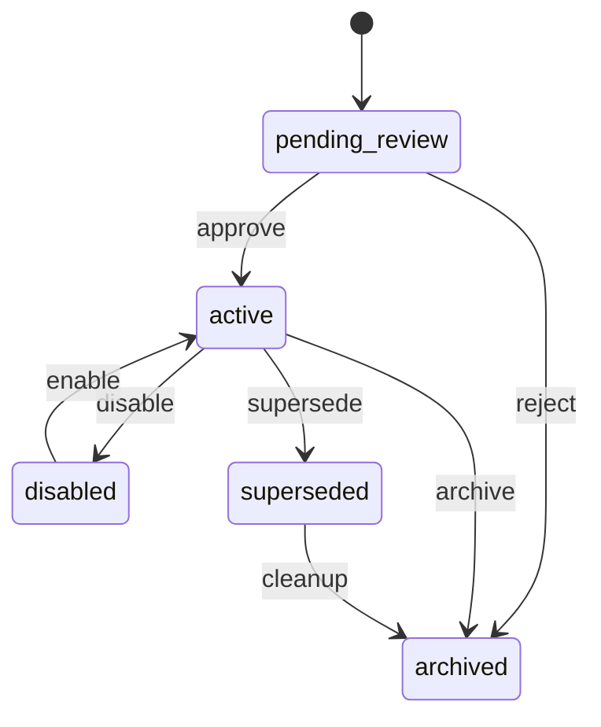
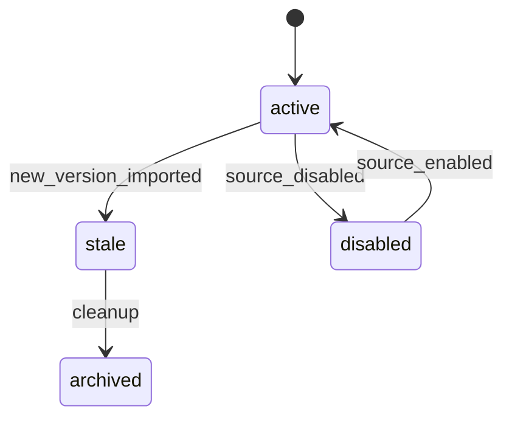
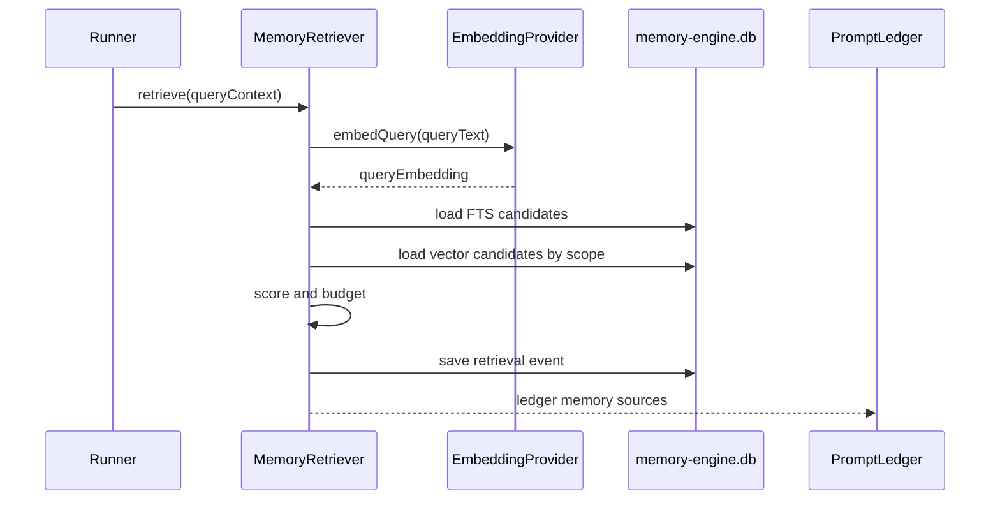
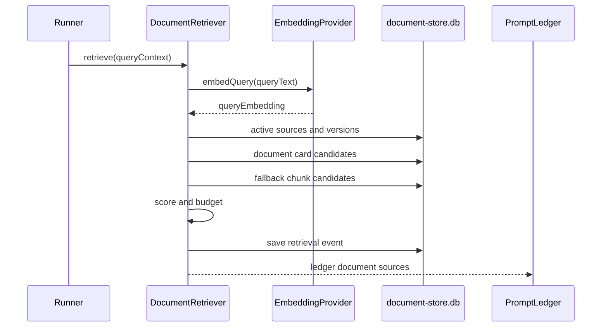

# Qwen3 Memory Engine 数据设计

## 1. 文档目的

本文是 `Qwen3 Memory Engine` 的数据设计文档, 与计划书配套:

- 计划书: `docs/superpowers/plans/2026-05-13-qwen-memory-engine.md`
- 本文: 说明数据库、表结构、字段语义、索引、迁移、数据生命周期。

核心原则:

- 原始对话历史继续在 `sessions.db`。
- 对话抽取出的长期记忆单独在 `memory-engine.db`。
- 文档源、文档版本、chunk、文档 embedding 单独在 `document-store.db`。
- Prompt 注入结果要可审计。
- Qwen3 embedding 的维度和模板版本必须可追踪。

## 2. 数据域划分

### 2.1 `sessions.db`

已有数据库, 不作为本方案主改动对象。

职责:

- 保存 session。
- 保存 messages。
- 保存 continuation summary。
- 保存运行过程需要的历史数据。

Memory Engine 只引用:

- `session_id`
- `message_id`
- `created_at`
- `cwd`
- `model`
- message role/content 摘要

禁止:

- 不在 `sessions.db` 中保存 memory embedding。
- 不把文档 chunk 写入 `sessions.db`。

### 2.2 `memory-engine.db`

新增数据库。

职责:

- 保存从对话、Session Analysis、人工输入中沉淀出来的 memory card。
- 保存 memory embedding。
- 保存抽取任务、审核记录、召回记录。

典型数据:

- 用户偏好。
- 项目决策。
- 工具使用经验。
- 失败排查结论。
- 可转规则或技能的候选。

### 2.3 `document-store.db`

新增数据库。

职责:

- 保存外部或项目文档源。
- 保存文档版本。
- 保存 chunk。
- 保存 document card。
- 保存 document embedding。
- 保存导入、重建索引、召回记录。

典型数据:

- Feishu wiki。
- Markdown 设计文档。
- README。
- API 文档。
- 会议纪要。
- 产品需求文档。

### 2.4 `skill-manager.db`

已有数据库。

职责不变:

- 保存技能。
- 保存场景。
- 保存技能和目标映射。

Memory Engine 可以产生 skill candidate, 但不直接写入技能库, 除非用户确认转换。

## 3. 公共约定

### 3.1 时间字段

全部使用 ISO 8601 文本:

```sql
created_at TEXT NOT NULL DEFAULT (datetime('now')),
updated_at TEXT NOT NULL DEFAULT (datetime('now'))
```

应用层统一按 UTC 处理, UI 再转本地时间。

### 3.2 ID

推荐:

- 主键使用 text uuid。
- 外部来源 token/hash 保留独立字段。
- 不依赖 rowid 做业务引用。

### 3.3 JSON 字段

SQLite 中 JSON 保存为 TEXT:

- 应用层做 schema 校验。
- 只把低频过滤字段放 JSON。
- 高频过滤字段必须拆列。

### 3.4 Embedding BLOB

向量保存为 little-endian Float32Array:

- `embedding BLOB NOT NULL`
- `dimension INTEGER NOT NULL`
- `embedding_format TEXT NOT NULL DEFAULT 'f32-le'`

应用层必须校验:

- blob 长度等于 `dimension * 4`。
- dimension 和 provider version 匹配。

### 3.5 Embedding version

格式建议:

```text
provider:qwen3|model:Qwen3-Embedding-8B|dim:1024|docTpl:v1|queryTpl:v1
```

字段拆分:

- `provider_id`
- `model`
- `dimension`
- `template_version`
- `embedding_version`

查询时:

- 向量相似度只比较相同 `embedding_version` 或同一兼容组。
- 不兼容版本只能走 FTS 或触发 reembed。

## 4. `memory-engine.db` DDL

### 4.1 `schema_migrations`

```sql
CREATE TABLE IF NOT EXISTS schema_migrations (
  id TEXT PRIMARY KEY,
  applied_at TEXT NOT NULL DEFAULT (datetime('now'))
);
```

### 4.2 `memory_cards`

```sql
CREATE TABLE IF NOT EXISTS memory_cards (
  id TEXT PRIMARY KEY,

  type TEXT NOT NULL CHECK (
    type IN (
      'fact',
      'preference',
      'decision',
      'workaround',
      'failure',
      'tool_lesson',
      'rule_candidate',
      'skill_candidate',
      'handoff'
    )
  ),

  title TEXT NOT NULL,
  body TEXT NOT NULL,
  normalized_body TEXT,

  user_id TEXT,
  workspace_id TEXT,
  repo_slug TEXT,
  cwd_hash TEXT,
  cwd_path TEXT,

  visibility TEXT NOT NULL DEFAULT 'user' CHECK (
    visibility IN ('user', 'workspace', 'repo', 'global')
  ),

  status TEXT NOT NULL DEFAULT 'pending_review' CHECK (
    status IN ('pending_review', 'active', 'disabled', 'archived', 'superseded')
  ),

  confidence REAL NOT NULL DEFAULT 0.5 CHECK (confidence >= 0 AND confidence <= 1),
  importance REAL NOT NULL DEFAULT 0.5 CHECK (importance >= 0 AND importance <= 1),

  tags_json TEXT NOT NULL DEFAULT '[]',
  metadata_json TEXT NOT NULL DEFAULT '{}',

  source_summary TEXT,
  created_by TEXT NOT NULL DEFAULT 'system' CHECK (
    created_by IN ('system', 'user', 'session_analysis', 'learn_hook', 'import')
  ),

  supersedes_id TEXT,
  expires_at TEXT,
  last_used_at TEXT,
  use_count INTEGER NOT NULL DEFAULT 0,

  created_at TEXT NOT NULL DEFAULT (datetime('now')),
  updated_at TEXT NOT NULL DEFAULT (datetime('now')),

  FOREIGN KEY (supersedes_id) REFERENCES memory_cards(id)
);
```

索引:

```sql
CREATE INDEX IF NOT EXISTS idx_memory_cards_status
  ON memory_cards(status);

CREATE INDEX IF NOT EXISTS idx_memory_cards_scope
  ON memory_cards(user_id, workspace_id, repo_slug, cwd_hash, visibility, status);

CREATE INDEX IF NOT EXISTS idx_memory_cards_type
  ON memory_cards(type, status);

CREATE INDEX IF NOT EXISTS idx_memory_cards_updated
  ON memory_cards(updated_at DESC);

CREATE INDEX IF NOT EXISTS idx_memory_cards_last_used
  ON memory_cards(last_used_at DESC);
```

FTS:

```sql
CREATE VIRTUAL TABLE IF NOT EXISTS memory_cards_fts USING fts5(
  title,
  body,
  tags,
  content='memory_cards',
  content_rowid='rowid'
);
```

说明:

- `body` 是注入 prompt 的主体。
- `normalized_body` 用于去重和相似合并。
- `status=pending_review` 默认不参与自动注入。
- `cwd_path` 方便 UI 展示, `cwd_hash` 用于过滤和索引。

### 4.3 `memory_card_sources`

```sql
CREATE TABLE IF NOT EXISTS memory_card_sources (
  id TEXT PRIMARY KEY,
  memory_card_id TEXT NOT NULL,

  source_type TEXT NOT NULL CHECK (
    source_type IN (
      'session',
      'message',
      'session_analysis',
      'manual',
      'document_card',
      'legacy_learning'
    )
  ),

  source_id TEXT NOT NULL,
  source_label TEXT,
  source_uri TEXT,
  source_created_at TEXT,

  evidence_excerpt TEXT,
  evidence_hash TEXT,
  metadata_json TEXT NOT NULL DEFAULT '{}',

  created_at TEXT NOT NULL DEFAULT (datetime('now')),

  FOREIGN KEY (memory_card_id) REFERENCES memory_cards(id) ON DELETE CASCADE
);
```

索引:

```sql
CREATE INDEX IF NOT EXISTS idx_memory_sources_card
  ON memory_card_sources(memory_card_id);

CREATE INDEX IF NOT EXISTS idx_memory_sources_source
  ON memory_card_sources(source_type, source_id);
```

说明:

- 每条 memory card 必须至少有一个 source。
- `evidence_excerpt` 只保存短摘录, 不复制大段原文。
- 如果 memory 从文档卡片提炼而来, `source_type=document_card`。

### 4.4 `memory_embeddings`

```sql
CREATE TABLE IF NOT EXISTS memory_embeddings (
  id TEXT PRIMARY KEY,
  memory_card_id TEXT NOT NULL,

  provider_id TEXT NOT NULL,
  model TEXT NOT NULL,
  dimension INTEGER NOT NULL,
  template_version TEXT NOT NULL,
  embedding_version TEXT NOT NULL,
  embedding_format TEXT NOT NULL DEFAULT 'f32-le',
  embedding BLOB NOT NULL,

  source_text_hash TEXT NOT NULL,
  status TEXT NOT NULL DEFAULT 'active' CHECK (
    status IN ('active', 'stale', 'failed', 'disabled')
  ),

  error_summary TEXT,
  embedded_at TEXT NOT NULL DEFAULT (datetime('now')),
  created_at TEXT NOT NULL DEFAULT (datetime('now')),

  FOREIGN KEY (memory_card_id) REFERENCES memory_cards(id) ON DELETE CASCADE
);
```

索引:

```sql
CREATE UNIQUE INDEX IF NOT EXISTS uq_memory_embedding_card_version
  ON memory_embeddings(memory_card_id, embedding_version);

CREATE INDEX IF NOT EXISTS idx_memory_embeddings_version
  ON memory_embeddings(embedding_version, status);

CREATE INDEX IF NOT EXISTS idx_memory_embeddings_card
  ON memory_embeddings(memory_card_id);
```

说明:

- 一张 card 可以有多个版本 embedding。
- body 改动后旧 embedding 标记 `stale`。
- Qwen 维度变更后不覆盖旧 embedding, 写新版本。

### 4.5 `memory_extraction_jobs`

```sql
CREATE TABLE IF NOT EXISTS memory_extraction_jobs (
  id TEXT PRIMARY KEY,

  source_type TEXT NOT NULL CHECK (
    source_type IN ('session', 'session_analysis', 'learn_hook', 'manual')
  ),
  source_id TEXT NOT NULL,

  status TEXT NOT NULL DEFAULT 'queued' CHECK (
    status IN ('queued', 'running', 'succeeded', 'failed', 'cancelled')
  ),

  extractor_version TEXT NOT NULL,
  requested_by TEXT,
  result_card_ids_json TEXT NOT NULL DEFAULT '[]',
  error_summary TEXT,

  started_at TEXT,
  finished_at TEXT,
  created_at TEXT NOT NULL DEFAULT (datetime('now')),
  updated_at TEXT NOT NULL DEFAULT (datetime('now'))
);
```

索引:

```sql
CREATE INDEX IF NOT EXISTS idx_memory_extraction_jobs_status
  ON memory_extraction_jobs(status, created_at);

CREATE INDEX IF NOT EXISTS idx_memory_extraction_jobs_source
  ON memory_extraction_jobs(source_type, source_id);
```

### 4.6 `memory_embedding_jobs`

```sql
CREATE TABLE IF NOT EXISTS memory_embedding_jobs (
  id TEXT PRIMARY KEY,
  memory_card_id TEXT NOT NULL,

  status TEXT NOT NULL DEFAULT 'queued' CHECK (
    status IN ('queued', 'running', 'succeeded', 'failed', 'cancelled')
  ),

  provider_id TEXT NOT NULL,
  model TEXT NOT NULL,
  dimension INTEGER NOT NULL,
  template_version TEXT NOT NULL,
  embedding_version TEXT NOT NULL,

  attempt_count INTEGER NOT NULL DEFAULT 0,
  next_attempt_at TEXT,
  error_summary TEXT,

  started_at TEXT,
  finished_at TEXT,
  created_at TEXT NOT NULL DEFAULT (datetime('now')),
  updated_at TEXT NOT NULL DEFAULT (datetime('now')),

  FOREIGN KEY (memory_card_id) REFERENCES memory_cards(id) ON DELETE CASCADE
);
```

索引:

```sql
CREATE INDEX IF NOT EXISTS idx_memory_embedding_jobs_status
  ON memory_embedding_jobs(status, next_attempt_at, created_at);
```

### 4.7 `memory_retrieval_events`

```sql
CREATE TABLE IF NOT EXISTS memory_retrieval_events (
  id TEXT PRIMARY KEY,

  session_id TEXT,
  run_id TEXT,
  user_query_hash TEXT NOT NULL,
  cwd_hash TEXT,
  repo_slug TEXT,

  embedding_version TEXT,
  query_embedding_hash TEXT,

  requested_top_k INTEGER NOT NULL,
  injected_count INTEGER NOT NULL,
  token_budget INTEGER NOT NULL,

  results_json TEXT NOT NULL DEFAULT '[]',
  filters_json TEXT NOT NULL DEFAULT '{}',
  scoring_version TEXT NOT NULL,

  created_at TEXT NOT NULL DEFAULT (datetime('now'))
);
```

`results_json` 示例:

```json
[
  {
    "memoryCardId": "mem_123",
    "rank": 1,
    "score": 0.86,
    "vectorScore": 0.78,
    "lexicalScore": 0.42,
    "scopeScore": 1,
    "injected": true,
    "reason": "repo scope and query embedding matched"
  }
]
```

说明:

- 不保存原始 query, 只保存 hash 和结构化结果。
- 调试需要时可以在开发模式下临时开启 query preview。

### 4.8 `memory_review_events`

```sql
CREATE TABLE IF NOT EXISTS memory_review_events (
  id TEXT PRIMARY KEY,
  memory_card_id TEXT NOT NULL,

  action TEXT NOT NULL CHECK (
    action IN (
      'approve',
      'disable',
      'edit',
      'delete',
      'merge',
      'supersede',
      'thumbs_up',
      'thumbs_down'
    )
  ),

  actor TEXT NOT NULL DEFAULT 'user',
  before_json TEXT,
  after_json TEXT,
  note TEXT,

  created_at TEXT NOT NULL DEFAULT (datetime('now')),

  FOREIGN KEY (memory_card_id) REFERENCES memory_cards(id) ON DELETE CASCADE
);
```

索引:

```sql
CREATE INDEX IF NOT EXISTS idx_memory_review_events_card
  ON memory_review_events(memory_card_id, created_at DESC);
```

## 5. `document-store.db` DDL

### 5.1 `schema_migrations`

```sql
CREATE TABLE IF NOT EXISTS schema_migrations (
  id TEXT PRIMARY KEY,
  applied_at TEXT NOT NULL DEFAULT (datetime('now'))
);
```

### 5.2 `document_sources`

```sql
CREATE TABLE IF NOT EXISTS document_sources (
  id TEXT PRIMARY KEY,

  source_type TEXT NOT NULL CHECK (
    source_type IN (
      'feishu_wiki',
      'feishu_docx',
      'markdown',
      'repo_file',
      'pdf',
      'web_page',
      'manual_note'
    )
  ),

  title TEXT NOT NULL,
  source_uri TEXT,
  source_token_hash TEXT,

  user_id TEXT,
  workspace_id TEXT,
  repo_slug TEXT,
  cwd_hash TEXT,
  cwd_path TEXT,

  access_scope TEXT NOT NULL DEFAULT 'user' CHECK (
    access_scope IN ('user', 'workspace', 'repo', 'global')
  ),

  status TEXT NOT NULL DEFAULT 'active' CHECK (
    status IN ('active', 'disabled', 'archived', 'deleted')
  ),

  metadata_json TEXT NOT NULL DEFAULT '{}',

  last_imported_at TEXT,
  created_at TEXT NOT NULL DEFAULT (datetime('now')),
  updated_at TEXT NOT NULL DEFAULT (datetime('now'))
);
```

索引:

```sql
CREATE INDEX IF NOT EXISTS idx_document_sources_scope
  ON document_sources(user_id, workspace_id, repo_slug, cwd_hash, access_scope, status);

CREATE INDEX IF NOT EXISTS idx_document_sources_type
  ON document_sources(source_type, status);

CREATE INDEX IF NOT EXISTS idx_document_sources_uri
  ON document_sources(source_uri);
```

说明:

- `source_uri` 可以是 Feishu URL、文件路径、网页 URL。
- `source_token_hash` 用于识别同一外部文档, 不保存敏感 token。
- source 禁用后, 其 active version 不再参与召回。

### 5.3 `document_versions`

```sql
CREATE TABLE IF NOT EXISTS document_versions (
  id TEXT PRIMARY KEY,
  document_source_id TEXT NOT NULL,

  version_label TEXT,
  content_hash TEXT NOT NULL,
  title TEXT NOT NULL,
  summary TEXT,

  status TEXT NOT NULL DEFAULT 'active' CHECK (
    status IN ('active', 'stale', 'archived', 'failed')
  ),

  raw_content_ref TEXT,
  raw_content_hash TEXT,
  raw_content_size INTEGER,

  imported_by TEXT NOT NULL DEFAULT 'system',
  import_job_id TEXT,
  metadata_json TEXT NOT NULL DEFAULT '{}',

  created_at TEXT NOT NULL DEFAULT (datetime('now')),
  updated_at TEXT NOT NULL DEFAULT (datetime('now')),

  FOREIGN KEY (document_source_id) REFERENCES document_sources(id) ON DELETE CASCADE
);
```

索引:

```sql
CREATE UNIQUE INDEX IF NOT EXISTS uq_document_version_hash
  ON document_versions(document_source_id, content_hash);

CREATE INDEX IF NOT EXISTS idx_document_versions_source_status
  ON document_versions(document_source_id, status, created_at DESC);
```

说明:

- 同一 source 可以有多个 version。
- source 更新时, 新内容生成新 version。
- 默认只召回 `status=active` 的最新 version。
- `raw_content_ref` 可以指向本地缓存文件, 不强制把大原文放 DB。

### 5.4 `document_chunks`

```sql
CREATE TABLE IF NOT EXISTS document_chunks (
  id TEXT PRIMARY KEY,
  document_version_id TEXT NOT NULL,

  chunk_index INTEGER NOT NULL,
  heading_path TEXT,
  body TEXT NOT NULL,
  body_hash TEXT NOT NULL,

  start_offset INTEGER,
  end_offset INTEGER,
  token_count INTEGER,

  chunk_type TEXT NOT NULL DEFAULT 'body' CHECK (
    chunk_type IN ('title', 'summary', 'body', 'code', 'table', 'quote')
  ),

  metadata_json TEXT NOT NULL DEFAULT '{}',

  created_at TEXT NOT NULL DEFAULT (datetime('now')),

  FOREIGN KEY (document_version_id) REFERENCES document_versions(id) ON DELETE CASCADE
);
```

索引:

```sql
CREATE UNIQUE INDEX IF NOT EXISTS uq_document_chunk_index
  ON document_chunks(document_version_id, chunk_index);

CREATE INDEX IF NOT EXISTS idx_document_chunks_version
  ON document_chunks(document_version_id);

CREATE INDEX IF NOT EXISTS idx_document_chunks_hash
  ON document_chunks(body_hash);
```

FTS:

```sql
CREATE VIRTUAL TABLE IF NOT EXISTS document_chunks_fts USING fts5(
  heading_path,
  body,
  content='document_chunks',
  content_rowid='rowid'
);
```

说明:

- chunk 保存原文片段。
- chunk 是检索的底层材料, 但默认不直接注入 prompt。
- 注入时优先用 `document_cards`。

### 5.5 `document_cards`

```sql
CREATE TABLE IF NOT EXISTS document_cards (
  id TEXT PRIMARY KEY,
  document_version_id TEXT NOT NULL,
  document_chunk_id TEXT,

  card_type TEXT NOT NULL CHECK (
    card_type IN (
      'doc_summary',
      'requirement',
      'decision',
      'api_contract',
      'schema_fact',
      'howto',
      'risk',
      'open_question'
    )
  ),

  title TEXT NOT NULL,
  body TEXT NOT NULL,
  citation TEXT,

  status TEXT NOT NULL DEFAULT 'active' CHECK (
    status IN ('active', 'disabled', 'stale', 'archived')
  ),

  confidence REAL NOT NULL DEFAULT 0.7 CHECK (confidence >= 0 AND confidence <= 1),
  importance REAL NOT NULL DEFAULT 0.5 CHECK (importance >= 0 AND importance <= 1),

  tags_json TEXT NOT NULL DEFAULT '[]',
  metadata_json TEXT NOT NULL DEFAULT '{}',

  created_at TEXT NOT NULL DEFAULT (datetime('now')),
  updated_at TEXT NOT NULL DEFAULT (datetime('now')),

  FOREIGN KEY (document_version_id) REFERENCES document_versions(id) ON DELETE CASCADE,
  FOREIGN KEY (document_chunk_id) REFERENCES document_chunks(id) ON DELETE SET NULL
);
```

索引:

```sql
CREATE INDEX IF NOT EXISTS idx_document_cards_version_status
  ON document_cards(document_version_id, status);

CREATE INDEX IF NOT EXISTS idx_document_cards_type_status
  ON document_cards(card_type, status);
```

FTS:

```sql
CREATE VIRTUAL TABLE IF NOT EXISTS document_cards_fts USING fts5(
  title,
  body,
  citation,
  content='document_cards',
  content_rowid='rowid'
);
```

说明:

- `document_cards` 是文档层给 Agent 用的摘要事实。
- 文档 card 不等于 memory card。
- 如果某条 document card 后续被确认为长期经验, 由用户或流程生成对应 memory card。

### 5.6 `document_embeddings`

```sql
CREATE TABLE IF NOT EXISTS document_embeddings (
  id TEXT PRIMARY KEY,

  target_type TEXT NOT NULL CHECK (
    target_type IN ('document_chunk', 'document_card')
  ),
  target_id TEXT NOT NULL,

  provider_id TEXT NOT NULL,
  model TEXT NOT NULL,
  dimension INTEGER NOT NULL,
  template_version TEXT NOT NULL,
  embedding_version TEXT NOT NULL,
  embedding_format TEXT NOT NULL DEFAULT 'f32-le',
  embedding BLOB NOT NULL,

  source_text_hash TEXT NOT NULL,
  status TEXT NOT NULL DEFAULT 'active' CHECK (
    status IN ('active', 'stale', 'failed', 'disabled')
  ),

  error_summary TEXT,
  embedded_at TEXT NOT NULL DEFAULT (datetime('now')),
  created_at TEXT NOT NULL DEFAULT (datetime('now'))
);
```

索引:

```sql
CREATE UNIQUE INDEX IF NOT EXISTS uq_document_embedding_target_version
  ON document_embeddings(target_type, target_id, embedding_version);

CREATE INDEX IF NOT EXISTS idx_document_embeddings_version
  ON document_embeddings(embedding_version, status);

CREATE INDEX IF NOT EXISTS idx_document_embeddings_target
  ON document_embeddings(target_type, target_id);
```

说明:

- 文档 chunk 和文档 card 共用一张 embedding 表。
- 通过 `target_type` 区分。
- 查询时优先查 document card embedding, 必要时查 chunk embedding。

### 5.7 `document_ingestion_jobs`

```sql
CREATE TABLE IF NOT EXISTS document_ingestion_jobs (
  id TEXT PRIMARY KEY,

  source_type TEXT NOT NULL,
  source_uri TEXT,
  document_source_id TEXT,
  document_version_id TEXT,

  status TEXT NOT NULL DEFAULT 'queued' CHECK (
    status IN ('queued', 'running', 'succeeded', 'failed', 'cancelled')
  ),

  ingestor_version TEXT NOT NULL,
  chunker_version TEXT NOT NULL,
  card_extractor_version TEXT,

  requested_by TEXT,
  error_summary TEXT,
  stats_json TEXT NOT NULL DEFAULT '{}',

  started_at TEXT,
  finished_at TEXT,
  created_at TEXT NOT NULL DEFAULT (datetime('now')),
  updated_at TEXT NOT NULL DEFAULT (datetime('now'))
);
```

索引:

```sql
CREATE INDEX IF NOT EXISTS idx_document_ingestion_jobs_status
  ON document_ingestion_jobs(status, created_at);

CREATE INDEX IF NOT EXISTS idx_document_ingestion_jobs_source
  ON document_ingestion_jobs(source_type, source_uri);
```

### 5.8 `document_embedding_jobs`

```sql
CREATE TABLE IF NOT EXISTS document_embedding_jobs (
  id TEXT PRIMARY KEY,

  target_type TEXT NOT NULL CHECK (
    target_type IN ('document_chunk', 'document_card')
  ),
  target_id TEXT NOT NULL,

  status TEXT NOT NULL DEFAULT 'queued' CHECK (
    status IN ('queued', 'running', 'succeeded', 'failed', 'cancelled')
  ),

  provider_id TEXT NOT NULL,
  model TEXT NOT NULL,
  dimension INTEGER NOT NULL,
  template_version TEXT NOT NULL,
  embedding_version TEXT NOT NULL,

  attempt_count INTEGER NOT NULL DEFAULT 0,
  next_attempt_at TEXT,
  error_summary TEXT,

  started_at TEXT,
  finished_at TEXT,
  created_at TEXT NOT NULL DEFAULT (datetime('now')),
  updated_at TEXT NOT NULL DEFAULT (datetime('now'))
);
```

索引:

```sql
CREATE INDEX IF NOT EXISTS idx_document_embedding_jobs_status
  ON document_embedding_jobs(status, next_attempt_at, created_at);
```

### 5.9 `document_retrieval_events`

```sql
CREATE TABLE IF NOT EXISTS document_retrieval_events (
  id TEXT PRIMARY KEY,

  session_id TEXT,
  run_id TEXT,
  user_query_hash TEXT NOT NULL,
  cwd_hash TEXT,
  repo_slug TEXT,

  embedding_version TEXT,
  query_embedding_hash TEXT,

  requested_top_k INTEGER NOT NULL,
  injected_count INTEGER NOT NULL,
  token_budget INTEGER NOT NULL,

  results_json TEXT NOT NULL DEFAULT '[]',
  filters_json TEXT NOT NULL DEFAULT '{}',
  scoring_version TEXT NOT NULL,

  created_at TEXT NOT NULL DEFAULT (datetime('now'))
);
```

说明:

- 和 memory retrieval event 分开保存。
- 方便后续分析: 是文档召回不准, 还是记忆召回不准。

## 6. FTS 同步策略

SQLite FTS external content 需要同步触发器。

Memory 示例:

```sql
CREATE TRIGGER IF NOT EXISTS memory_cards_ai AFTER INSERT ON memory_cards BEGIN
  INSERT INTO memory_cards_fts(rowid, title, body, tags)
  VALUES (new.rowid, new.title, new.body, new.tags_json);
END;

CREATE TRIGGER IF NOT EXISTS memory_cards_ad AFTER DELETE ON memory_cards BEGIN
  INSERT INTO memory_cards_fts(memory_cards_fts, rowid, title, body, tags)
  VALUES ('delete', old.rowid, old.title, old.body, old.tags_json);
END;

CREATE TRIGGER IF NOT EXISTS memory_cards_au AFTER UPDATE ON memory_cards BEGIN
  INSERT INTO memory_cards_fts(memory_cards_fts, rowid, title, body, tags)
  VALUES ('delete', old.rowid, old.title, old.body, old.tags_json);
  INSERT INTO memory_cards_fts(rowid, title, body, tags)
  VALUES (new.rowid, new.title, new.body, new.tags_json);
END;
```

Document chunk/card 同理。

## 7. 数据生命周期

### 7.1 Memory card lifecycle



规则:

- `pending_review`: 不自动注入。
- `active`: 可检索、可注入。
- `disabled`: 保留但不检索。
- `superseded`: 被新 card 替代, 不检索。
- `archived`: 归档, 默认 UI 隐藏。

### 7.2 Document lifecycle



规则:

- source disabled 后, 全部 version/card/chunk 不参与召回。
- 新 version active 后, 旧 version 变 stale。
- stale version 可保留用于审计, 不参与默认召回。

## 8. Query 和召回数据流

### 8.1 Memory retrieval



### 8.2 Document retrieval



## 9. 去重策略

### 9.1 Memory 去重

新 card 入库前:

1. 计算 `normalized_body`。
2. 同 repo/status 下查 exact hash。
3. 查 FTS 相似。
4. 如已有相似 active card:
   - 低置信自动 merge 到 sources。
   - 高冲突进入 pending_review。

冲突场景:

- 两条 decision 相互矛盾。
- preference 被新偏好覆盖。
- workaround 已失效。

处理方式:

- 不静默覆盖。
- 生成 supersede proposal。

### 9.2 Document 去重

文档 source:

- 同 `source_uri` 或 `source_token_hash` 视为同 source。

文档 version:

- 同 `content_hash` 不重复导入。

chunk:

- 同 version 下 `body_hash` 重复可以保留 chunk index, 但 embedding 可复用。

## 10. 迁移策略

### 10.1 初始化

应用启动时:

1. 打开 `memory-engine.db`。
2. 执行未应用 migration。
3. 打开 `document-store.db`。
4. 执行未应用 migration。
5. provider 未配置也不能失败退出。

### 10.2 从 learning store 迁移

后续可选:

1. 读取 `learning-store.db.learnings`。
2. 转成 `memory_cards`。
3. source_type 记为 `legacy_learning`。
4. 默认 `pending_review`, 不直接 active。

第一期不强制迁移。

### 10.3 Re-embedding

触发条件:

- provider 变更。
- dimension 变更。
- template version 变更。
- body/chunk/card 内容变更。

策略:

- 写新 embedding version。
- 旧版本标记 stale。
- retrieval 默认使用最新 active version。

## 11. Repository API 草案

### 11.1 Memory

```ts
export interface MemoryRepository {
  createCard(input: CreateMemoryCardInput): Promise<MemoryCard>;
  updateCard(id: string, patch: UpdateMemoryCardInput): Promise<MemoryCard>;
  getCard(id: string): Promise<MemoryCard | null>;
  searchCards(input: SearchMemoryCardsInput): Promise<MemoryCard[]>;
  addSource(input: AddMemorySourceInput): Promise<MemoryCardSource>;
  saveEmbedding(input: SaveMemoryEmbeddingInput): Promise<void>;
  findEmbeddingCandidates(input: EmbeddingCandidateInput): Promise<MemoryCard[]>;
  saveRetrievalEvent(input: SaveMemoryRetrievalEventInput): Promise<void>;
}
```

### 11.2 Document

```ts
export interface DocumentRepository {
  upsertSource(input: UpsertDocumentSourceInput): Promise<DocumentSource>;
  createVersion(input: CreateDocumentVersionInput): Promise<DocumentVersion>;
  createChunks(input: CreateDocumentChunkInput[]): Promise<DocumentChunk[]>;
  createCards(input: CreateDocumentCardInput[]): Promise<DocumentCard[]>;
  saveEmbedding(input: SaveDocumentEmbeddingInput): Promise<void>;
  searchCards(input: SearchDocumentCardsInput): Promise<DocumentCard[]>;
  searchChunks(input: SearchDocumentChunksInput): Promise<DocumentChunk[]>;
  saveRetrievalEvent(input: SaveDocumentRetrievalEventInput): Promise<void>;
}
```

## 12. Prompt Ledger 数据结构建议

建议扩展 source kind:

```ts
export type PromptLedgerSourceKind =
  | 'system'
  | 'user'
  | 'history'
  | 'tool'
  | 'attachment'
  | 'memory'
  | 'document';
```

Memory source metadata:

```ts
interface MemoryLedgerMetadata {
  memoryCardId: string;
  type: string;
  score: number;
  confidence: number;
  scope: string;
  sourceIds: string[];
  retrievalEventId: string;
}
```

Document source metadata:

```ts
interface DocumentLedgerMetadata {
  documentSourceId: string;
  documentVersionId: string;
  documentCardId?: string;
  documentChunkId?: string;
  sourceType: string;
  score: number;
  citation?: string;
  retrievalEventId: string;
}
```

要求:

- UI 不展示 embedding。
- UI 展示可读 source。
- 用户能从 ledger 跳转到 Memory Center 或 Document Knowledge Center。

## 13. 配置数据

建议配置项:

```ts
interface MemoryEngineSettings {
  enabled: boolean;
  autoInjectMemories: boolean;
  autoInjectDocuments: boolean;
  requireReviewForExtractedMemories: boolean;
  memoryTokenBudget: number;
  documentTokenBudget: number;
  memoryTopK: number;
  documentTopK: number;
}

interface EmbeddingSettings {
  providerId: 'qwen3' | 'openai-compatible' | 'fake';
  endpointUrl: string;
  apiKeyRef?: string;
  model: string;
  dimension: number;
  templateVersion: string;
  requestTimeoutMs: number;
}
```

存储位置建议:

- 先沿用现有 app settings 存储。
- 不把 API key 明文写入 DB。

## 14. 性能策略

### 14.1 MVP exact scan

第一期可接受:

- 先按 scope/status/embedding_version 过滤。
- 加载候选 embedding BLOB。
- 应用层计算 cosine。
- 候选数量控制在几千以内。

原因:

- 记忆卡片数量初期不会太大。
- 文档卡片数量可控。
- 避免第一期引入 sqlite-vec 或 native extension 的安装复杂度。

### 14.2 扩展路径

当数据规模超过阈值:

- memory cards > 50k。
- document chunks > 200k。
- 单次检索 > 200ms。

再评估:

- sqlite-vec。
- hnswlib-node。
- 外部向量库。
- 分项目索引文件。

第一期 schema 不锁死扩展:

- embedding 表独立。
- provider/version 字段完整。
- retrieval event 可对比性能。

## 15. 数据清理

建议维护动作:

- 删除 archived 超过 N 天的 memory。
- 清理 stale embedding。
- 清理 failed job 超过 N 次的重复记录。
- 对 document source disable 后可选择保留或删除 chunk。
- 定期 `VACUUM` 可手动触发。

不建议默认自动硬删:

- memory source evidence。
- document version。
- retrieval event。

除非用户开启数据清理策略。

## 16. 测试数据夹具

建议 fixture:

### 16.1 Memory fixture

- repo preference: 不主动提远端分支。
- workaround: better-sqlite3 ABI 失败时用 sqlite3.exe。
- decision: 文档数据必须单独存储。
- failure: embedding service down fallback FTS。

### 16.2 Document fixture

- 一篇 Feishu wiki 摘要。
- 一篇 Markdown 方案。
- 一段 API contract。
- 一段 DDL。

### 16.3 Query fixture

- "帮我继续做 Qwen memory engine"
- "Feishu 文档数据怎么存"
- "为什么召回到了错误的项目"
- "embedding 服务挂了怎么办"

## 17. 验收 SQL

### 17.1 DB 文件存在

```sql
SELECT id, applied_at FROM schema_migrations ORDER BY applied_at;
```

### 17.2 Memory card 不默认注入

```sql
SELECT id, title, status
FROM memory_cards
WHERE status = 'pending_review';
```

### 17.3 Active memory 有 embedding

```sql
SELECT c.id, c.title, e.embedding_version, e.dimension
FROM memory_cards c
JOIN memory_embeddings e ON e.memory_card_id = c.id
WHERE c.status = 'active'
  AND e.status = 'active';
```

### 17.4 文档数据不进入 memory DB

```sql
SELECT COUNT(*) AS document_derived_memory_count
FROM memory_card_sources
WHERE source_type = 'document_card';
```

这条可以大于 0, 但代表"从文档提炼出的长期记忆", 不是文档 chunk 原文。真正的文档 chunk 必须在 `document-store.db.document_chunks`。

### 17.5 文档 source/version/chunk

```sql
SELECT s.title, v.content_hash, COUNT(c.id) AS chunk_count
FROM document_sources s
JOIN document_versions v ON v.document_source_id = s.id
LEFT JOIN document_chunks c ON c.document_version_id = v.id
WHERE s.status = 'active'
  AND v.status = 'active'
GROUP BY s.id, v.id;
```

## 18. 风险检查清单

实现前检查:

- 是否真的创建两个新 DB, 而不是混到 sessions.db?
- 是否新增 `document` ledger kind?
- 是否所有 embedding 都有 version?
- 是否 provider down 不影响 app 启动?
- 是否 pending memory 不自动注入?
- 是否 document source disabled 后不召回?
- 是否 UI 不返回 embedding BLOB?
- 是否有 retrieval event 可审计?
- 是否有 fake provider 测试?

## 19. 推荐第一版 migration 编号

`memory-engine.db`:

- `202605130001_memory_schema`
- `202605130002_memory_fts`
- `202605130003_memory_jobs`
- `202605130004_memory_retrieval_audit`

`document-store.db`:

- `202605130001_document_schema`
- `202605130002_document_fts`
- `202605130003_document_jobs`
- `202605130004_document_retrieval_audit`

## 20. 本文结论

数据层的关键不是表多, 而是边界清楚:

- History 是原始事实。
- Memory 是经验沉淀。
- Document 是知识源。
- Skill 是可执行能力。
- Prompt Ledger 是注入审计。

只要这几个层次不混, Qwen3 embedding 就能成为一个稳定的检索基础设施, 而不是又一个把上下文越塞越满的临时补丁。
